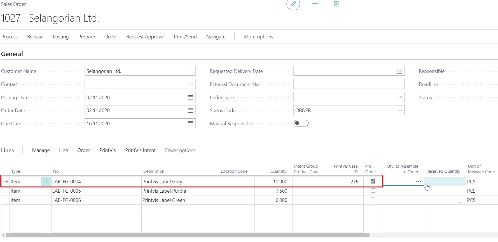

# Multiple Items in a Ganged Production

## Prerequisites

This article covers a special scenario often required by companies using dies/tools, such as narrow web label production or folding carton production. It allows ganging of different products with the same layout and imposition to be produced in a single production order. The workflow supports both single and multiple items.

> **Note**: This scenario is not typically used to gang orders from different customers together on a combined sheet. For that scenario, refer to the "Ganged Production" articles that focus on gathering customer orders into production orders for planning optimization.

 **Required Extensions**

This functionality is part of the **PrintVis SalesOrder Integration** app. This extension must be installed to achieve the described results.

## Setup

### Cost Center Configuration Settings
Set the field **More items per imposition** to **Successive** in the cost center configuration of the presses.

### Product Group Settings
Set the **Salesorder production method** field to **One job item per line**.

### Finished Good Items
Ensure that the following fields contain the same values for all Finished Goods Items to be produced together:

- **Template ID/Job/Version**
- **Imposition Code**
- **Product Group**
- **Paper No.**
- **Tool 1**

Fill the following fields, as they may otherwise be empty on the job item:

- **Colors Front**
- **Colors Back**

> **Tip**: If you do not get the expected results, check these fields on each **Item Card**.

## Creating a Sales and Production Order for Multiple Items

1. Select the items to be produced together.
2. Set **Production order** to **Yes** on one of the lines for the selected items.

3. Copy the ID from the ID field using the F8 key.
4. Paste the ID into the ID field of the remaining items.
5. Enable **Production order** = **Yes** for those lines with the same ID.

## Result on the Case Card/Production Order

When opening the production order, only one job is created with the information and template from the first item. The **Job Quantity** is the total of all selected sales line quantities.

On the **Job Card**, one **Job Item** is created for each item from the sales line, and all items are placed on the same sheet/section number.

