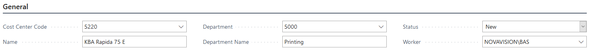

# The Hourly Rate Calculator Scenarios by PrintVis

## Introduction

The Hourly Rate Calculator is designed to assist in calculating the hourly rate used for cost centers, providing a valuable tool for our Partners and Customers. This tool takes into account all factors affecting the appropriate rates for a printer's specific operations—fixed and variable costs, materials, labor, and overhead. By aggregating these amounts, the calculator determines the optimal rate per cost center to help maintain a company's profitability and viability.

## Open Calculator

Search for:

## Scenario Setup

There are three ways to create a scenario: **New**, **Copy Scenario**, or **Open Wizard**.

| Action       | Description |
|--------------|-------------|
| **New**      | This is how you can create a new scenario from scratch. This opens the primary page for establishing a scenario allowing you to complete all fields manually. |
| **Open Wizard** | The wizard allows you to step through the scenario setup process in an organized way. You can use the wizard for newly created scenarios or to modify scenarios that have already been completed.   In order to use the wizard you must first use **New** to create the scenario that will be used by the wizard. The only fields required in this new scenario are the **Code** and **Description** fields. Highlight the newly created scenario and select **Open Wizard**. |

 The **Open Wizard** dialog box will appear:

  Click **Next**

  Verify the correct code and description and click **Next**

  Enter the period for your scenario and the period used for comparison. Use your regional date format with ".." between the beginning and ending dates. Click **Next**

  Enter the production facility size and cost. The size can be in square meters or square feet. Click **Next**

 

 Enter the warehouse facility cost and the ratio allocated to materials and the ratio unallocated. Click **Next**

  Enter the interest rate and the fixed cost breakdown ratio between assets and staff (department headcount). Click **Next**

  Select/Add the variable costs. The **Amount** will show the budgeted amount for the Totaling G/L account(s), and the **Actual Amount** will show the amount actually spent in those same accounts. Click **Next**

  Select/Add the fixed non-production costs. **Amount** is entered as the fixed cost. **Actual Amount** will show the amount spent for the Totaling G/L account(s) selected. Click **Next**

  Select/Add the fixed production costs. The total sum registered on all the cost centers will be shown as the **Amount**. **Actual Amount** will show the amount spent for the Totaling G/L account(s) selected. Click **Next**

  Select/Add the labor costs. The labor cost rate is the hourly rate for each defined entry. The **Amount** will be automatically calculated. Click **Next**

  Select/Add the cost centers for this scenario. **Net Profit %**, **Price**, and **Net Profit** can be adjusted for each cost center. Click **Next**

  Enter the head count for each department and click **Finish** to complete the wizard.

### Copy Scenario

The **Copy Scenario** option allows you to create an exact copy of an existing scenario.

1. Select a scenario, click **Copy Scenario**, enter a new scenario code, and click **OK**.

#### General

The General fast tab contains base information about the scenario.

| Field                         | Description |
|------------------------------|-------------|
| **Code**                     | The code is the identifier for the scenario. |
| **Description**              | Describes the scenario in detail. |
| **Period**                   | The period used in the scenario. This is a regionally formatted date range using “..” between the beginning and the ending dates. This is important for the data within the scenario that pulls budgeted and actual amounts from the general ledger. |
| **Period Compare**           | The period used to compare the scenario against previous, actual data. This is a regionally formatted date range using “..” between the beginning and ending dates. This is important for the data within the scenario that pulls budgeted and actual amounts from the general ledger. |
| **Public Holiday Days (Period)** | The number of public holidays within the period defined. |
| **Status**                   | The status of the scenario allows you to track the progress of the scenarios created. This field is manually changed as desired.  **Options are:** - New - In Progress - Completed - Closed |
| **Worker**                   | The user who created or is currently assigned to the scenario. |

#### Status

The Status fast tab tracks the progress of each individual component of the scenario. Fields are manually updated as needed. Status options are:
- New
- In Progress
- Reviewed
- Completed

#### Production Facility

The Production Facility fast tab allows you to enter scenario information related to the production facility and its associated costs.

| Field                          | Description |
|-------------------------------|-------------|
| **Production Area**           | The total production area in square meters or square feet. |
| **Production Facility Cost**  | The total cost of the production facility for the defined period. |
| **Cost Per m² or Sq. Ft.**    | The calculated cost of the production facility per square meter or square feet (the production facility cost divided by the production area). |
| **Area Allocated**            | The area allocated field shows the calculated sum of all the individual cost center production facility area fields. This gives the amount of the total production facility space that is being utilized by cost centers. |
| **Actual Cost Per m² or Sq. Ft.** | The calculated cost of the production facility being utilized by cost centers (the production facility cost divided by the area allocated). |

#### Warehouse

The Warehouse fast tab allows you to enter scenario information related to the warehouse and its associated costs.

- **Warehouse Cost**: The total cost of the warehouse for the defined period.
- **Allocation Ratio Material**: The percentage of warehouse cost allocated toward materials.
- **Ratio Unallocated**: The percentage of warehouse cost allocated for production.
- **Warehouse Cost Allocated**: Calculated currency amount of warehouse cost allocated for production.
- **Warehouse Cost Share**: Calculated currency amount of warehouse cost allocated for production.

#### Fixed Costs – Non Production

The Fixed Costs – Non Production fast tab allows you to enter non-production fixed costs to be considered in the scenario. Lines can be added as needed.

- **Code**: Identifier for the non-production fixed cost.
- **Text**: Description of the non-production fixed cost.
- **Amount**: Currency amount budgeted for the non-production fixed cost.
- **Actual Amount**: Actual currency amount consumed during the period based on the G/L account(s) in the Totaling field.
- **Totaling**: The G/L account(s) used to calculate the actual amount. Multiple accounts should be separated by “|” or number ranges separated by “..”.

#### Departments

The Departments fast tab allows you to enter the number of employees (head count) for a department and displays the production unit count (cost centers) considered in the scenario.

- **Code**: Identifier for the department.
- **Text**: Description of the department.
- **Head Count**: Number of employees allocated for the department.
- **Production Unit Count**: Calculated number of production units (cost centers) within the department.

#### Fixed Costs

The Fixed Costs fast tab allows you to enter the interest rate and allocation ratio for fixed costs.

- **Interest Rate**: The interest rate assigned to fixed costs.
- **Fixed Cost Asset Ratio**: Percentage of fixed costs (overhead) allocated to capital.
- **Fixed Cost Staff Ratio**: Percentage of fixed costs (overhead) allocated to staff.
- **Fixed Cost Asset Amount**: Total calculated currency amount (from Fixed Costs – Non Production fast tab) for assets.
- **Fixed Cost Staff Amount**: Total calculated currency amount (from Fixed Costs – Non Production fast tab) for staff.
- **Production Asset Total**: Calculated currency amount total of “fair value” of all cost centers.
- **Production Head Count**: Total number of employees across all departments (from Departments fast tab).

#### Variable Costs

The Variable Costs fast tab allows you to enter different variable costs (non-registered costs) considered within the scenario.

- **Code**: Identifier for the variable cost.
- **Text**: Description of the variable cost.
- **Amount**: Total calculated currency amount of all variable costs entered on the cost centers.
- **Actual Amount**: Actual currency amount consumed during the period based on the G/L account(s) in the Totaling field.
- **Totaling**: The G/L account(s) used to calculate the actual amount. Multiple accounts should be separated by “|” or number ranges separated by “..”.

#### Labor Costs

The Labor Costs fast tab allows you to enter different labor costs assigned to cost centers within the scenario.

- **Code**: Identifier for the labor cost.
- **Text**: Description of the labor cost.
- **Labor Cost Rate**: Hourly rate set as a currency amount.
- **Amount**: Total calculated currency amount based on the labor rate(s) assigned to the scenario cost centers and hours the cost centers are operational.

#### Fixed Costs – Production

The Fixed Costs – Production fast tab allows you to enter different fixed production costs assigned to cost centers within the scenario.

- **Code**: Identifier for the fixed production cost.
- **Text**: Description of the fixed production cost.
- **Amount**: Total calculated currency amount based on fixed production cost(s) assigned to the scenario cost centers.
- **Actual Amount**: Actual currency amount consumed during the period based on the G/L account(s) in the Totaling field.
- **Totaling**: The G/L account(s) used to calculate the actual amount. Multiple accounts should be separated by “|” or number ranges separated by “..”.

#### Cost Centers

The Cost Centers fast tab allows you to load, add, remove, and edit production cost centers within the scenario. Once set up, the scenario can be written back to the production system to update costs, opening hours, and cost center values.

- Displays the cost centers considered in the scenario. Select a cost center and click **Edit** to modify.

#### Cost Center Details

#### General

- **Cost Center Code**: The code identifying the cost center.
- **Name**: The name of the cost center.
- **Department**: The cost center's associated department.
- **Department Name**: The name of the associated department.
- **Status**: The status of the cost center within the scenario. Options include:
  - New
  - In Progress
  - Review
  - Completed
- **Worker**: The user who created or is editing the cost center.

#### Implied Costs

- **Production Unit Count**: The number of units within the cost center.
- **Fair Market Value**: The current residual value of the cost center.
- **Scrap Value**: The value of the cost center after depreciation.
- **Useful Life**: The depreciation period for the cost center.
- **Implied Cost**: Calculated implied cost for the scenario period. (Fair market value minus scrap value divided by useful life.)
- **Interest Cost**: Calculated interest based on the value of the cost center.
- **Production Facility Area**: The production area used by the cost center in m² or sq. ft.
- **Production Facility Area Cost**: Calculated production area costs for the cost center.
- **Warehouse Ratio**: Ratio of used inventory as a whole number percentage. Typically used for printing presses.
- **Warehouse Cost**: Calculated inventory cost amount for the cost center.
- **Fixed Cost Asset Share**: Calculated cost center portion of the fixed costs based on invested capital.
- **Fixed Cost Staff Share**: Calculated cost center portion of the fixed costs based on the number of persons.

#### Costs

- **Fixed Costs Production**: Select and assign the production fixed costs and their currency values to the cost center.
- **Variable Costs**: Select and assign the variable costs and their currency values to the cost center.
- **Labor Costs Per Hour**: Select and assign the labor costs and their head count to the cost center.

#### Hours

- **Opening Hours**: Number of hours in the period the cost center is listed as open.
- **Availability Ratio**: Percentage of time the cost center is available during the period.
- **Utilization Ratio**: Percentage of time the cost center will be utilized during the period.
- **Hours**: Calculated number of hours in the period the cost center will be running billable work considering availability and utilization ratios.

#### Totals

- **Variable Cost, Total**: Calculated total variable costs for the cost center.
- **Labor Cost, Total**: Calculated total labor costs for the cost center.
- **Overhead, Total**: Total currency amount overhead costs for the cost center.
- **Total Cost, Total**: Calculated total cost for the cost center.
- **Per Hour Variable Cost**: Calculated hourly variable cost for the cost center.
- **Per Hour Labor Costs**: Calculated hourly labor costs for the cost center.
- **Per Hour Direct Cost**: Calculated direct cost for the cost center (variable and labor costs).
- **Per Hour Overhead**: Calculated hourly overhead costs for the cost center.
- **Per Hour Total Cost**: Calculated hourly total cost for the cost center
- **Net Profit %**: Whole number percentage of net profit desired for the cost center.
- **Price**: Hourly currency amount price needed based on costs and net profit percentage.
- **Net Profit**: Calculated currency amount hourly net profit for the cost center.