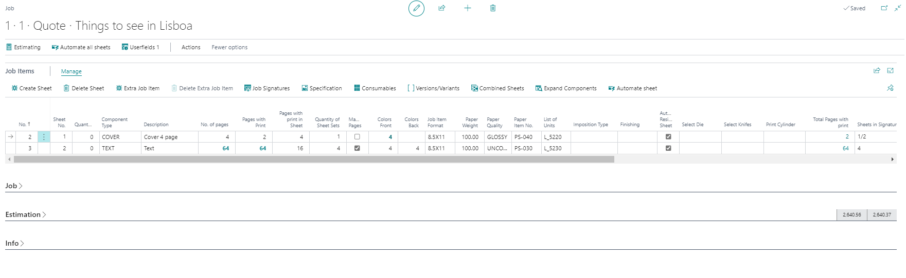
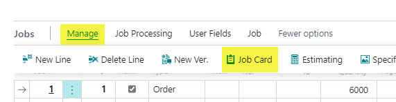
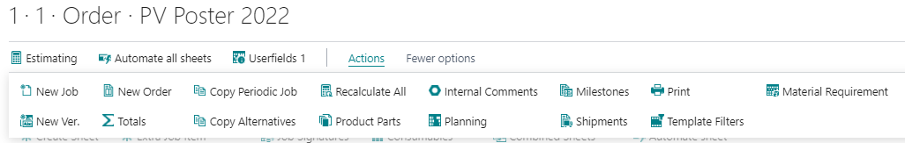
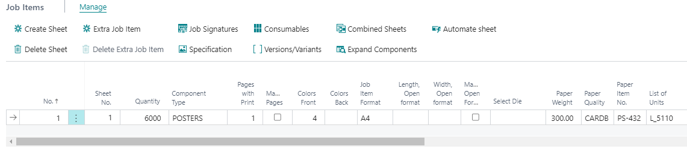
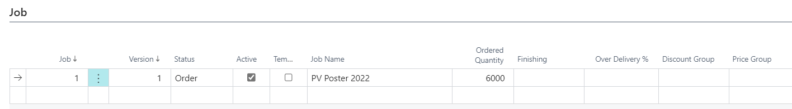
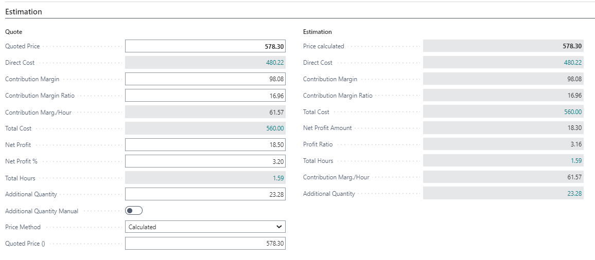
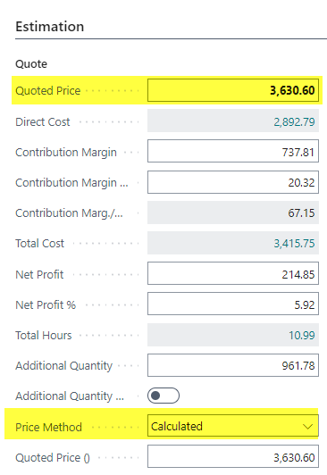
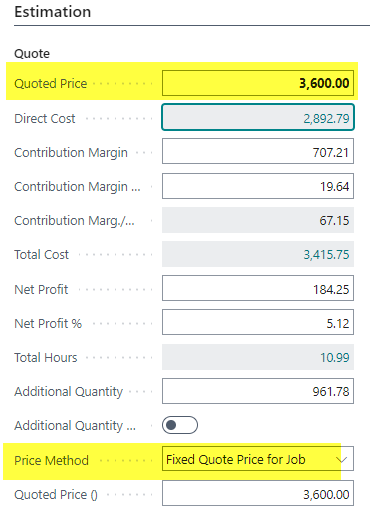
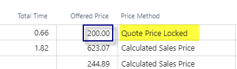
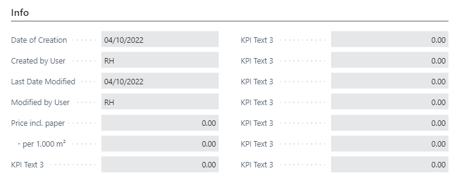

# Job Card

## Summary
The Job Card is the place where the estimator can detail the components of the job and review the detailed estimated price.

The most important section for estimating is the **Job Items** section, which contains the Job Item table, detailing the components of the product being made.

Open the Job Card from the Case Card here

## Page Main Menu

| Function                 | Description |
|--------------------------|-------------|
| **Estimating**           | Opens the detailed Estimation for this job. |
| **Automate all sheets**  | This function tries to find the optimal printing machine for all job items (sheets). The selection is based on the Estimation Automation Setup. See here: Estimation Automation |
| **Userfields 1,2,3**     | Open the Userfield page. |

 Actions

| Action                   | Description |
|--------------------------|-------------|
| **New Job**              | Create a new Job line in the "Job" section based on the current status of the case. |
| **New Ver.**             | Create a new Job Version based on the selected job in the "Job" section. |
| **New Order**            | Create a new Order line based on the selected job in the "Job" section. |
| **Totals**               | Opens the Total Overview page with the calculated cost for User Hours, Material, Subcontracting, etc. |
| **Copy Periodic Job**    | Opens the Copy Periodic Job page where you can define periodicals. See here: Copy Periodic Job |
| **Copy Alternatives**    | Copy the actual Job line to an alternative Job. |
| **Recalculate All**      | This function recalculates all jobs of the current case. This is recommended when a case was copied because speed-/scrap-tables and cost/overhead/prices for machines and materials might have changed. |
| **Recalculate Job**      | This function recalculates the current job of the case. This is recommended when a case was copied because speed-/scrap-tables and cost/overhead/prices for machines and materials might have changed in the meantime. Recalculate Job takes less performance than recalculating all jobs. |
| **Product Parts**        | Opens a page to view, add, and edit the product parts for the job. |
| **Internal Comments**    | Opens a page to view and edit the internal comments for all departments. These can be shown on the Job Ticket and in the case description section of the case. |
| **Planning**             | Opens the job planning page. |
| **Milestones**           | Opens a page to view, edit, and add milestones for this case. |
| **Shipments**            | Opens the shipment page if the job is ready for shipping. |
| **Print**                | Opens the Report Selection page to print one of the available reports. |
| **Template Filters**     | Opens the Template Filter page. |
| **Material Requirement** | Opens the Material Requirement page to show the required material(s) for this job. |

## Job Items 

The main work is done in this section - which contains the Job Item table.
The Job Item table is the technical definition of the components of the product we are making on this Case.
This is where the product components are equipped with substrate and printers and many more things.

### Job Items Menu
 
| Function               | Description |
|------------------------|-------------|
| **Create Sheet**       | Create a new sheet/web line. |
| **Delete Sheet**       | Delete the sheet/web line. |
| **Copy Sheet**         | Copy the current sheet with all related job items and residual sheets. |
| **Extra Job Item**     | Create an Extra Job Item on the actual sheet/web. For example, another item to be printed on the same press sheet to save make-ready costs. |
| **Delete Extra Job Item** | Delete the Extra Job Item. |
| **Job Signatures**     | Open a page with the actual job signatures. This is used for sequencing the signatures of a book or larger brochure, most commonly used in JDF communication. |
| **Specification**      | Open the Specification page. More info here: Specification Page |
| **Consumables**        | Open a page to view, add, and edit the consumables for the actual job item. |
| **Versions/Variants**  | Open the Version/Variant page (used with combined sheets). |
| **Combined Sheets**    | Open the combined sheets page, if you print multiple versions of job items on a single sheet. |
| **Expand Components**  | If the selected component type is defined as a "List," click this to expand it into single entries. |
| **Automate Sheet**     | This function tries to find the optimal printing machine for this job item (sheet). The selection is based on the Estimation Automation Setup.  |

### Job Item Lines

| **Field**                         | **Description** |
|------------------------------------|---------------|
| **No.**                           | Internal field, line number. |
| **Sheet No.**                     | The sheet number where this job item will be printed. |
| **Quantity**                      | Default quantity from the entire job, manually adjustable for combined sheets. |
| **Qty. in Block**                  | Used for production quantities in "Blocks" like notepads or calendars. Default = 1. |
| **Component Type**                 | Defines sheet types (Cover, Text, etc.) and influences auto-estimation. |
| **Pages with Print**               | Number of pages selected on the Case Card job line. |
| **Manual Pages**                   | Indicates if the number of pages is entered manually. |
| **Colors Front**                   | Number of colors on the front page. |
| **Colors Back**                    | Number of colors on the back page. |
| **Job Item Format**                | Final format of the finished product, auto-filled but modifiable. |
| **Open Format Code**               | Calculates the open size for the job item. Manual input required for some cases. |
| **Length, Open Format**            | Extracts the length from the entered Open Format. |
| **Width, Open Format**             | Extracts the width from the entered Open Format. |
| **Manual Open Format**             | Indicates if the Open Format is entered manually. |
| **Paper Weight**                   | Displays the weight of the selected paper. |
| **Paper Quality**                  | Displays the quality group of the selected paper. |
| **Paper Item No.**                 | Displays the selected Paper Item number. |
| **List of Units**                   | Selects the main printing machine for the job item. |
| **Conjugate Length**               | Multiplies with the job item’s length to calculate open format. |
| **Conjugate Width**                | Multiplies with the job item’s width to calculate open format. |
| **Finishing**                      | Lists finishing options related to the job item. |
| **Placement of Job Item**          | Determines how job items are placed on the printed sheet. |
| **Automatic Residual Sheet**       | Automatically creates residual sheets to optimize paper usage. |
| **Pages with Print in Sheet**      | Displays the number of pages per job item on the sheet. |
| **Total Pages with Print**         | A calculated field showing total printed pages. |
| **Sheets in Signature**            | Displays the number of sheets within the same imposition. |
| **Select Die**                     | Links to tools for in-line finishing like dies or cutters. |
| **Manual Quantity**                | Indicates if the quantity was entered manually. |
| **Manual Colors**                  | Indicates if colors were entered manually. |
| **Manual Pages on the Sheet**      | Indicates if the number of pages was entered manually. |
| **Manual Format**                  | Indicates if the format was entered manually. |
| **Manual Imposition Type**         | Indicates if the imposition type was entered manually. |
| **Ganged Job**                     | Displays ganging status of the job item. |
| **Ganged Job Possible**            | Identifies if the job item can be used for ganged production. |
| **Ganged on SheetID**              | Displays the SheetID if the job item is part of a ganged order. |
| **Ganging Info**                   | Displays job item’s ganging status (Candidate, Ganged on Order, etc.). |
| **Item No.**                       | Links to the corresponding item in the Item table. |
| **Product Code**                   | PrintVis product code, usable as a template or inventory item. |
| **Plate Changes**                  | Number of required plate changes for multi-language or varied color jobs. |
| **Imposition Type**                | Defines how job items are placed on the sheet. |
| **Imposition Description**         | Description of the selected imposition type. |
| **Screening Parameter**            | Used in JDF integration. |
| **Manufacturing No.**              | Holds manufacturing layout info from CAD software. |

## Job
This section includes fields from the Case Card Job line, with additional options:

| **Field**           | **Description** |
|---------------------|---------------|
| **Template**       | Marks the job as a template, making it available in the Jobs Product Group template list. |
| **Finishing**      | Provides quick access to post-press finishing options from the "List of calculation units." |
| **Over Delivery %** | Used when pre-printed paper is stocked and only requires additional printing (e.g., addresses). Ensures the correct Finished Goods Item number is used and prevents double stock consumption. |
| **Price Group**    | Links to the Price Group table, allowing different pricing structures for specific Cases, Jobs, or Versions. Can influence cost center rates and price lists. |

## Estimation
The result of the calculation is displayed in detail here. The fields in the first column (Quote) can be modified to adjust the Quoted price. The right column (Estimate) shows the results of the system and cannot be changed.

| **Field**                        | **Description** |
|----------------------------------|---------------|
| **Quoted Price**                | Displays the job's price based on the selected pricing method. Can be overwritten as a Fixed Quote Price. |
| **Direct Cost**                 | Sum of variable and labor costs for the job. |
| **Contribution Margin**         | The amount derived from Sales Price minus Direct Costs. |
| **Contribution Margin Ratio**   | The percentage of contribution margin relative to Sales Price. |
| **Contribution Marg./Hours**    | The contribution margin per hour. |
| **Total Cost**                  | Sum of direct costs and overhead costs for the job. |
| **Net Profit**                  | The amount derived from Sales Price minus Total Costs. |
| **Net Profit %**                | The percentage of net profit relative to Sales Price. |
| **Total Hours**                 | A calculated field showing the total hours for the job. |
| **Additional Quantity**         | Displays the additional price calculated for extra quantity. Can be manually overwritten. |
| **Additional Quantity Manual**  | Indicates if the additional price was manually adjusted. Removing the checkmark resets to the calculated price. |
| **Price Method**                | Automatically filled based on the pricing method. Can be overridden manually. Options: Calculated Price, Fixed Quoted Price. |
| **Manually per Calc Unit**      | Selected when a user manually changes the sales price of at least one calculation unit. Can only be reset via the calculation line. |
| **Item Price**                  | If an item is used in the case card, its price is sourced from the item card. |
| **Fixed Unit Price**            | Used for pricing per unit in flexible packaging (e.g., kilo, meter). |
| **Quoted Price (Customer Currency)** | Displays the quoted price in the customer's currency. Can be manually adjusted, setting the Price Method to Fixed Quoted Price. If reset to "Calculated," updates based on exchange rates. |

## Info
Provides metadata about the job card:

| **Field**               | **Description** |
|-------------------------|---------------|
| **Date of Creation**    | The date this department was created. |
| **Created by User**     | The user who created this department. |
| **Last Date Modified**  | The date this department was last modified. |
| **Modified by User**    | The user who last modified this department. |
| **KPI's**              | Displays all KPIs defined in the product group. More details: [KPI's](#) |

