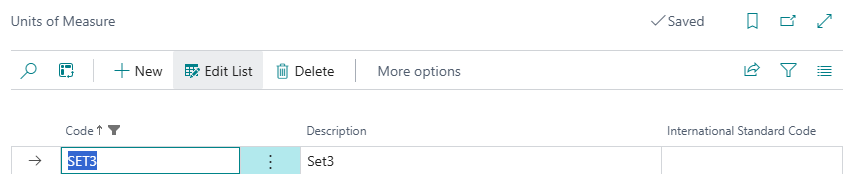
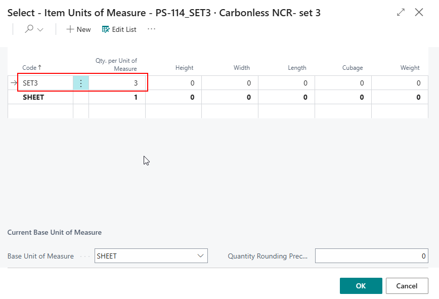
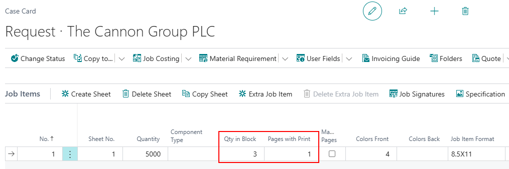
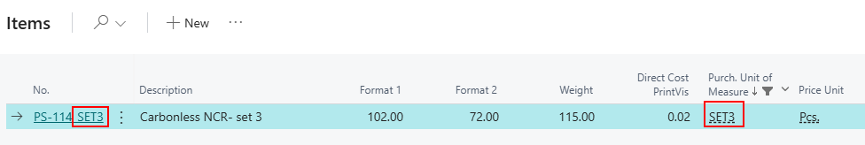
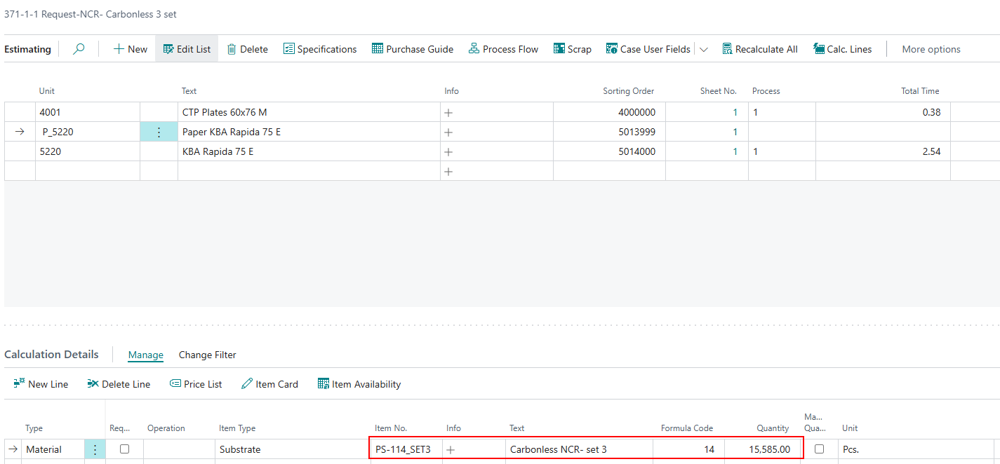
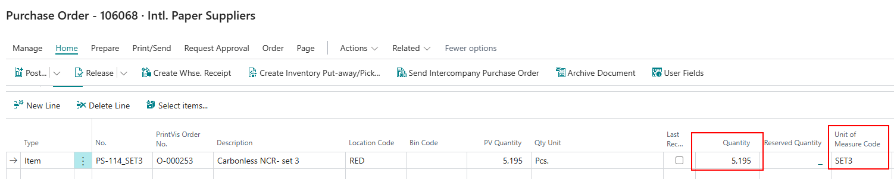

# Multipart NCR forms on Impression Counts

## Summary

Some customers are printing using Carbonless multipart forms. NCR parts can come in 2, 3, 4, or even more sheets per part. These parts can be purchased as individual sheets (example: White/Canary/Pink). This would be handled as individual items and would have their own job item.

A more complex example would be purchasing "pre-collated" sets. Purchasing would occur where individual sheets (example: white/canary/pink) would be presorted and count as a single item. The question arises: how can the estimation calculate properly versus how purchasing would take place?

Example used above where there was a 3-part NCR form:  
- The calculation of impressions would need to be **3 times** the quantity to account for the individual sheets/impressions.  
- Purchasing would be **1/3** the quantity because 3 sheets would come as a single item.  

This article describes how the setup and usage for this scenario would work, but it can be adjusted to account for any number of multipart NCR forms, regardless of the number of individual sheets.

---

## Setup

The main setup is regarding the **item card**.  
**Purchase Unit of Measure** should be set with the number of sheets per "set" or per single item that is being purchased. It is advised to create a separate Purchase Unit of Measure to accommodate the different numbers per set.

 Steps:
1. **Create the Unit of Measure**  
   *(e.g., "3-PartSet", "4-PartSet")*

2. **Assign the unit of measure** inside the field **Purchase Unit of Measure** on the specific item card, and make sure to add the **Qty. per Unit of Measure** that matches the number of sheets per set.

- `Base Unit of Measure` should be **Sheets** (or a value equivalent).

---

## Usage / Example

There are just a few items to note in a use case scenario.

- **Case Card**:  
  - In the **Pages** field, it should remain `1` because there is technically only **1 page** being printed.
  - The **Qty in Block** field will hold the value of how many **individual sheets** are present. This field can be found on the **job item line**.  
    - If `Qty in Block` field is not visible, please personalize and add the field.  
    - Example: 3-part NCR would have a value of `3` in the `Qty in Block` field.

- **Job Item**:  
  - Make sure to select the **correct paper** that has the **Purchase Unit of Measure** matching the collated set.

### Helpful hints for making easily recognizable paper:
- Have the **quantity per set** described in **Item No/Description**.
- Apply a **filter** on the **Purchase Unit of Measure** from the item list to match the value that is desired.

---

### Results

On the **Estimation page**, the quantity for paper will be equal to:

> `Job Quantity x Number of Sheets per Set` (+ scrap)

Example:  
- Quantity = 5,000  
- Sheets per set = 3  
- Total sheets for the press = **15,000 + scrap**

---

On the **Purchase Order**, the quantity will reflect the number of **sets** that need to be purchased, **not** the total number of sheets.

Continuing the example:  
- Total sheets = 15,000  
- Required sets = 5,000  
- Purchase quantity = **5,195** (includes scrap)

---
