# Newspaper Print Setup.

## Summary

This article shows how to set up PrintVis to track:

- The short timespan from when the material is ready until the delivery/deadline (typically just one night).
- Some content may arrive at the last minute, resulting in last-minute changes to the imposition and the paper to print on.
- Tight and crucial planning requirements.
- Delivery profiles on the order must be managed carefully, such as pickup times and routes.
- There may be several contracted orders specific to one particular day.
- A newspaper may consist of several sections, and not necessarily all sections appear in all newspapers (i.e., local sections).

## The Newspaper Composition

The newspaper is typically built as a single job with several sections to be printed (though not necessarily at the same time). Additional treatment may occur in the packing department, such as outside inserts or offline sections.

The focus of newspaper production is on the printing machine, while the prepress and packing departments assist in the optimum production. This means that deadlines in prepress need to be on time for printing, and the packaging department must handle newspapers as they come from the printer.

Once the size (number of pages) for each section is determined by the newspaper editors, this information is entered into the order, and the imposition is decided for each section.

Changes may then be required for the paper width, necessitating a change in paper item number and replanning according to those changes. The planning aims to transition from one print job to the next with minimal pauses, as stopping the machine is costly.

Attention is also focused on the delivery schedule for each order, as transportation is pre-booked, and the newspapers must be delivered on time the next morning.

## Production Setup

Here, we address production setup concerns for the following departments:

- The prepress department
- The printing machine
- The packing department

## The Prepress Department

This section covers production setup issues for the prepress department.

### Number of Plates

The usual formula for plates cannot be used here.

- Examine how many plates are on one cylinder and how many cylinders are in one tower.
- For example, each cylinder may have 8 plates, and there may be 8 cylinders in one tower (for printing 4+4 colors on the web), resulting in 64 plates in a tower.

| Paper | K | K |
|-------|---|---|
|       | Y | Y |
|       | M | M |
|       | C | C |

Cylinders printing the web.

One cylinder might look like this:

| Plate | 1a | a2 | a3 | a4 |
|-------|----|----|----|----|
| Plate | B1 | b2 | b3 | b4 |
| Zone  | 1  | 2  | 3  | 4  |

There are 8 plates on the cylinder, with the cylinder divided into 4 zones, each containing 2 plates.

### Pagination

For example, the cutoff may be 112 cm. Two formats can be printed on this:

- **Broadsheet (39.5x56):** 8 pages on one side, totaling 16 pages on one full tower.
- **Tabloid (28x39.5):** 16 pages on one side, totaling 32 pages on one full tower.

### Zones

It is possible to print with fewer than a full tower by changing the width of the paper web. For example, a full-width web is (4x39.5 + allowance for fold) 159 cm wide. By switching to a paper item that is only 119 cm wide and placing plates in 3 zones, the page capacity drops to 12 tabloid/6 broadsheet pages.

The print works only with full zones, so the available web widths are 159, 119, 79, and 39.5 cm.

### Blind Plates

Some printing cylinders require all zones to be mounted with plates to avoid damage from different pressure levels. In such cases, ‘Blind Plates’ are used. Blind plates can either be bought from the plate vendor or recycled, as they are not printing anything.

It takes the same amount of time to mount and remove a blind plate as it does a regular plate. However, customers typically do not pay for blind plates, so it is important to distinguish between real and blind plates. A special formula for the machine must handle this.

### Change Plates

For large orders, plates may wear out before production is completed. Typically, a new plate can print around 300,000 copies before it needs to be changed. Use a special formula to estimate how many plate changes are needed.

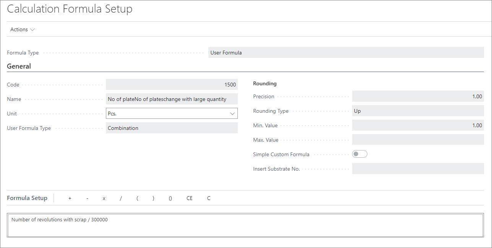

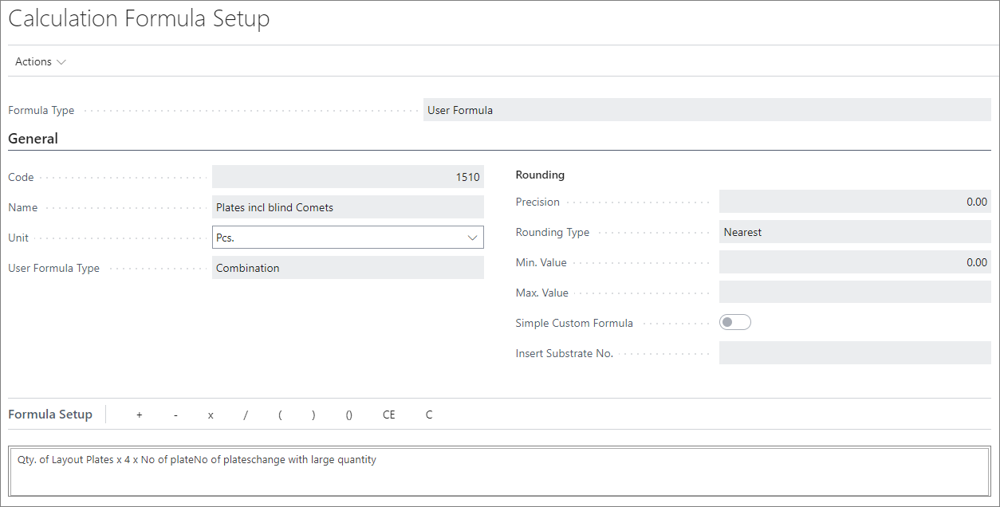

### Imposition Codes

All possible impositions must be entered into the system as a library, with each imposition code containing the correct information. If an imposition has more pages than can fit in one tower, an additional tower will be used until all pages are placed.

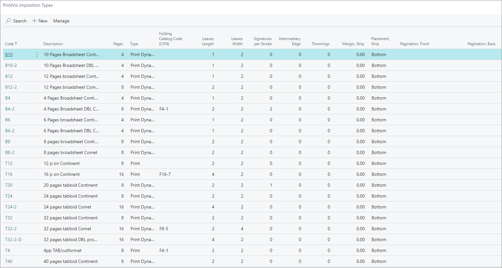

Imposition types can be found by searching "PrintVis Imposition Types." Here, you will need to enter the code, descriptions, leaf width, leaf length, and other parameters, along with choosing the correct folding catalog code.

### Creating a New Tower

To activate additional towers, the imposition code must have more lines. Open a new window by selecting **Imposition > Range** and enter the necessary details for each new tower.

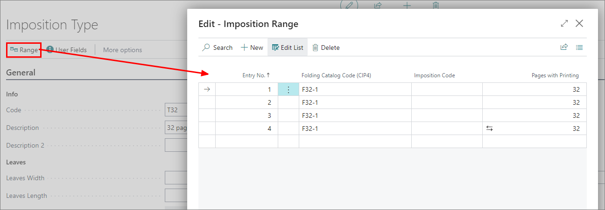

#### Double Production

When the number of pages in the product is less than half of the largest newspaper possible, the optimum printing method is **Double Production**. This involves printing the same page twice on the same cylinder and using more towers.

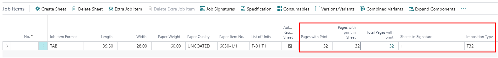

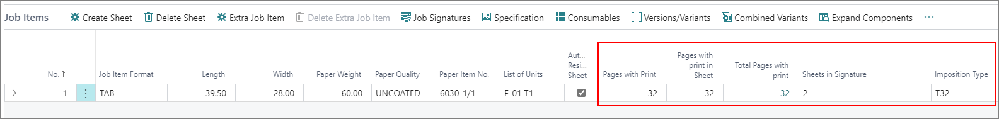

The printing machine can split the webs in two and collate each of the two newspapers produced simultaneously.

To set this up, tick the **Double Production** field in the **Info** tab.

### Deadlines for Materials and Plates

In production planning, specific milestones such as content deadlines and the number of pages are not planning units, so they must be added to the order via a product group list of planning units.

Example:

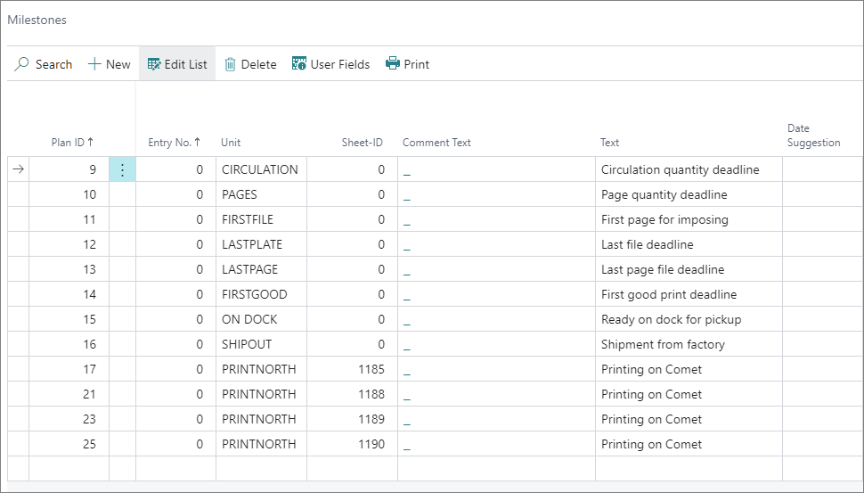

## The Printing Machine

In this department, there may be different machine models, often with special adaptations, meaning one setup won't cover all cases.

The printing machine typically consists of the following parts:

- **Printing towers** (1-5 towers typically): Each tower prints 1 web of paper in typically 4+4 colors.
- **Folding units**: Collates all the webs for the printed newspaper, outputting full newspaper sections. There may be more than one folding unit (one in each end), allowing for two jobs to be printed simultaneously from different towers.
- **Stitching unit**
- **Gluing unit**
- **Oven** (for drying)

The speed of the machine is uniform across all units, so the setup must be the same for all. The cylinders within the machine are always the same size, meaning newspapers will be printed in two possible sizes: **Broadsheet** and **Tabloid**. Any other size is created using a trimmer to cut down the size.

### Cylinders

The cylinder size depends on how the newspapers are set to be placed. It's important to thoroughly investigate how plates are placed and how pages are printed. Misunderstanding this in the setup process may result in confusing or incorrect impositioning. Ensure proper understanding of the **cutoff**, **cylinder width**, and plate placement.

### The Packing Department

This department usually has facilities to pack newspapers into bundles, which are then placed in cages. Packing occurs online from the conveyor belt, though it may or may not come directly from the machine. Other machines may include:

- **Insertion/sectioning machines**
- **Trimming**
- **Address printer**
- **Folder** (for folding finished newspapers)
- **Offlining stations**
- **Onlining stations**

#### Online vs Offline

The printer outputs newspapers onto a conveyor belt. If production continues with the papers still on the conveyor, it is referred to as **online production**. This may affect the printing machine's speed.

In some cases, the production process is slower. Newspapers are taken off the conveyor and placed back on it later at a slower pace. This is called **offline production**. Typically, insertions occur offline.

## Estimation Setup and Issues

### Cost Center Setup

When the entire production is on one conveyor belt, it becomes difficult to distinguish the end of one cost center and the beginning of the next.

- The printing machine setup is the most complex one.
- The folding unit is often regarded as a tool (surcharge configuration) on the machine. However, for these printers, it’s not viable since the folder must handle all webs in one go.

Setup Example

| Department | Cost Center | Configuration Name | Type | Machine Type | Configuration |
|------------|-------------|--------------------|------|--------------|----------------|
| Printing   | PRINTER      | FOLDER1            | Machine | Printing machine | Basic |
| Printing   | PRINTER      | FOLDER2            | Machine | Printing machine | Basic |
| Printing   | PRINTER      | STITCH             | Machine | Printing machine | Surcharge |
| Printing   | PRINTER      | GLUE               | Machine | Printing machine | Surcharge |
| Printing   | PRINTER      | SECT.GLUE          | Machine | Printing machine | Surcharge |
| Printing   | PRINTER      | STRING STITCH      | Machine | Printing machine | Surcharge |
| Printing   | PRINTER      | PRINT1             | Machine | Printing machine | Basic |
| Printing   | PRINTER      | PRINT2             | Machine | Printing machine | Basic |
| Printing   | PRINTER      | PRINT3             | Machine | Printing machine | Basic |
| Printing   | PRINTER      | PRINT4             | Machine | Printing machine | Basic |
| Printing   | PRINTER      | PRINT5             | Machine | Printing machine | Basic |

The machine can be modeled like this:

Folding unit 1 | Tower 1 | Tower 2 | Tower 3 | Tower 4 | Folding unit 2 | Tower 5 Stitcher | | | | | Stitcher Glue | | | | | Glue String Stitcher| | | | | Section glue

With this configuration, it’s possible to set the machine type to **Postpress (process level)** in version 5.01 and 2009, allowing the system to correctly handle the collation of webs for the newspaper. Describing complex newspapers in the setup remains challenging.

### Cost/Sale Price Distribution Problem

In a regular printing machine, determining costs and sales prices is straightforward. However, newspaper printing machines are more complex. The number of towers used is never known in advance, and the machine is so large that it requires a minimum of 4-5 people to operate it. As most newspaper printing happens at night, they maintain a constant staff onsite.

A solution to this challenge is to assign all costs to the folding units, as one is always used on the job and using two is not possible. This makes smaller newspapers more expensive to print per page, a critical discussion point during implementation.

## Price Unit/List of Units Setup

For each configuration, create a price unit. Remember to create a unit for paper as well. Then, move on to creating lists of units. Here's the trick:

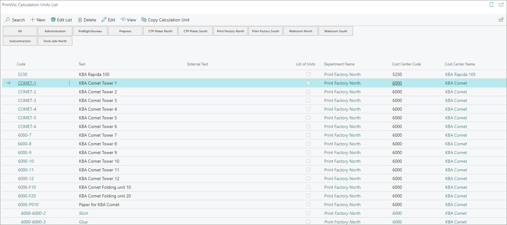

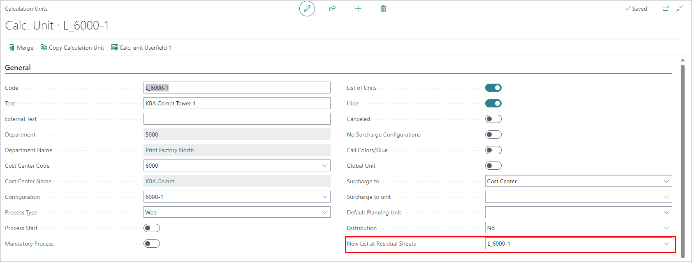

- Create lists for each tower in each position.
- On the first list, use the **New List at Residual Sheets** field to point to the next tower list for the production.

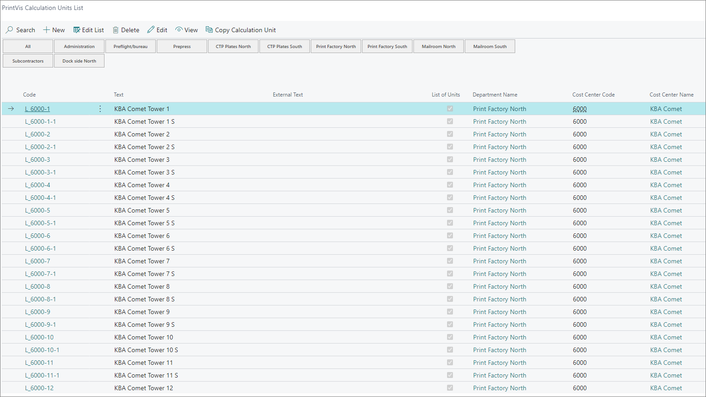

### Planning Setup

Each tower should have its own capacity unit. To avoid interference in planning units, set the **Start/Stop Type** to **Calculation** on the towers.

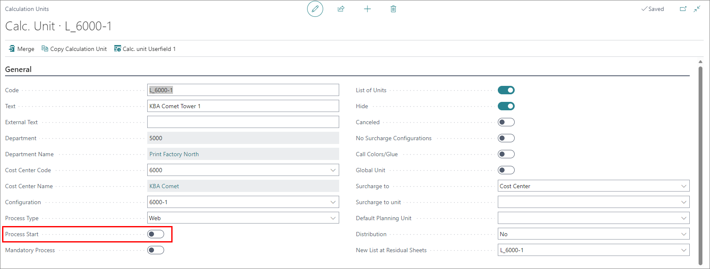

Another solution is to point the towers away from the folding unit’s capacity and planning unit, and use only the folding units for planning.

## Planning for Repairs and Cleaning

Printing machines are large and costly to leave idle for repairs or cleaning. Here's a quick tip on how to set up planning for repairs and cleaning:

1. Create an internal order type (for filtering statistics).
2. Create an internal product group (for filtering statistics).
3. Create an internal customer (for filtering statistics).
4. Add cleaning and maintenance tasks as milestones (i.e., a detailed list of things to clean or check).
5. Set the minimum planned time to 0.50 hours.
6. Link the activity to a particular capacity (if applicable).
7. Create a case card using customer, order type, and product group.
8. Create a job line and set the status code to one that allows planning.
9. Set the delivery date to the next Sunday.
10. In the planning window, add the milestones you’ve created and make a detailed cleaning plan with dates and times.

This setup will generate planning units that are visible, time-flexible, and easy to move on the planning board and production plan.
