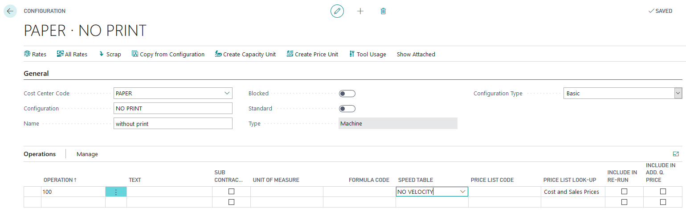
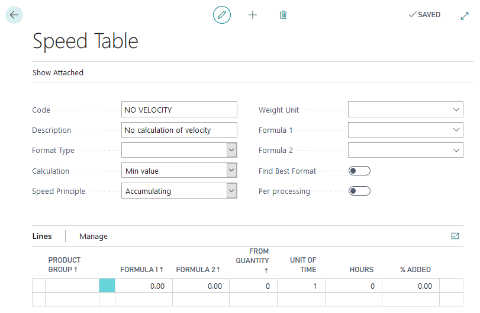
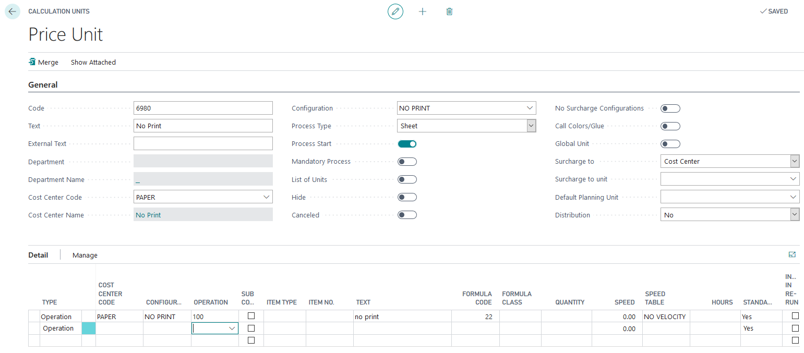
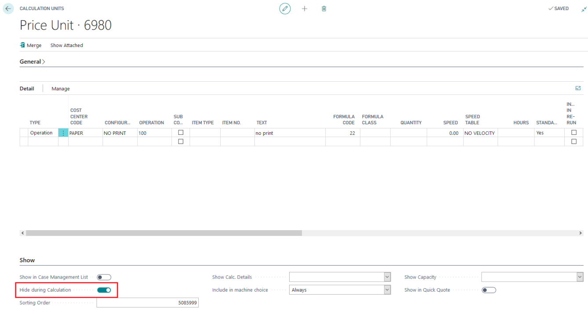
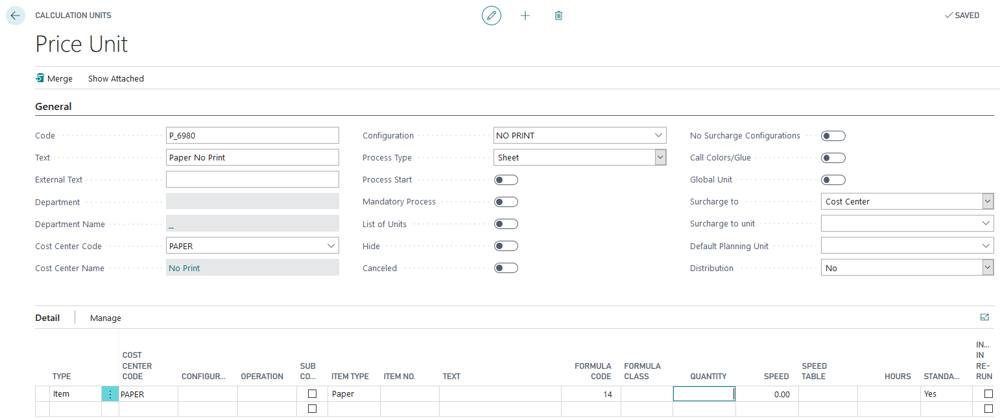
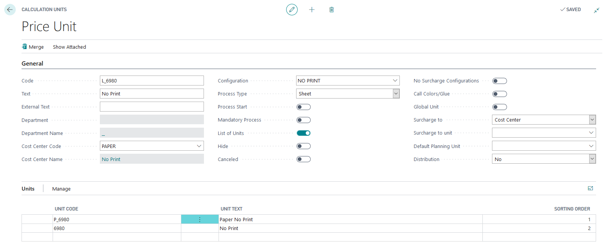
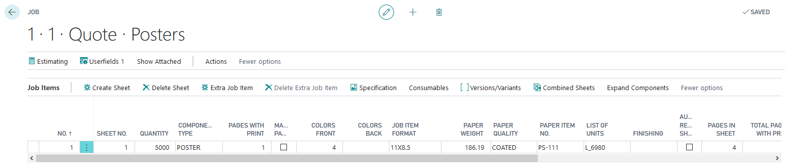
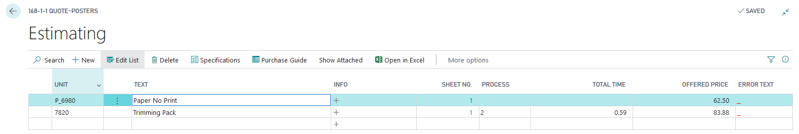
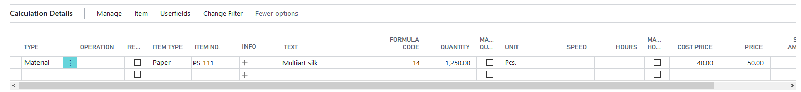

# Calculation without printing

## Summary

For orders that require finishing only, a setup is needed to calculate the paper quantity and replace the press setup.

## Setup

### Cost Center

To set up the Cost Center:

1. Search for **PrintVis Cost Centers**.
2. Select the printing machine with the largest format.
3. Open the configuration and create a new configuration.

### Speed Table

To set up the Speed Table:

1. Search for **PrintVis Speed Tables**.
2. Create a new speed table without hours.

### Calculation Unit

To set up Calculation Units:

1. Search for **PrintVis Calculation Units List**.
2. Create a new Calculation Unit for:
   - **Machine**

 

  - **Paper**
  

 
  - **List**

## Estimation

For example, if the job involves only trimming, follow the appropriate steps to estimate the requirements.

