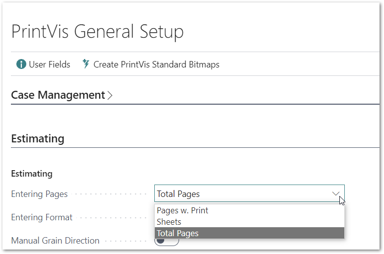
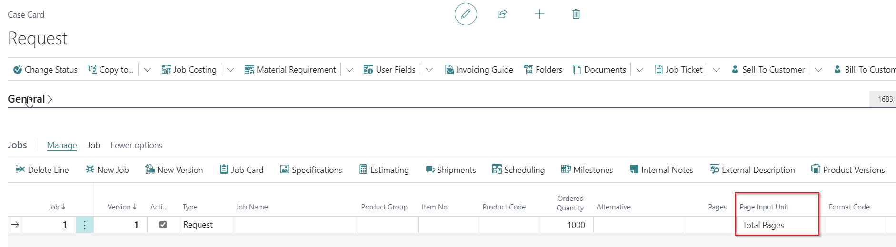
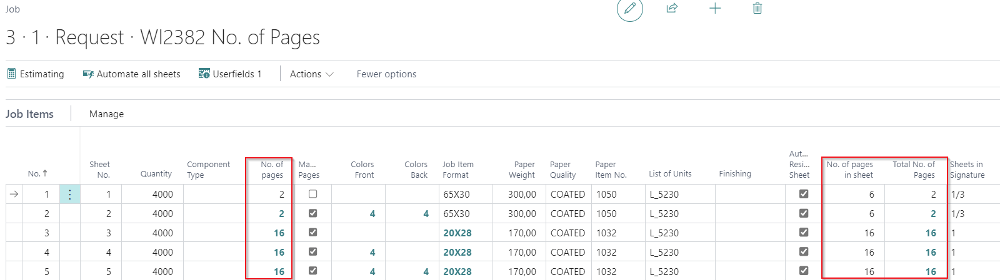
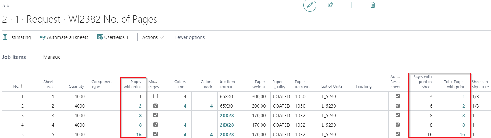
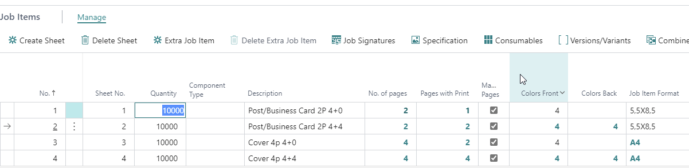

# No. of Pages vs. Pages with Print

## Introduction

In former versions, there was only a field called "Pages with Print." Users had to manually adjust this when a job changed from one-sided to two-sided or vice versa, which was confusing. To simplify, we've introduced new fields so users don't need to worry about whether pages are printed or unprinted.

The default setting for new jobs can be configured in the **Field "Entering Pages"** in PrintVis General Setup.

## "No. of Pages" vs. "Pages with Print"

- **No. of Pages**: Indicates the total number of pages for a job item, including both printed and unprinted pages. This is the number of pages of the final job item after cutting, folding, etc.
- **Pages with Print**: Indicates only the number of pages for a job item that are printed. This reflects the pages with print of the final job item after cutting, folding, etc.

 Examples

1. A one-sided poster/card (unfolded product) has 2 sides (front and back) but is printed only on the front. Thus:
   - **No. of Pages** = 2
   - **Pages with Print** = 1

2. A one-sided cover (often a hard-cover printed only on the outside) has 2 sides (front and back) and 4 pages if folded but is printed only on the front/outside. Thus:
   - **No. of Pages** = 4
   - **Pages with Print** = 2

This difference appears only if one side is printed while the other side remains unprinted.

 Field Usage

It doesn't matter which field is used since they are interconnected. You can choose which field to use, but understanding what each field shows and its impact on other parts is beneficial.

 Job Pages Input Unit Settings

The default Page Input Unit can be set in the **PrintVis General Setup - Estimation Tab**, and can be modified for each job.

## Preset for New Jobs in PrintVis General Setup

This setting will apply to all new jobs. Existing and copied jobs will retain their current settings and display related fields.

### Job Pages Input Unit = Total Pages

| Field                    | Description                                         |
|--------------------------|-----------------------------------------------------|
| No. of Pages             | No. of physical pages for this Component          |
| No. of Pages in Sheet    | No. of physical pages on this Job Item/Print Section |
| Total No. of Pages       | No. of physical pages on this Sheet incl. pages of all residual sheets |

### Job Pages Input Unit = Pages with Print

| Field                        | Description                                           |
|------------------------------|-------------------------------------------------------|
| Pages with Print             | Pages with Print for this Component                  |
| Pages with Print in Sheet    | Pages with Print on this job item/print section      |
| Total Pages with Print       | Pages with Print on this sheet incl. pages of all residual sheets |

## Examples

1. **Poster / Business Card**:
   - 2 pages, 1-sided print, 4+0 colors
     - **Pages with Print** = 1
     - **No. of Pages** = 2
   - 2 pages, 2-sided print, 4+4 colors
     - **Pages with Print** = 2
     - **No. of Pages** = 2

2. **Folder**:
   - 2 pages, 1-sided print, 4+0 colors
     - **Pages with Print** = 1
     - **No. of Pages** = 2
   - 2 pages, 2-sided print, 4+4 colors
     - **Pages with Print** = 2
     - **No. of Pages** = 2

3. **Cover**:
   - 4 pages, 1-sided print, 4+0 colors
     - **Pages with Print** = 2
     - **No. of Pages** = 4
   - 4 pages, 2-sided print, 4+4 colors
     - **Pages with Print** = 2
     - **No. of Pages** = 4

4. **Folding Carton**:
   - 2 pages when flat, 1-sided print, 4+0 colors
     - **Pages with Print** = 1
     - **No. of Pages** = 2
   - 2 pages when flat, 2-sided print, 4+4 colors
     - **Pages with Print** = 2
     - **No. of Pages** = 2

5. **Label**:
   - 2 pages, 1-sided print, 4+0 colors
     - **Pages with Print** = 1
     - **No. of Pages** = 2
   - 2 pages, 2-sided print, 4+4 colors
     - **Pages with Print** = 2
     - **No. of Pages** = 2
