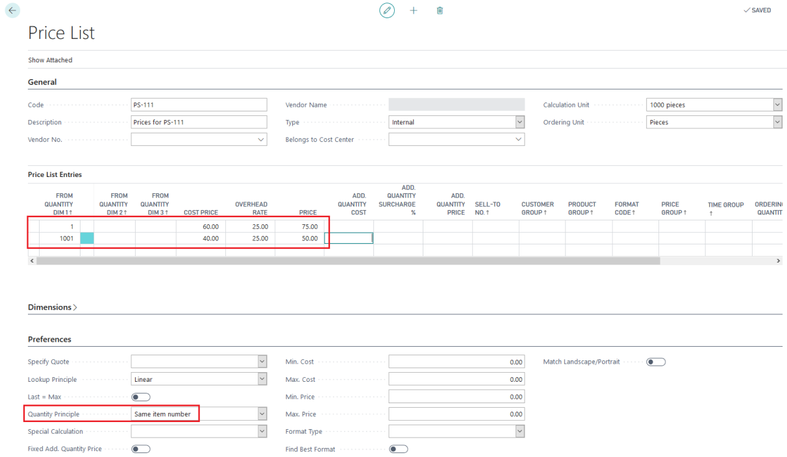
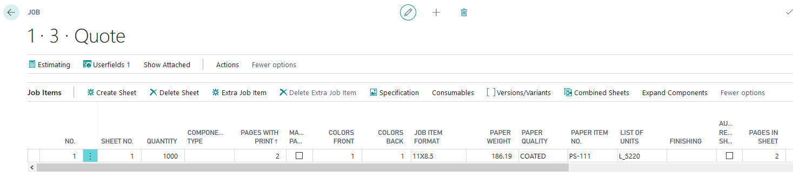
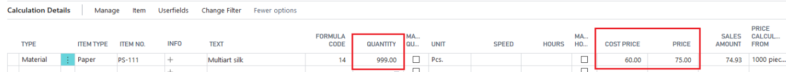
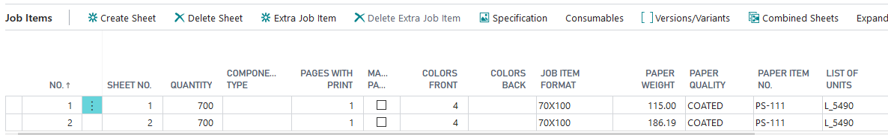
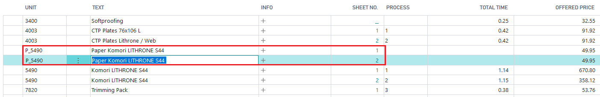
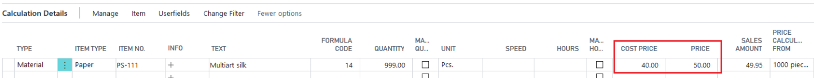

# Price List Prices for Paper based on Total Quantity of Sheets

## Price List Setup 

When using a PrintVis price list for paper (or any kind of item), PrintVis can total up the quantities for the entire job to select the correct price from the price list.

Example 1 (Job1V1)

- **Scenario:** 1 Poster (1 job item) with 999 paper sheets needed.
- **Price:** 60 per 1000 pcs.

 Example 2 (Job1V2)

- **Scenario:** 2 Posters (2 equal job items), each requiring 999 paper sheets, resulting in a total of 1998 sheets.

- **Expected Cost:** 40 per 1000 pcs.

 

**Result:** The price is 40 per 1000 pcs even if the line quantity is less than 1001 sheets.

## Options for Quantity Principle

The following options are available as Quantity Principles to group or total the quantities differently:

- **Only Current Line**
- **Same Item Number**
- **Same Operation on Cost Center**
- **Same Item and Operation Number**
- **Same Price List Code**
