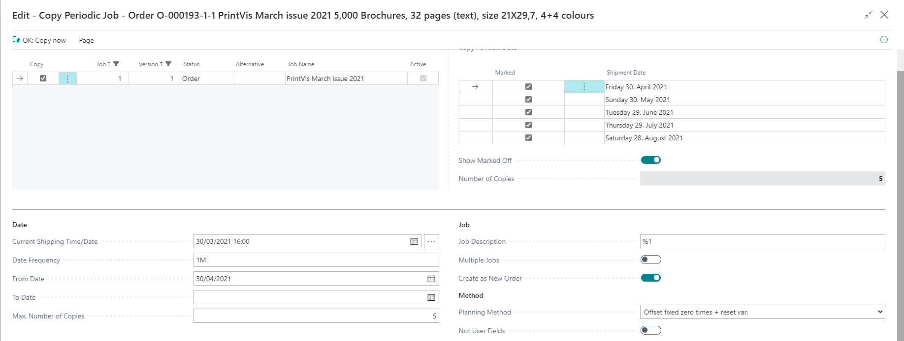
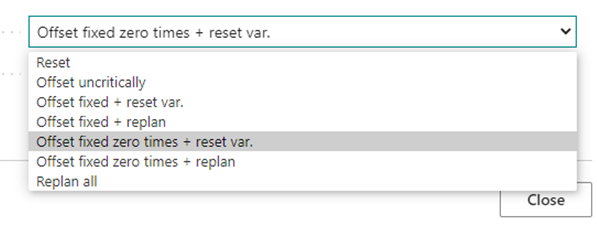

# Copying Periodic Job

## Copy Periodic Job

PrintVis offers an option to, once a Job has been fully estimated, prepared and scheduled, copy the job out into multiple new releases (new cases and jobs typically) — for example, for a Monthly issue of a magazine, etc.

The function is found from the **JobLine Actions** on the **Case Card** under 'Copy' → 'Copy Periodic Job'. Once opened, you will be required to fill in frequencies, etc.

Step 1: Select Job and Version
As your first entry, please fill in the 'Copy' field, which Job and Version from the current case you wish to copy out periodically.

### Date

Next, in the lower section, specify your required date frequency (standard Business Central date-format). Examples:

- `1M` = Monthly
- `3M` = Quarterly
- `2W` = Bi-Weekly

The list of release dates will update in the top right corner. Specifying a **To-date** or a **max. number of copies** will adjust this list accordingly.

### Job 
In the **Job Description** field, give a value for what you wish to have as the 'external description' for the copied cases. If you hover over the field caption, you will be presented with the options you have for variables.

Next, select one of the two options to either:

1. Create **Multiple Jobs** on the existing case, or
2. Create **New Orders/Cases** (most commonly used).

### Method
Select the **Planning Method** to apply to the new cases being created. The options are:

- **Reset**: Fully reset the planned dates (leaving all blank and unplanned).
- **Offset uncritically**: Move all planned dates the set number of days ahead, without regard to weekends or holidays.
- **Offset fixed + reset var.**: Move all fixed units forward the set number of days, and blank all variable planned units.
- **Offset fixed + replan**: Move all fixed units (typically Milestones) forward the set number of days, and replan all variable planned units based on when they can start the earliest, according to 'Shipment Date'.
- **Offset fixed zero times + reset var.**: Move all fixed units (without calculated time) forward the set number of days, and blank all variable planned units.
- **Offset fixed zero times + replan**: Move all fixed units (without calculated time) forward the set number of days, and replan all variable planned units according to their earliest start date.
- **Replan all**: Replan all according to 'Delivery Date', including milestones and fixed dates/times.

Mark the field **Not User Fields** active if you do **not** want to copy the values from **UserFields** to the new Cases/Jobs.

### To Copy
Press the action in the ribbon **'OK: Copy now'** to activate the creation of new jobs/cases according to the settings above.
