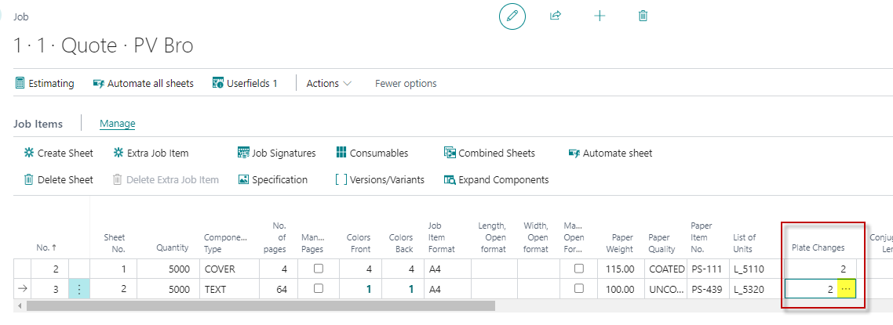
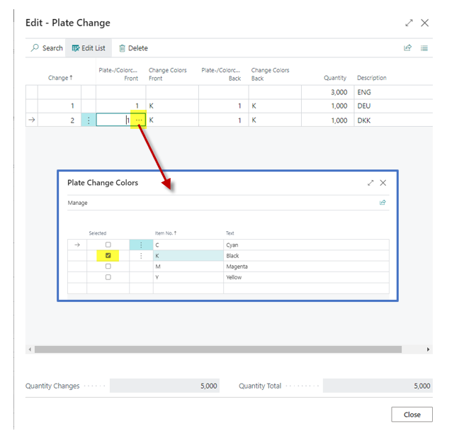
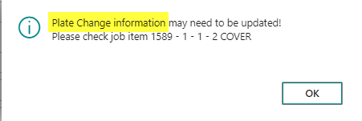

# Plate Changes

## Summary

Sometimes, it's necessary to provide printed materials for customers in multiple color or language versions. These versions are produced in one go using a uniform base, with changes made only to the plates.

This function is covered in the calculation process.

## Job Card

### To-Do's

For each job item that requires one or more plate changes:

1. Enter the number of plate changes and leave the field.
2. Re-enter the field and press the three dots to open the "Edit - Plate Change" page.

## Plate Change

### To-Do's

1. Enter the number of plate changes and leave the field.
2. Press the three dots to open the "Plate Change Color" page.
3. Choose the colors that will be changed.
4. Enter the quantity and description per line.

### Fields

| Field                      | Description                                                                                         |
|----------------------------|-----------------------------------------------------------------------------------------------------|
| **Change**                 | A system primary key for the Plate Change. Lines are created based on the number of plate changes entered. The first line remains empty for the initial plate set quantity. |
| **Plate-/Colorchange Front** | Enter the number of plates that need to be changed on the front side of this plate change. This will be considered in the plate calculation. |
| **Change Colors Front**    | Displays the colors that need to be changed on the front side of this plate change. Colors are selected using the Plate-/Colorchange Front field. |
| **Plate-/Colorchange Back** | Enter the number of plates that need to be changed on the back side of this plate change. This will be considered in the plate calculation. |
| **Change Colors Back**     | Displays the colors that need to be changed on the back side of this plate change. Colors are selected using the Plate-/Colorchange Back field. |
| **Quantity**               | Enter the quantity for the actual plate change line. The page will show a total of all plate change lines to compare with the job item quantity. The total quantity must equal the job item quantity. |
| **Description**            | Enter a description for the actual plate change line, e.g., English Version, German Version, etc. |
| **Quantity Changes**       | Enter the quantity for the actual plate change line. The page will show a total of all plate change lines to compare with the job item quantity. The total quantity must equal the job item quantity. |
| **Quantity Total**         | Shows the total quantity of this job item.                                                          |

## Change Job- / Job Item Quantity

If you change the job quantity or job item quantity, a message will prompt you to verify the plate change quantity.

