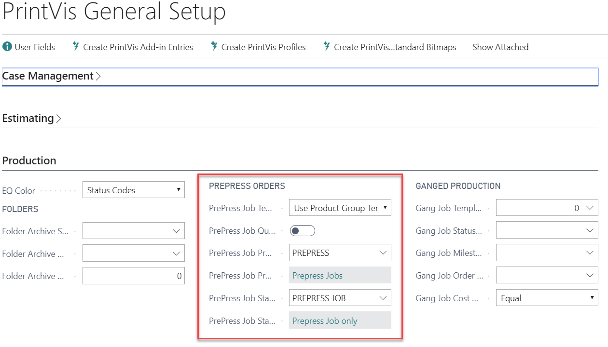
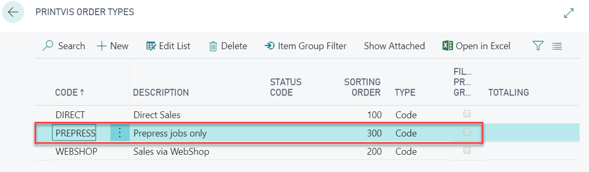
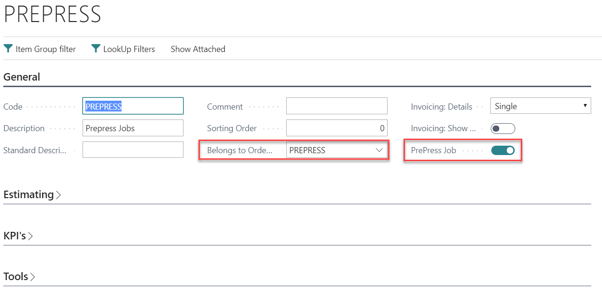
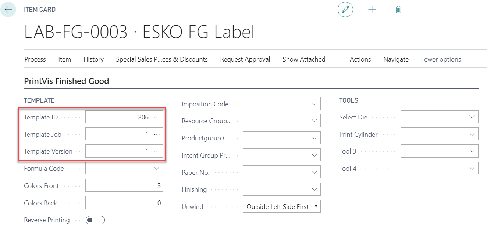
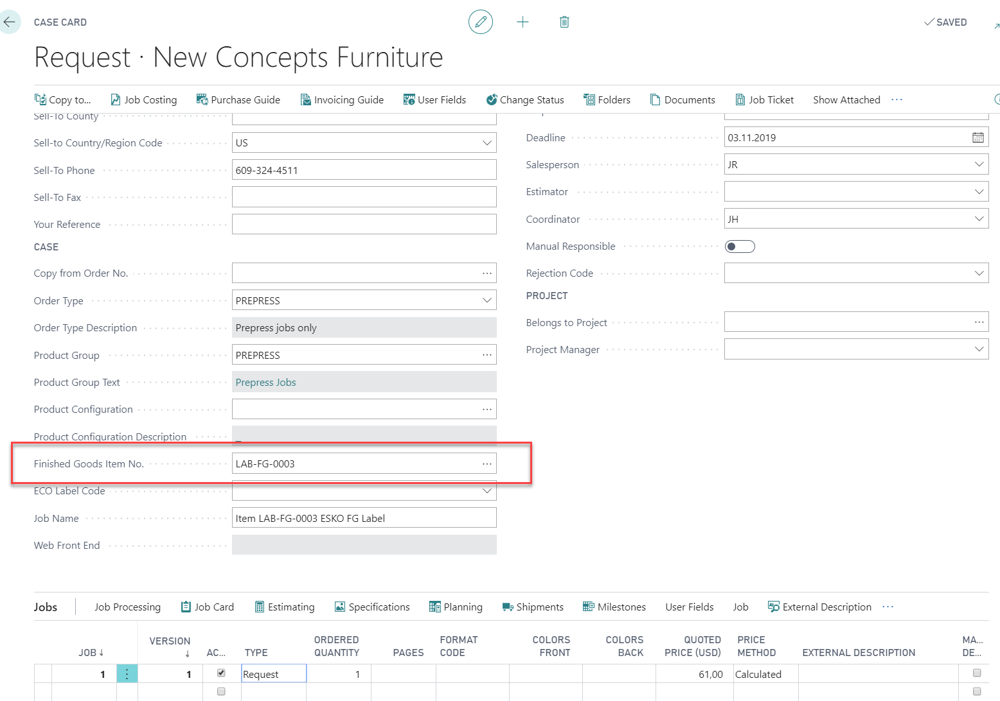
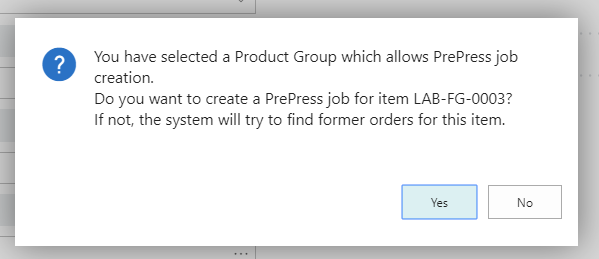
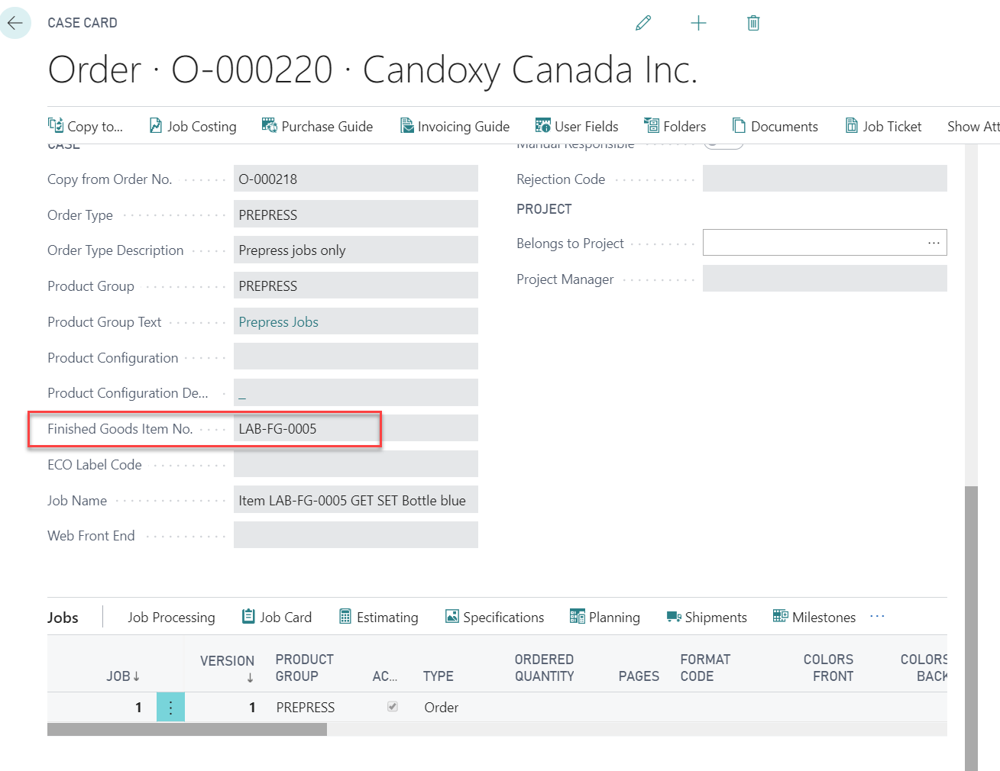
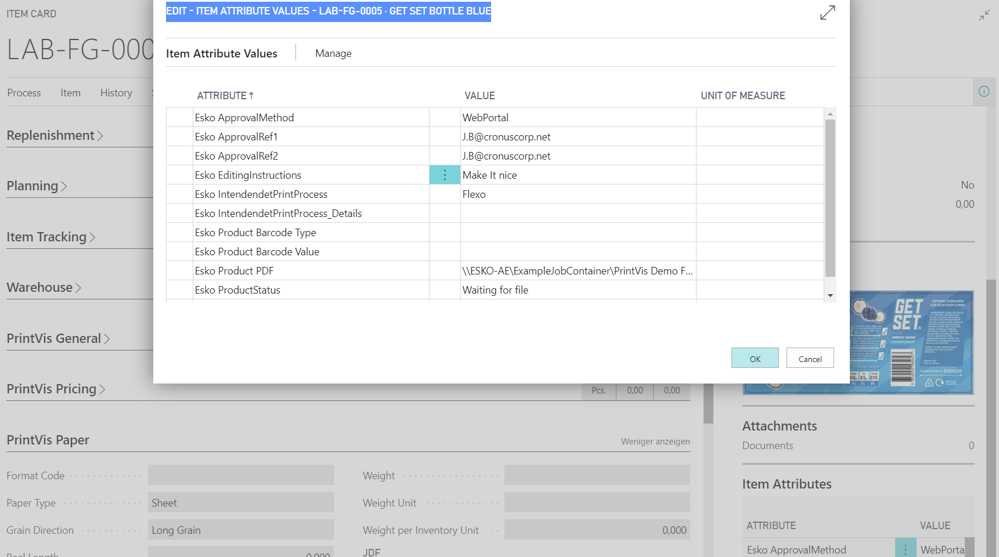
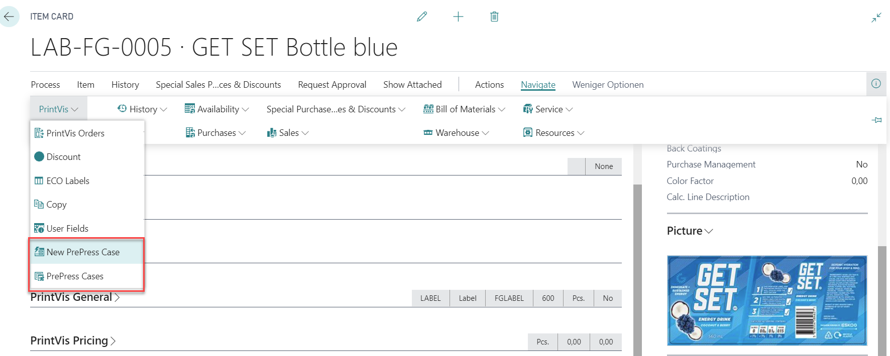

# PrintVis Prepress Orders

## Introduction

PrintVis Prepress Orders are a special class of order that do not involve any actual print production. They encompass all the initial processes leading up to customer proof approval and support integration with JDF workflow partners.

Creating a Prepress Case involves selecting a Finished Goods item with one of the following options:
- A **Product Group template**
- An **Item template** (Finished Goods Item)
- Copying a job from a preexisting Prepress Order for the same Item

A Prepress Order typically has a different Status Code workflow compared to a print production case, which can be initiated by a specific Order type.

All other functionalities are based on case/estimation/planning/job costing/invoicing and related processes.

## Setup

### PrintVis General Setup

In the **Prepress Order** tab, the following fields can be configured:

 PrePress Job Template Settings

| Setting                         | Description |
|----------------------------------|-------------|
| **PrePress Job Template Usage**  | Options for how PrePress job templates are created:    - **Use Product Group Template**: The Product Group Template will be copied for the Prepress case.   - **Use Item Template**: The Item Template will be copied for the Prepress case.   - When selecting the Finished Goods item on the Case Card, there is also an option to choose a previously created job instead of a template for the new Prepress case. |
| **PrePress Job Quoted Price = 0** | Enables a fixed quoted price of 0 for Prepress jobs. Useful for companies that do not charge customers for initial Prepress PDF creation. |
| **PrePress Job Product Group**   | Select the Product Group used to identify Prepress cases/orders. Only these will be affected by the "Quoted Price = 0" option. |
| **PrePress Order Status Code**   | Required only in a JDF workflow setup. Specifies the Status Code that triggers sending a Prepress JDF to the workflow partner. This is necessary if the JDF is not triggered directly from the Case Card. |

### Order Type Setup

This setup is necessary for Prepress Orders only if a special Status Code workflow is required.

### Product Group Setup

The Product Group indicates that a Case with this group attached is a Prepress Order.

If a PrintVis Order Type is set up for Prepress Orders, select this Order Type in the field **Belongs to Order Type**. If this Product Group is the only one associated with the Order Type, the Product Group is automatically added to the Case Card after selecting the Order Type.

### Prepress Order Status Code Workflow

The status code workflow must be configured in Responsibility Areas and Planning Units.

## Prepress Order Creation

### From Item Card

1. Ensure the item includes a template ID/Job/Version with a production or prepress calculation (see Prepress Template setup).

2. In the **Finished Goods** tab, tick the field **Reverse Printing** if the item is printed on the back side (reversed) on a transparent substrate.

### Creating a Prepress Case

#### From Case Card

1. Create a case as usual and select a product group set up for prepress jobs.
2. Select a finished goods item.

   A dialog will appear:
   

- **Yes**: The template from the item or product group will be copied and created as a new job on this case.
   - **No**: Existing jobs created for this item number will be listed to copy and create an existing job as a prepress case.

3. A JDF will be created and sent to the Esko Automation Engine when changing to the ESKO prepress Status code.
4. Item attributes will be exchanged and updated by the JMF response from ESKO.
5. A new job (the copy of the selection above) is added to the case. Enter a job name, and the case is now ready for further use.

   The **FactBox** of the finished goods item can be displayed as a FactBox on the case card. It primarily stores information relevant to JDF integration.

6. The item card of the selected item can be opened directly from the case card using the action: **"Finished Goods Item"**.

#### From Item Card

In the item card, there are actions to create a new prepress case and view existing prepress cases for the item.

