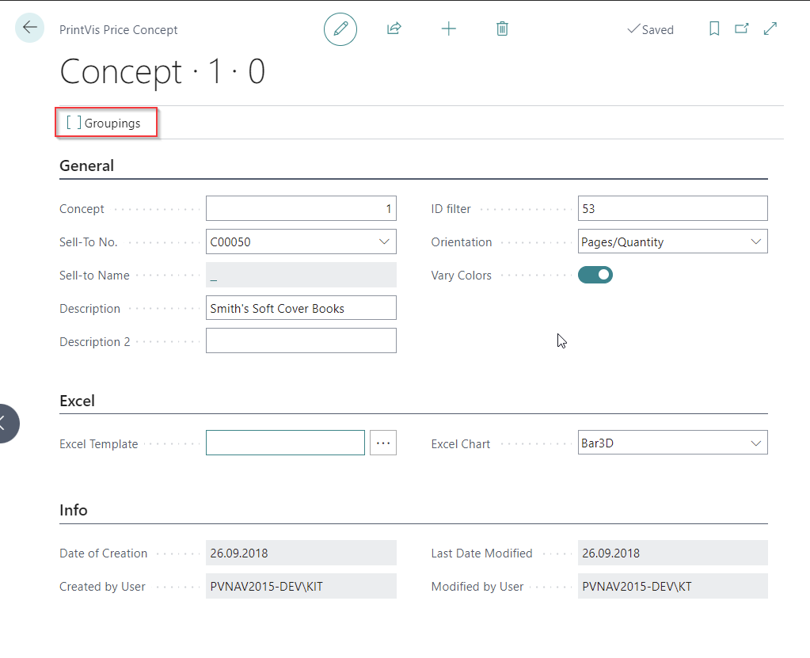
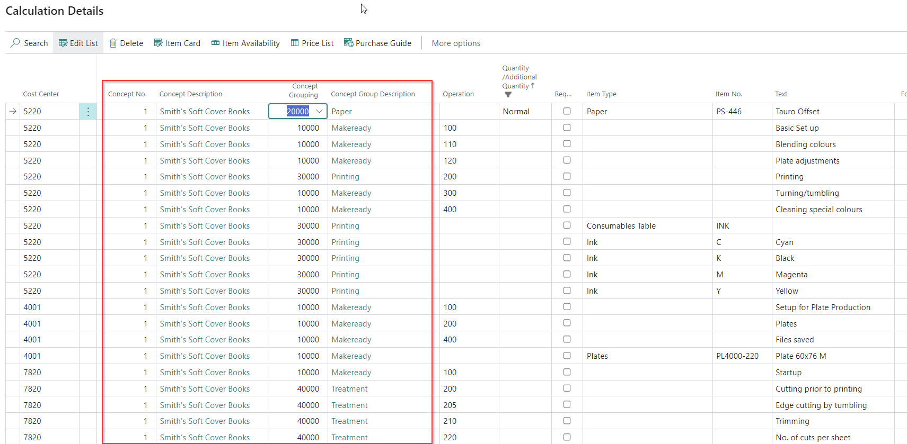

# Price Concept

Basically the 'Price Concept' is build to accommodate functionality towards 'Tenders', so where you have to split prices into multiple bits and parts, for a range of different variations of quantities and #pages.

## Price Concept in PrintVis

The **Price Concept** is designed to accommodate functionality related to **Tenders**—scenarios where prices need to be split into multiple parts for a variety of quantity and page variations.

### Structure of the Price Concept

Once you build a concept or tender, you subcategorize which **bits and parts** your quote must be split into.  
For each subcategory, you determine how it is priced by selecting a method under the **Price Concept Groupings** (field: `Price Method Group`), such as:

- Calculated  
- Contribution Ratio  
- Profit  
- Mark-Up  
- Other pricing models

### Example Groupings

Groupings can vary depending on complexity. Examples include:

**Detailed groupings:**

- PrePress  
- PreFlight  
- Plate Production  
- Paper  
- Print Setup  
- Print Production  
- Finishing  
- Shipping  

**Simplified groupings:**

- PrePress  
- Paper  
- PressRun  
- Finishing  

You can freely define the groupings as needed for the specific tender or customer case.

### Building a Concept

On the **Concept** page, set a filter of **Case IDs** to include in the tender using the `ID Filter` field (see screenshot if available).

### Workflow per Case ID

1. Start with a **base version** of the job.
2. Create the required **estimation**.
3. Once all processes are completed, open the **Calc Lines** / **Calculation Details** page.
4. Apply the following line by line:
   - `Concept Number`
   - `Concept Grouping`

This information is copied forward when you create a new version. You only need to:

- Adjust the **quantity** and/or **number of pages**
- Let residual sheets be created automatically
- Update the new Calc Lines with the appropriate `Concept No` and `Concept Grouping`

### Final Output: Price Matrix

Under **Navigate** on the Concept page, once everything is finalized, open the **Price Matrix** to view the tender:

- By quantity  
- By number of pages  
- Split by Concept Grouping

### Purpose

The output is often used to generate a **custom report** for the customer.  
This can be used as a **price grid**, often forming the basis for a **long-term agreement**.

Under 'Navigate' on the Concept itself, once all the rest has been finalized, you can then open the 'Price Matrix' to see the entire tender by quantity and #pages, split per grouping.

The output is often used as a custom report for a customer to build a price grid that can be used as based for a long term agreement.
