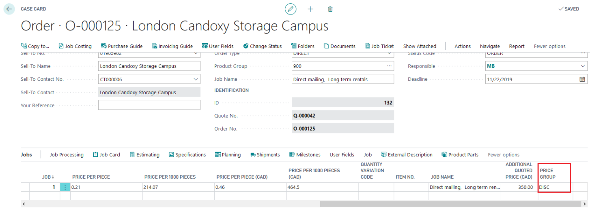

# Price Group Setup

## Summary

Price Groups allow for adjusting pricing through fixed price steps instead of entering individual sales prices. They are set up and utilized within Price Lists.

## Setup

- **Recommendation**: It is advisable to set up a line without a specific group attached to represent an average value. This allows for automatic calculation without needing to select a specific group.

## Usage

Price Groups can be selected in two ways:

1. **Globally for the Job**:
   - Affects all price lists that include the selected group.

2. **For a Specific Price/Calculation Unit**:
   - Only impacts the selected Price/Calculation Unit.
   - The selection is limited to Price Groups used in the price list attached to this Price Unit.

### Price Group Selection on Job

- Allows global application across all price lists containing the selected group.

### Price Group Selection on Calculation Unit

- Only displays Price Groups that are active in the attached price list.
- Example: Only groups like DISC and HEAVY are available for selection if they are the ones in use in the price list setup.

