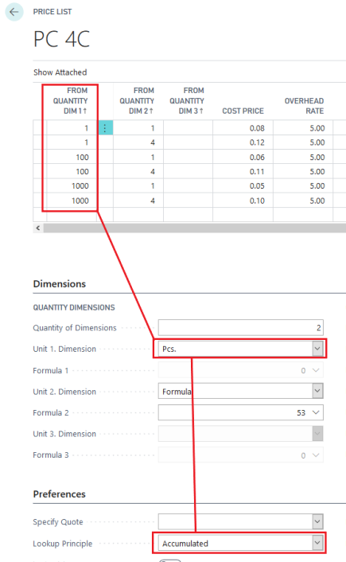

# Price List Setup

## Example

- **Cost**: 40 per 1000 pieces (even if the line quantity is less than 1001)
- **Price**: 60 per 1000 pieces

## Setup

### General

1. **Code & Description**: Set up a code and description for the Price List.
2. **Vendor Selection**: Choose a vendor and set the Type to "External."
   - **External**: Overrides price list selections on Graphic Item Cards.
   - **Internal**: Prioritizes price list look-ups regardless of item card details.
3. **Cost Center**: Optionally select a cost center to restrict the price list's applicability.
4. **Total Amount**: State a total amount for the price list, often used for subcontracting.
5. **Ordering Unit**: Define the unit for ordering (e.g., Pcs., Kg., Square meters).

### Dimensions

Via the Dimensions tab, you set up which dimensions must apply to the price list. It is possible to indicate up to 3 optional dimensions in addition to the dimensions which may be selected as fixed dimensions in the right-hand side of the window.

In the Quantity of Dimensions field, you indicate how many dimensions must apply to the price list and from the field; you open fields to indicate the selected number of dimensions - dimensions 1, 2 and 3, respectively. By a look-up in the Unit Field per Dimension, you choose how the unit is to be calculated.

| Dimension       | Description                                                                                                                                   |
|-----------------|-----------------------------------------------------------------------------------------------------------------------------------------------|
| **Pcs.**        | The dimension depends on the number and is calculated on the basis of the number of pieces.                                                  |
| **1000 pieces** | The dimension depends on the number and is calculated on the basis of the number of 1,000 pieces.                                            |
| **Kg.**         | The dimension depends on the number of kilograms. This dimension is often used for paper price lists where the grading is made by kilo intervals. |
| **Square meters** | The dimension depends on the number of square meters. This is often used for varnishing, lining, and similar tasks where the total area determines the price. |
| **Meter**       | The dimension depends on the number of meters. This is used for calculations, e.g., rotary jobs or subcontracting based on running meters.    |
| **Hours**       | This dimension depends on the number of hours, i.e., the calculated time of an operation.                                                    |
| **Formula**     | Selecting this dimension opens a field to the right where you can choose a calculation formula to determine the unit by looking it up.        |

### Columns

- Set up to 9 column titles for exporting price lists to Excel.

### Preferences

| Field/Option                | Description                                                                                                                                                                                                                   |
|-----------------------------|---------------------------------------------------------------------------------------------------------------------------------------------------------------------------------------|
| **Specify Quote**           | Choose how much of the price list must be specified in quotes formed on the basis of the price list:                                                                                  |
|                             | - **Blank**: Nothing is specified.                                                                                                                                                    |
|                             | - **Additional Quantity**: The Additional Quantity unit price is specified in the quote.                                                                                             |
|                             | - **Entire Price List**: The entire price list is specified in the quote.                                                                                                            |
|                             | This function is rarely used; **Blank** is often selected.                                                                                                                           |
| **Look-up Principle**       | Choose if the price is calculated based on a Linear or Accumulated price look-up:                                                                                                    |
|                             | - **Linear**: Looks up the price for the grading that corresponds to the number.                                                                                                     |
|                             | - **Accumulated**: Sums up the price so that the total price is an average of several calculations.                                                                                   |
|                             | Example for 15 pcs. using a price list:                                                                                                                                            |
|                             | From Quantity | Price                                                                                                                                                               |
|                             | 1             | 10.00                                                                                                                                                               |
|                             | 5             | 8.00                                                                                                                                                                |
|                             | 10            | 7.00                                                                                                                                                                |
|                             | Total price = **DKK 122.00**                                                                                                                                                       |
| **Last = Max**              | The last line in the price list equals the maximum load for the service, regardless of whether the price list is linear or accumulated.                                              |
| **Quantity Principle**      | Indicates how the price calculation is performed. Options include:                                                                                                                  |
|                             | - **Only current line**: Individual price look-up for each occurrence in the calculation.                                                                                            |
|                             | - **Same item number**: Price look-ups are based on the total quantity of the item number calculated for a job.                                                                      |
|                             | - **Same operation on cost center**: Summed up on calculation details with the same operation number and cost center.                                                                |
|                             | - **Same item and operation number**: Summed up based on calculation details with the same item and operation number.                                                                |
|                             | - **Same price list code**: Summed up based on all calculation details performing look-ups in the price list.                                                                        |
| **Special Calculation**     | Select **Blank** or **Price=Input factor** where the input factor can be stated in the Calculation window. This enables manual control of the price look-up.                         |
| **Fixed Additional Quantity Price** | Calculates additional quantity prices based on the same price look-up as the main quantity. Useful for paper price lists to avoid negative additional quantity prices.                                    |
| **Min. Cost Price**         | Indicates a minimum cost price for the price list, regardless of calculated line values.                                                                                             |
| **Max. Cost Price**         | Indicates a maximum cost price for the price list, regardless of calculated line values.                                                                                             |
| **Min. Price**              | Indicates a minimum price for the price list, regardless of calculated line values.                                                                                                  |
| **Max. Price**              | Indicates a maximum price for the price list, regardless of calculated line values.                                                                                                  |
| **Format Type**             | If the price list depends on format, select the format indication for the calculation. Options include:                                                                              |
|                             | - **Blank**: Price list does not depend on format.                                                                                                                                   |
|                             | - **Job item format**, **Printed sheet format**, **Paper sheet format**, **Plates**, **Film**, 
| **Sliding formats**.                            | If a format type is selected, the system can find the nearest larger format if the exact format does not exist in the price list. |                                                   If a format type is selected, the system can find the nearest larger format if the exact format does not exist in the price list. |                                                 

When you are using a price list from one of your paper vendors while quoting a job which has multiple versions, PrintVis is able to sum up the required quantities for the entire job to select the best price – both from an internal cost perspective and for a more competitive bid. Let’s look at the PrintVis setup inside Microsoft Dynamics 365 Business Central.

## Price List Setup

- **Example 1**: For Job 1, Version 1 (1 poster requiring 999 sheets) 

The cost is 60 per 1000 sheets.

- **Example 2**: For Job 1, Version 2 (2 posters, each requiring 999 sheets), the total is 1998 sheets 

resulting in a cost of 40 per 1000 sheets.

## Accumulating Price List

- **Lookup Principle**: If set to "accumulated," the first dimension must be Quantity.

**Note**: Price lists can be used for various items and services, not just paper.

