# PrintVis Pricelist import and export

## Introduction

You can import vendor price lists from Excel spreadsheets using the **PrintVis Import Setup List** page. This feature allows you to create new items, update existing items with new prices, and block discontinued items. You can also import price lists with different pricing methods (e.g., kg, lbs, 1000 pcs, Boxes) and associate them with specific vendors.

## Setup

1. **Access the Setup**:
   - Search for `PrintVis Import Setup List`. If not found, try searching `Pricelist import`.

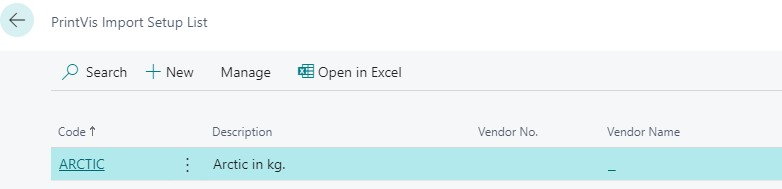

2. **Create or Edit**:
   - Click **Create** to start a new setup or **Edit** to modify an existing one.

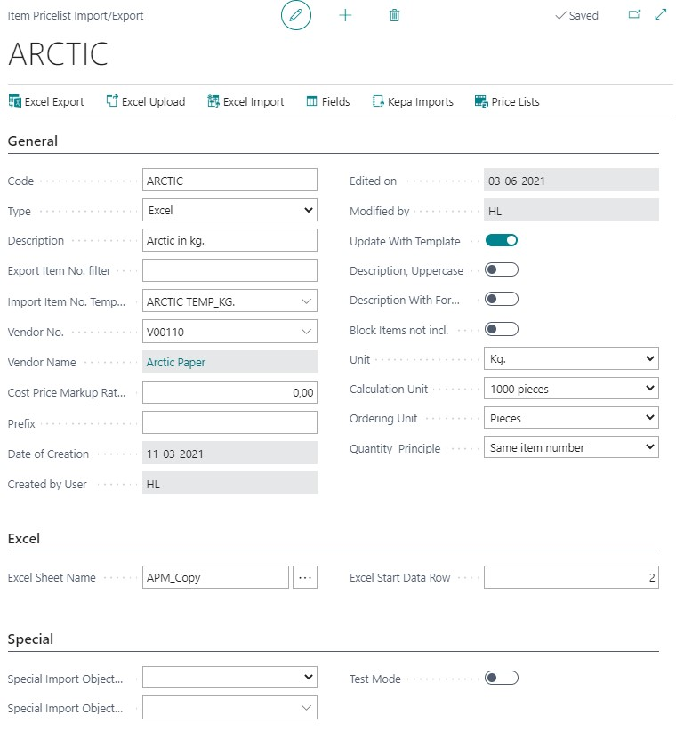

| **FastTab**   | **Field**                     | **Description**                                                                                                                                                                                                                                                                                                                                                   |
|---------------|-------------------------------|-------------------------------------------------------------------------------------------------------------------------------------------------------------------------------------------------------------------------------------------------------------------------------------------------------------------------------------------------------------------|
| General       | Code                          | Type in a Code                                                                                                                                                                                                                                                                                                                                                   |
|               | Type                          | Excel or Kepa (For Kepa see another Article)                                                                                                                                                                                                                                                                                                                     |
|               | Description                   | Type in a description                                                                                                                                                                                                                                                                                                                                           |
|               | Export Item No. filter        | Filter to specify exactly which items are to be included in the export                                                                                                                                                                                                                                                                                          |
|               | Import Item No. Template      | The Import Item No. Template can be selected from the Item table. When the Import is used to create Items from, the selected Template is used to fill in information not given by the Excel Import, such as for example posting Setup, Base Unit of Measure, Unit of Measure, Item Quality and/or Item Type Code. Templates should be created to be just templates. |
|               | Vendor No.                    | Select from the Vendor table                                                                                                                                                                                                                                                                                                                                    |
|               | Cost Price Markup Ratio       | If you require a "MarkUp" added from the CostPrice which should filled in on the PriceList for the Items, please write the required % in this field. However, we recommend that you use Page PrintVis Additional Rate Groups for this, as updating will be easier.                                                                                                |
|               | Prefix                        | If you require a Prefix given to all the Item Numbers being created. For example; Papyrus = Prefix "P"; Stora Enzo = Prefix "SZ"                                                                                                                                                                                                                                 |
|               | Update With Template          | Yes or No. If all Items are to be updated with the current selected Template, please tick this field to indicate so.                                                                                                                                                                                                                                            |
|               | Description, Uppercase        | Yes or No. If ticked, all Item-Description will be made in capital letters                                                                                                                                                                                                                                                                                       |
|               | Description With Formats      | Yes or No. If ticked, Items-Description will be made of the actual description followed by "format 1 x format 2", where format 1 will describe the papergrain direction                                                                                                                                                                                          |
|               | Block Items not incl.         | Yes or No. If ticked, Items from Vendor that were not found in the Excel sheet will be blocked in PrintVis                                                                                                                                                                                                                                                       |
|               | Unit                          | Select from dropdown the Unit, in which the prices are stated in the Price List                                                                                                                                                                                                                                                                                  |
|               | Calculation Unit              | Select from dropdown the Unit you wish to use in the Estimation when using these items                                                                                                                                                                                                                                                                           |
|               | Ordering Unit                 | Select from dropdown the Unit you are to use when purchasing the items                                                                                                                                                                                                                                                                                          |
|               | Quantity Principle            | Select from dropdown. Often paper prices have different steps, so the more you purchase the cheaper the price per unit.                                                                                                                                                                                                                                         |
| Excel         | Excel Sheet Name              | Show the Excel Sheet Name. Choose the Excel sheet at the 3 dots                                                                                                                                                                                                                                                                                                  |
|               | Excel Start Date Row          | Enter in which Row in Excel is the starting row for date                                                                                                                                                                                                                                                                                                        |
| Special       | Special Import Object Type    | Use if a special function has been developed specifically for your company                                                                                                                                                                                                                                                                                       |
|               | Special Import Object ID      | Use if a special function has been developed specifically for your company                                                                                                                                                                                                                                                                                       |

### Fields 

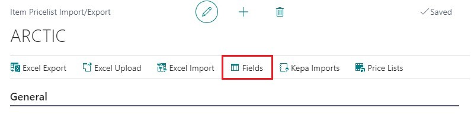

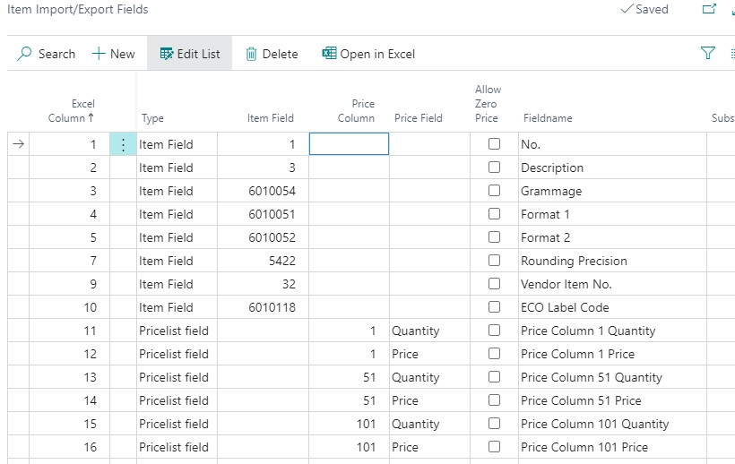

| **Field**         | **Description**                                                                                                                                                                                                                                   |
|--------------------|---------------------------------------------------------------------------------------------------------------------------------------------------------------------------------------------------------------------------------------------------|
| Excel Column       | Inset column number to read from. The Columns are defined in numbers, so column A = 1, B = 2, C = 3, etc.                                                                                                                                         |
| Type               | Item Field: Use if this column must be imported to the Item Card Pricelist field: Use if this column must be used on the pricelist                                                                                                             |
| Item Field         | If Item Field was selected in the "Type", please select the exact field from the Item Table the column represents. By looking up into the field, a full list of Item Fields are displayed.                                                        |
| Price Column       | If Pricelist Field was selected as "Type", please enter which Price Column in the Pricelist the current Excel-column represents.                                                                                                                  |
| Price Field        | Each set of PriceList consist of a (from) Quantity, then a Price for that quantity-interval, and perhaps a description to the Price Column. Please select from dropdown.                                                                          |
| Allow Zero Price   | Yes or No.                                                                                                                                                                                                                                       |
| Fieldname          | Show the selected fieldname (Item- or Price Field).                                                                                                                                                                                              |

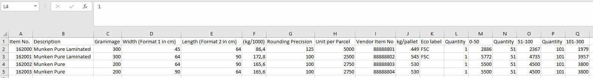

**Note**: Ensure the quantity column is before the price column in the Excel file for proper import functionality.

## Selecting Excel Spreadsheet

1. **Click on the 3 dots** to select the Excel spreadsheet.

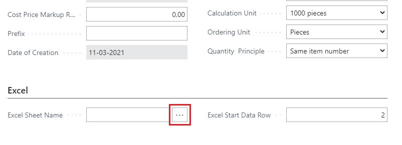

2. **Enter the Start Date Row** in the Excel file.

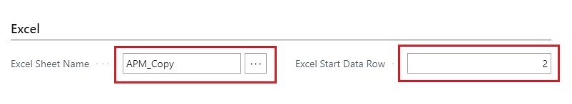

## Import

1. **Review the Setup**: Double-check the setup parameters.
2. **Click "Excel Import"** in the ribbon to start the import process.

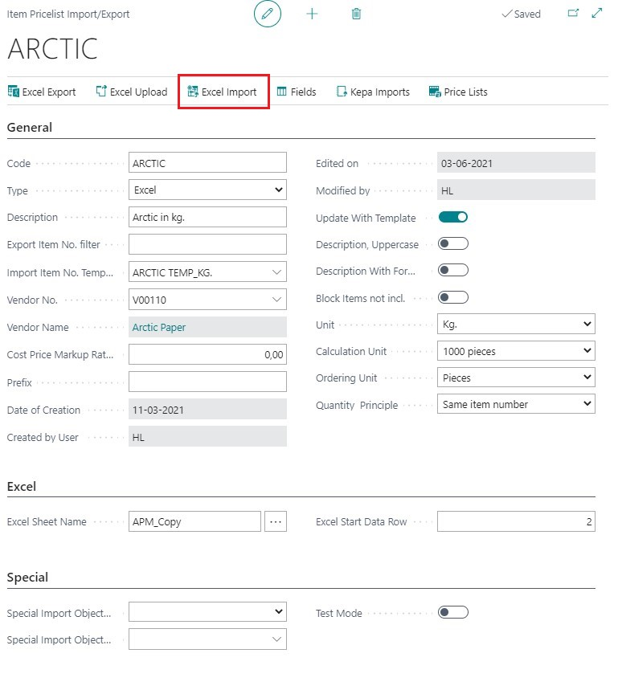

## KEPA Pricelist Import

1. **KEPA File**: Use XML format for more detailed information than Excel or CSV files.

## Build KEPA Header: 
Set up the import header in the **Item Pricelist Import/Export** page.

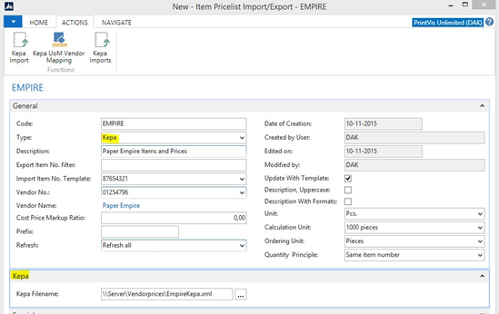

3. **Mapping Table**:
   - **Kepa UoM Vendor Mapping**: Map KEPA units to PrintVis base units and specify the ordering unit.

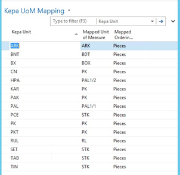

### Result

- New items are created if they don’t exist.

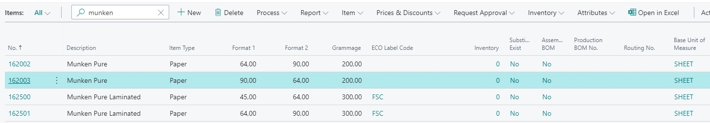

- Existing items' price lists are updated.

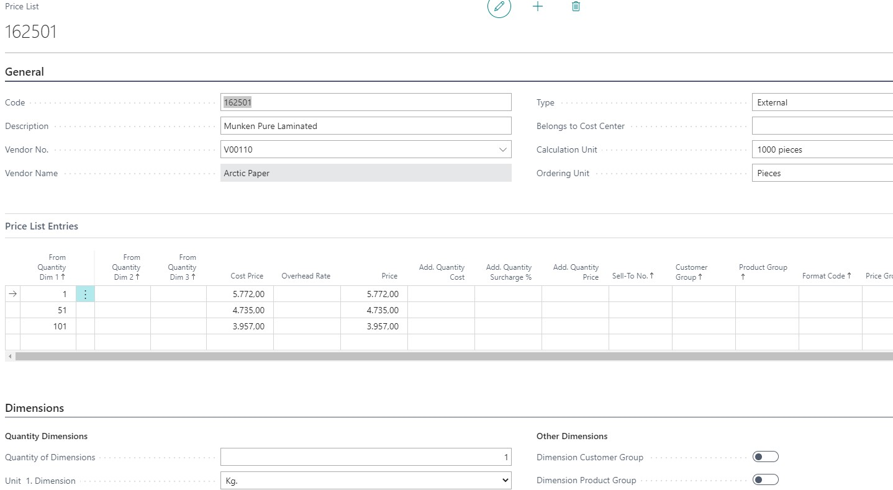

- Discontinued items can be blocked as needed.

