# Process Flow / Process Groups

## Summary

To accurately calculate scrap on a job in PrintVis, the process flow must be correctly set up, as quantities from preceding processes also impact the calculation.

## Show PrintVis Process Flow

- **Estimating Page**

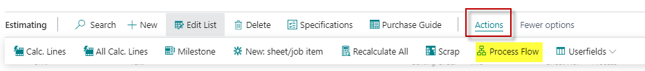

- **Specification Page**

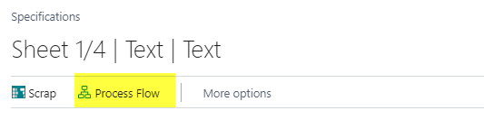

 Example

The process flow for a product could look like this:

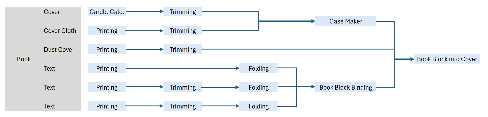

1. After entering the individual calculation units, the process flow is constructed based on the "Sorting Order" field only.

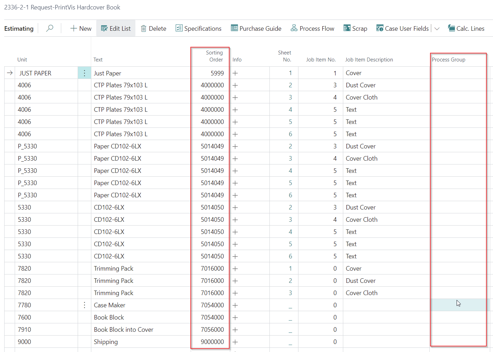

2. The process flow may appear incorrect if PrintVis lacks the necessary Process Group information.

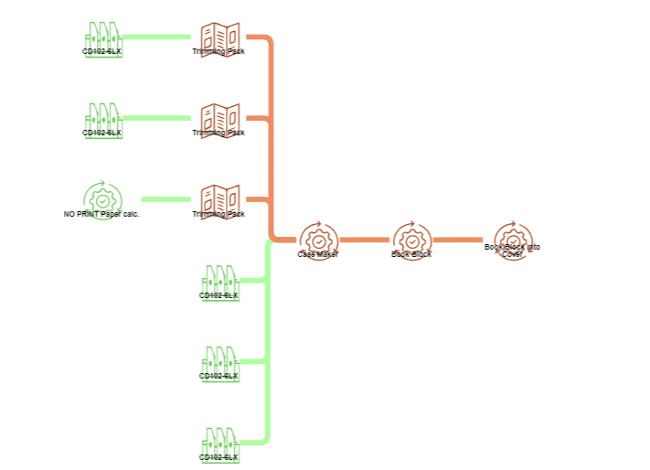

### Process Flow by Using the Process Group Field

The process flow can be corrected by using the "Process Group" field. Related processes are grouped together, and within a group, the "Sorting Order" field defines the sequence of processes.

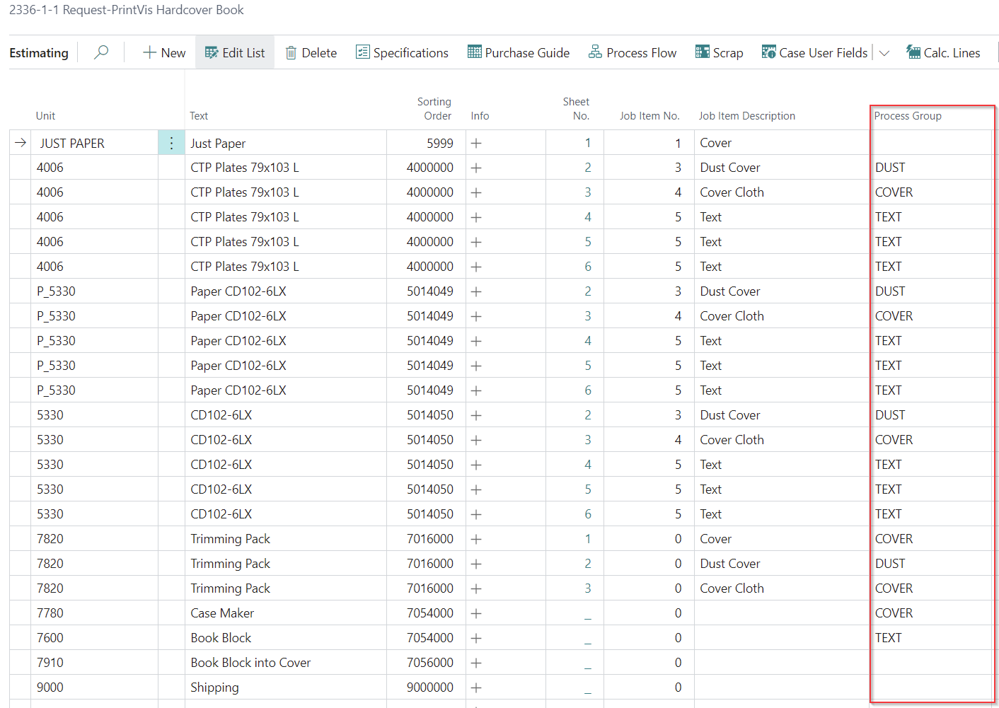

- **Desired Process Flow:** Corrected by grouping processes and defining the sequence within each group.

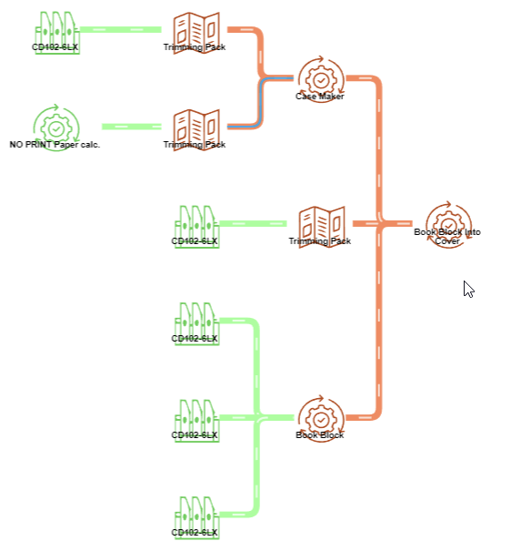

**Note:** Changing the process flow via the Process Group will NOT affect planning units, which will continue to be planned based on Sorting Order in Estimating. The primary impact of the Process Group setting is the accurate scrap calculation for each process.

#### Bypassing a Process in Final Finishing

Another option when using the **Process Group** field is to bypass a process within a sheet.

In more complex products, the next process in the calculation is not always just the next one on the same sheet, or not all sheets are assembled with the same finishing process. The **PrintVis process groups** provide functionality that allows the user to modify the process flow and point to specific successors.

---

 Example:

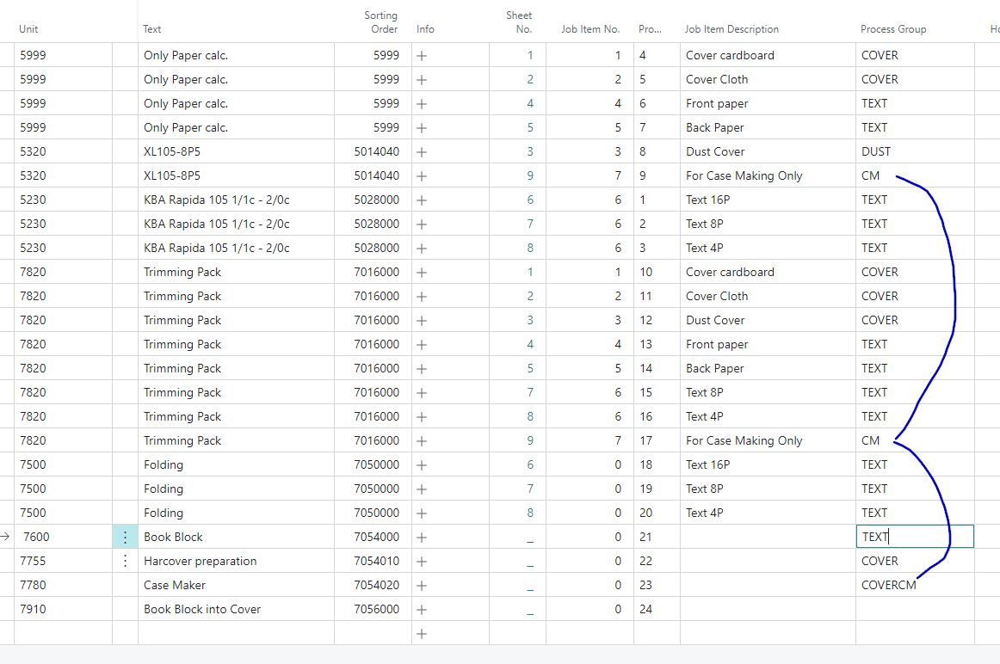

- All parts with the process group **COVER** will be assembled in the final finishing (no sheet-related finishing) **"Hardcover preparation"**.
- All parts with the process group **TEXT** will be assembled in the final finishing (no sheet-related finishing) **"Book Block"**.
- Sheet 9 **"For Case Making Only"** with the process group **CM** will be assembled in the final finishing (no sheet-related finishing) **"Case Maker"**, because the process group **COVER** and **CM** are added to **COVERCM**.
- The assembly of all existing parts is now only on the process **24 "Book Block into Cover"**, because no more process group is keeping any other part together.
- In this process, the process groups **COVERCM**, **TEXT**, and **DUST** are merged.

---
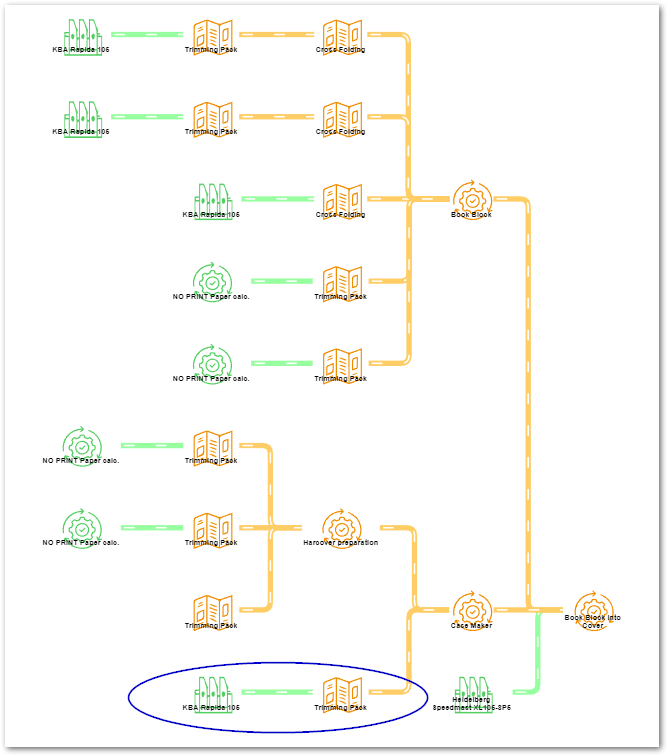

#### Functional Description of PrintVis Process Groups

PrintVis tries to find the next process for the current one, to link the current with the next.

- If no process group is entered, the next process is simply the next one in the same sheet, and all sheets are assembled in the first **non-sheet-related** process.

- If a **Process Group** is entered, PrintVis can find the next process by filtering on the current process group, surrounded by the wildcard `*`.

 Example:

- **Process group = CM**  
  The filter to find the next process is built like this:  
  `*CM*|""`

  _In words:_ Find the next process that contains the current process group **CM**, or where the process group is blank.

### In the example above:

- The successor of process no. **9** is process no. **17**: Process group **CM → CM**.
- The successor of process no. **17** is process no. **23**: Process group **CM → COVERCM**.

## Additional Process Information

Clicking the text in one of the process icons displays additional information for that process.

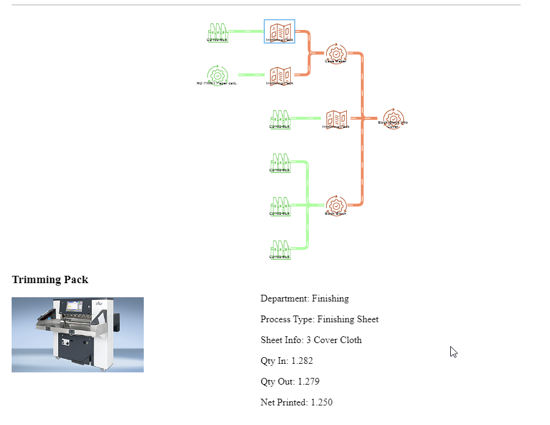

Additional Information

| Description    | Information                                                                                  |
|----------------|----------------------------------------------------------------------------------------------|
| **Department** | Displays the description for the department of the selected process.                        |
| **Process Type** | Displays the process type of the selected process.                                          |
| **Sheet Info** | Displays the Job Item Description of the selected process.                                  |
| **Qty. In**    | Displays the quantity including scrap before the selected process (includes scrap for this and following processes). |
| **Qty. Out**   | Displays the quantity including scrap after the selected process (includes scrap for following processes). |
| **Net Printed** | Displays the net quantity for the current process.                                           |

## Setup for the Icons and Cost Center Pictures

- The icon for the diagram and the cost center picture for additional information can be set up on the related cost center.
- Select an option in the "Picture Flow" field that best fits the type of cost center. A specific icon for each option will be displayed on the Process Flow diagram.
- Import a picture for the cost center into the fact box on the right. This picture will be displayed in the "Additional Process Information" section for this cost center.

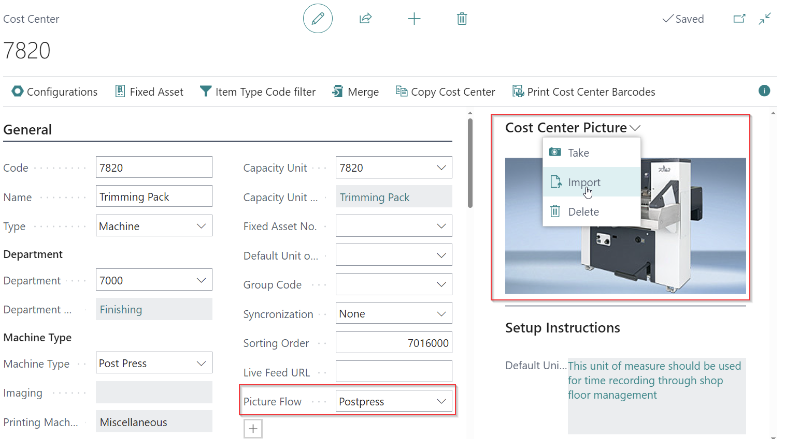

