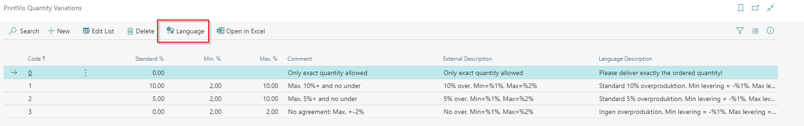
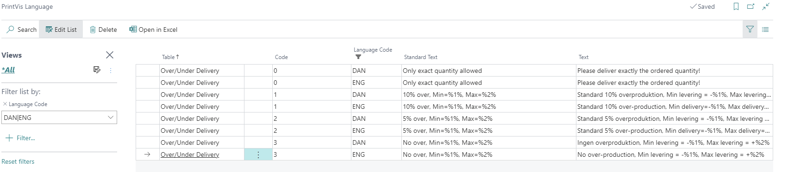
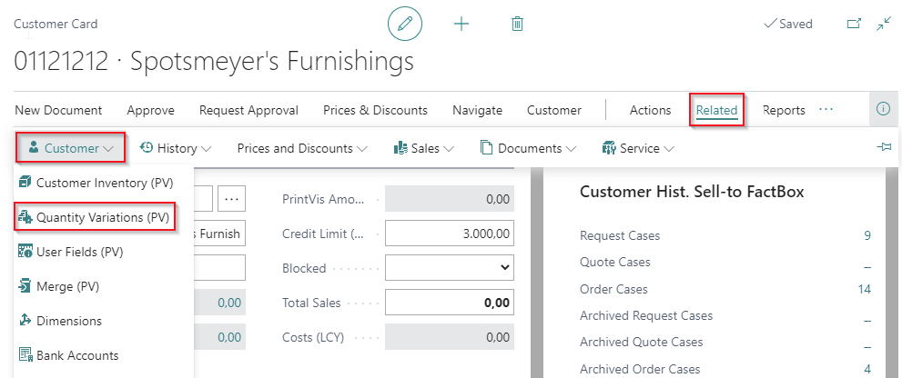
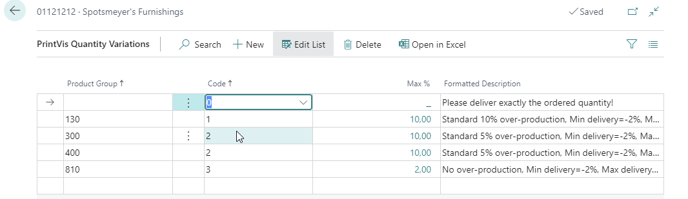
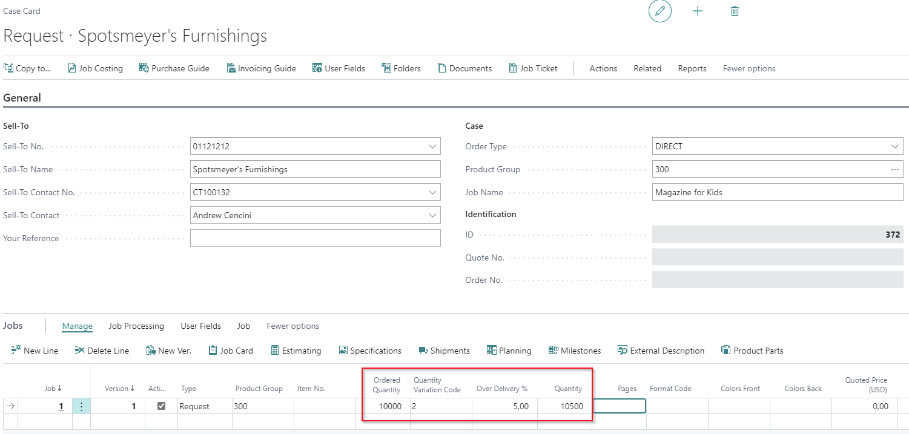

# PrintVis Quantity Variations and Over Delivery of Printvis Jobs

## Introduction

With Quantity Variations, you can set up allowed/agreed over and under deliveries. 

A standard percentage can be applied to the job in every case, and there is information available for acceptable over-delivery for each case. A presetting can be made for each customer.

Information about over and under delivery can also be printed on quotes, order confirmations, and invoices. Language support is available for this purpose.

By using over and under delivery, PrintVis calculates the production quantity.

## Quantity Variations Setup

Available Fields

| Field                  | Description                                                                                                   |
|------------------------|---------------------------------------------------------------------------------------------------------------|
| **Code**               | Identification field for the Quantity Variation. Maximum length is 20 characters.                           |
| **Standard %**         | Standard percentage used as the over-delivery percentage on the job of a case.                               |
| **Min. pct.**          | Minimum percentage used in the PrintVis Sales Order Integration (Additional BC Extension) for calculating combined quantity. |
| **Max pct.**           | This value is for information purposes.                                                                      |
| **Comment**            | Internal comment/description.                                                                               |
| **External Description** | External description for printouts. Available variables: %1 = Min. %, %2 = Max. %.                         |
| **Language Description** | Displays the text for the selected language from the PrintVis Language table. Not editable.                  |

## Language Setup

When using the "Language" action, you can set up external descriptions for different languages. If the text field is empty, the language description field in Quantity Variations Setup will also remain empty.

Below is an example setup filtered for language codes DAN and ENG. Without a filter, all existing BC language codes for each Quantity Variation will be displayed.

| Field             | Description                                                                                             |
|-------------------|---------------------------------------------------------------------------------------------------------|
| **Table**         | Displays by default the table from which PrintVis Languages are called.                                |
| **Code**          | The code from the setup from which PrintVis Languages are called (e.g., Quantity Variations Code).      |
| **Language Code** | The Business Central language code for the given language.                                              |
| **Standard Text** | Displays the external description for the displayed code.                                               |
| **Text**          | Field for entering the description for the given language.                                              |

## Quantity Variations Setup per Customer

On the Customer Card, you can preset Quantity Variations per Product Group. It is recommended to set up only one Quantity Variation per Product Group. If more than one is set up, PrintVis will choose the last Quantity Variation code for the job on the Case with the given Product Group.

To set up Quantity Variations on the customer card, go to **Actions -> Related -> Customer -> Quantity Variations (PV)**.

 Example Setup for a Customer

This is the result on a Case Card / Job line:

When looking up Quantity Variations on the Job line on the Case, all available Quantity Variations can be selected. There is no filter for the Quantity Variations setup for the selected customer.

## Manual Over Delivery

For flexibility, you can also manually enter an over-delivery percentage into the "Over Delivery %" field.
