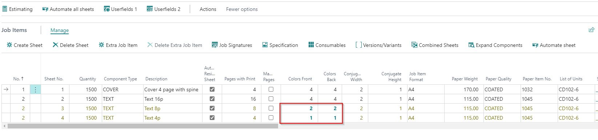

# Residual Sheets

	
## Summary

To improve the visibility of residual sheets, line values in a residual sheet line will now be displayed in a special color.

Definition of Residual Sheet. 
If the number of pages cannot be produced with a full sheet, PrintVis splits it into a residual sheet if the field "Automatic Residual Sheet" on the Job item is set to "Yes" (the field is ticketed).

## Example

Consider a product with 28 pages in the text part. It is produced on paper and machine size where 16 pages fit on a sheet.

1. **Full Sheets**: 
   - 1 full sheet of 16 pages is used because the remaining 12 pages do not fill a full sheet, so a residual sheet is created. (28 - 16 = 12)

2. **Residual Sheets**:
   - The remaining 12 pages do not fit on a 16-page sheet. PrintVis creates a sheet of 8 pages with 2 ups. This results in a residual sheet.
   - The remaining 4 pages fit on a 16-page sheet. PrintVis creates a sheet of 4 pages with 4 ups.
   - All residual sheets (not the main sheet) will be displayed in a different color.

   If the field "Automatic Residual Sheet" is set to "No", PrintVis will handle this example as 2 sheets of 16 pages, with the last sheet containing 12 pages. The 4 pages are blank/waste with the same impositioning.

 Additional Functionality

On the residual sheet, you can now also change the Color Front/Back.

