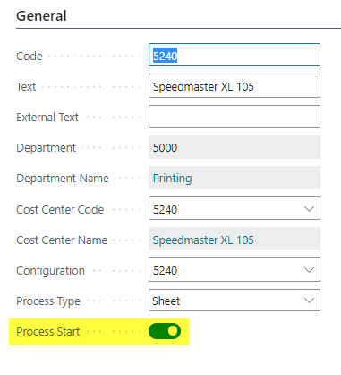
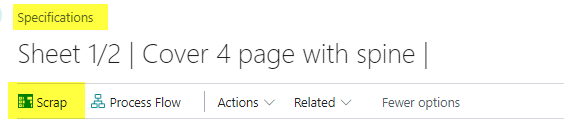
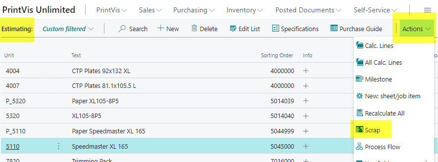
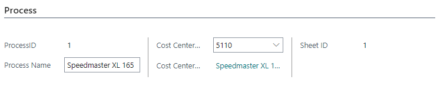
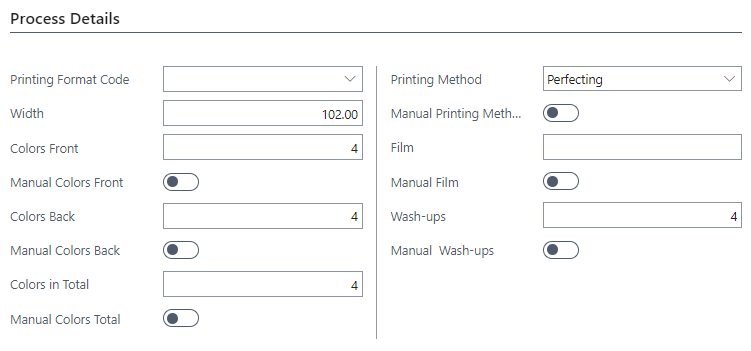
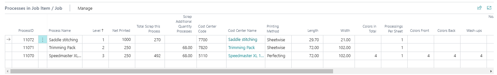
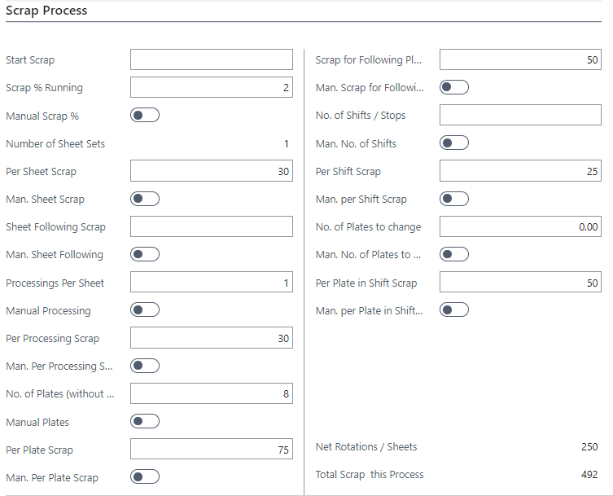
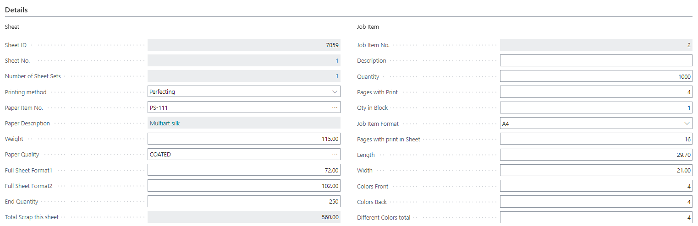
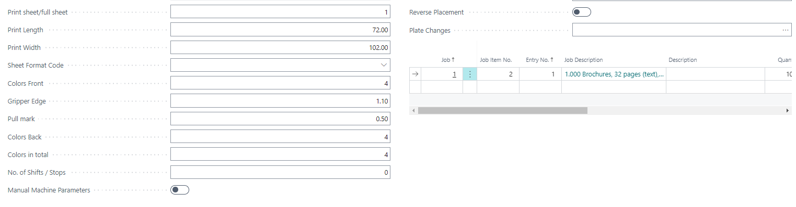

# Scrap page

## Summary

- **Scrap Calculation**:
  - Scrap is calculated for each process that has a scrap setup (search for "Scrap Table Setup").
  - The Calculation Unit that calculates scrap must be marked as "Process Start."
  

  - Scrap is accumulated from the last process to the first process. The first process (typically the press) produces its own scrap and all scrap for the following processes. Each subsequent process produces its own scrap only, excluding the scrap from prior processes.
  - For jobs with multiple items processed together (e.g., saddle-stitching), scrap must be produced by all individual job item processes.
  - The format size of the scrap is considered.

## Open Scrap page (Edit - Technical Specifications: Advanced)  

### From Specification Card

### From Estimation page

## Scrap page

### Process

| Field             | Description                                                                                                                                               |
|-------------------|-----------------------------------------------------------------------------------------------------------------------------------------------------------|
| Process ID        | Show the ID of the current process                                                                                                                        |
| Process Name      | Displays the naming of the current process to allow you full transparency as to where in the process flow you are looking for the current Unit. Browsing through a line of processes this information changes from process to process. |
| Cost Center Code  | Cost Center Code relates to the Code field in the Cost Center table. Hence you are able to see the code for the current Cost Center.                     |
| Cost Center Name  | Displays the name of the Cost Center for the current process. Hence you are able to see the Cost Center Name or description.                              |
| Sheet ID          | SheetID is the unique identifier for the Sheets/Rolls. The field is for internal system use only.                                                         |

Note: The values in the following FastTabs

Process Details
Processes in Job Item/Job
Scrap Process
Details 
are related to the process selected above.

### Process Details

| Field                  | Description                                                                                                                                                                                                                                                                                                                                                                                                                                                                                              |
|------------------------|----------------------------------------------------------------------------------------------------------------------------------------------------------------------------------------------------------------------------------------------------------------------------------------------------------------------------------------------------------------------------------------------------------------------------------------------------------------------------------------------------------|
| Printing Format Code   | If a specific Format Code is selected for the size of the Printing Format (paper/material size), the selected code will be displayed. When looking up from the field, only Format codes with type Printed Format will be displayed. In general, Printing Format will depend on the format/size of the Raw Material selected for the Job and the max. size given for the Printing Press. If such info is sufficient, no specific Printing Format Code is needed. |
| Width                  | Width – for the Print Sheet Format – is always displayed as Left/right format. Printing Format Width may differ from the format of the Raw material, as you can split or trim the paper to a different Print Format.                                                                                                                                                                                                                                                                                    |
| Colors Front           | A number to indicate No. of Colors on the Front-side of the paper. Looking up into the field will let you specify precisely which colors are to be used.                                                                                                                                                                                                                                                                                                                                                |
| Manual Colors Front    | If the belonging field has been adjusted manually, this field is automatically checked.                                                                                                                                                                                                                                                                                                                                                                                                                  |
| Colors Back            | A number to indicate No. of Colors on the Back-side of the paper. Looking up into the field will let you specify precisely which colors are to be used.                                                                                                                                                                                                                                                                                                                                                 |
| Manual Colors Back     | If the belonging field has been adjusted manually, this field is automatically checked.                                                                                                                                                                                                                                                                                                                                                                                                                  |
| Colors in Total        | Indicates the total No. of colors for the current Sheet used for print Front and Back. Often the same colors C-M-Y-K will be used for both sides of the Sheet, where 4+4 colors will have Colors in total = 4.                                                                                                                                                                                                                                                                                          |
| Manual Colors Total    | If the belonging field has been adjusted manually, this field is automatically checked.                                                                                                                                                                                                                                                                                                                                                                                                                  |
| Printing Method        | Displays the calculated or selected Printing Method for the current Job Item/Sheet. PrintVis has the following Options:  - **Work and Turn**: print on the upper surface, then turn the stack and mount new plates to print the back (now upper side).  - **Turning**: print Front-pages on the left half, Back-pages on the right half. Then turn the stack over the vertical axis and print the other side.  - **Tumbling**: same as Turning, but with the horizontal axis.  - **Perfecting**: print Front and Back in one run through the press. |
| Manual Printing Method | If the belonging field has been adjusted manually, this field is automatically checked.                                                                                                                                                                                                                                                                                                                                                                                                                  |
| Film                   | If Film is still used to produce Printing Plates, you will see how many pcs. of Film is estimated for the actual process, or you can manually input the required quantity.                                                                                                                                                                                                                                                                                                                             |
| Manual Film            | If the belonging field has been adjusted manually, this field is automatically checked.                                                                                                                                                                                                                                                                                                                                                                                                                  |
| Wash-ups              | No. of Wash-ups is displayed and is estimated based on how many of the selected Ink-Items for the Process are marked as 'Mixed color'. You may manually override input to estimate wash-ups differently.                                                                                                                                                                                                                                                                                                |
| Manual Wash-ups        | If the belonging field has been adjusted manually, this field is automatically checked.                                                                                                                                                                                                                                                                                                                                                                                                                  |

### Processes in Job Item / Job

| Field                           | Description                                                                                                                                                                                                                                                                                                                                                                                                                                                                                                                                                                     |
|--------------------------------|---------------------------------------------------------------------------------------------------------------------------------------------------------------------------------------------------------------------------------------------------------------------------------------------------------------------------------------------------------------------------------------------------------------------------------------------------------------------------------------------------------------------------------------------------------------------------------|
| Process ID                     | Show the ID of the current process.                                                                                                                                                                                                                                                                                                                                                                                                                                                                                                                                              |
| Process Name                   | Displays the naming of the current process to allow you full transparency as to where in the process flow you are looking for the current Unit. Browsing through a line of processes this information changes from process to process.                                                                                                                                                                                                                                                                                                                                            |
| Level                          | A JobItem undergoing multi-step manufacturing has such steps visualized as 'steps'. Steps for each JobItem will start with Step 1 being the Printing process. Further steps can vary depending on job structure. To change a step for a JobItem, adjust the sorting order on the Estimation screen.                                                                                                                                                                                                                                                                                             |
| Net Printed                    | Displays how many sheets/rotations are needed to produce the total quantity, disregarding scrap for the current and following processes.                                                                                                                                                                                                                                                                                                                                                                                                                                     |
| Total Scrap this Process       | Displays the total scrap/waste quantity for the current process. This value is estimated and cannot be overwritten.                                                                                                                                                                                                                                                                                                                                                                                                                                                            |
| Scrap Additional Quantity Processes | Gives an exact count of how much scrap is needed for the upcoming processes. For example, in a job with printing, lamination, folding, and stitching, scrap will be estimated for each.                                                                                                                                                                                                                                                                                                                                                                                     |
| Cost Center Code               | Refers to the "Code" field in the Cost Centre table. Enables you to see both the code and the name/description of the Cost Center for the current process.                                                                                                                                                                                                                                                                                                                                                                                                                    |
| Cost Center Name               | Displays the name of the Cost Center for the current process.                                                                                                                                                                                                                                                                                                                                                                                                                                                                                                                   |
| Printing Method                | Displays the selected or calculated Printing Method for the current JobItem/Sheet. Options include: - **Work and Turn**: Print top side, turn stack, print back with new plates. - **Turning**: Split sheet vertically, print both sides using same plates. - **Tumbling**: Split sheet horizontally, print both sides using same plates. - **Perfecting**: Print both sides in one pass.                                                                                                                                                                                                       |
| Length                         | Displayed as Top/Down format (depth) of the Print Sheet Format. May differ from raw material if sheet is trimmed or split.                                                                                                                                                                                                                                                                                                                                                                                                                                                   |
| Width                          | Displayed as Left/Right format (width) of the Print Sheet Format. May differ from raw material.                                                                                                                                                                                                                                                                                                                                                                                                                                                                               |
| Colors in Total                | Indicates the total number of colors used for both Front and Back of the sheet. E.g., 4+4 colors using CMYK will total 4.                                                                                                                                                                                                                                                                                                                                                                                                                                                       |
| Processings Per Sheet          | Indicates how many times each sheet is processed through the press based on printing method, colors, varnish, etc. E.g., 4/0 on a 4-color press = 1 processing; on a 2-color press = 2 processings.                                                                                                                                                                                                                                                                                                                                                                               |
| Colors Front                   | Number of colors on the front side of the paper. Field allows specific color selection.                                                                                                                                                                                                                                                                                                                                                                                                                                                                                        |
| Colors Back                    | Number of colors on the back side of the paper. Field allows specific color selection.                                                                                                                                                                                                                                                                                                                                                                                                                                                                                         |
| Wash-ups                       | Number of wash-ups estimated based on how many ink items are marked as 'Mixed color'. Can be manually adjusted.                                                                                                                                                                                                                                                                                                                                                                                                                                                              |
| No. of Plates (without Change Plates) | Displays estimated number of plates needed. Depends on printing method, duplex, impositions, content changes, etc. Can be manually adjusted.                                                                                                                                                                                                                                                                                                                                                                                                       |
| No. of Shifts                  | Indicates how many plate or color changes ("Replaces") are needed for the process. E.g., different languages in the same booklet.                                                                                                                                                                                                                                                                                                                                                                                                                                              |
| Prints                         | Displays the number of impressions to be made in the process, depending on machine capability and press runs.                                                                                                                                                                                                                                                                                                                                                                                                                                                                |
| Start Scrap                    | Manually filled-in field for additional scrap not covered by the Scrap Table settings.                                                                                                                                                                                                                                                                                                                                                                                                                                                                                         |
| Scrap % Running                | Shows the percentage of running scrap or general waste. Example: color control sheets every 200 = 0.5%.                                                                                                                                                                                                                                                                                                                                                                                                                                                                         |
| Per Sheet Scrap                | Scrap per sheet in the job. Can be manually overwritten.                                                                                                                                                                                                                                                                                                                                                                                                                                                                                                                        |
| Per Processing Scrap           | Scrap per run or procession. E.g., if a sheet runs twice, this defines scrap per run. Can be overwritten.                                                                                                                                                                                                                                                                                                                                                                                                                                                                     |
| Per Shift Scrap                | Displays the "Replace" scrap count.                                                                                                                                                                                                                                                                                                                                                                                                                                                                                                                                              |
| Per Plate Scrap                | Displays scrap per plate. Can be manually overridden.                                                                                                                                                                                                                                                                                                                                                                                                                                                                                                                           |

### Scrap Process

| Field                             | Description                                                                                                                                                                                                                                                                                                                                                                                                                                                                                                                   |
|----------------------------------|-------------------------------------------------------------------------------------------------------------------------------------------------------------------------------------------------------------------------------------------------------------------------------------------------------------------------------------------------------------------------------------------------------------------------------------------------------------------------------------------------------------------------------|
| Start Scrap                      | Not filled from the Scrap Table. Used for manual input of additional scrap for a process not already accounted for in Scrap Table setup.                                                                                                                                                                                                                                                                                                                                                                                     |
| Scrap % Running                  | Percentage of sheets taken as scrap or general waste. E.g., for color control during printing or faulty finishing.                                                                                                                                                                                                                                                                                                                                                                                                            |
| Manual Scrap %                   | Automatically checked if the Scrap % Running field was adjusted manually.                                                                                                                                                                                                                                                                                                                                                                                                                                                     |
| Number of Sheet Sets             | Displays how many sheets with the same imposition exist in the process. E.g., 48 pages with 16-page imposition = 3 Sheet Sets.                                                                                                                                                                                                                                                                                                                                                                                               |
| Per Sheet Scrap                  | Displays scrap count per sheet. Can be manually overridden from the default Scrap Table setting.                                                                                                                                                                                                                                                                                                                                                                                                                             |
| Man. Sheet Scrap                 | Automatically checked if the Per Sheet Scrap field was adjusted manually.                                                                                                                                                                                                                                                                                                                                                                                                                                                     |
| Sheet Following Scrap            | If the Scrap Table defines different scrap for the first sheet vs. following ones, this shows the scrap per additional sheet. Can be manually overridden.                                                                                                                                                                                                                                                                                                                                                                     |
| Man. Sheet Following             | Automatically checked if the Sheet Following Scrap field was adjusted manually.                                                                                                                                                                                                                                                                                                                                                                                                                                               |
| Processings Per Sheet            | Indicates how many times each sheet is processed, based on printing method, color count, varnish, etc. E.g., 4-0 on a 4-color press = 1 processing; on 2-color press = 2 processings.                                                                                                                                                                                                                                                                                                                                           |
| Manual Processing                | Automatically checked if the Processings Per Sheet field was adjusted manually.                                                                                                                                                                                                                                                                                                                                                                                                                                               |
| Per Processing Scrap             | Scrap per run/procession. E.g., if a sheet runs twice, this is the scrap per run. Can be manually overridden.                                                                                                                                                                                                                                                                                                                                                                                                                |
| Man. Per Processing Scrap        | Automatically checked if the Per Processing Scrap field was adjusted manually.                                                                                                                                                                                                                                                                                                                                                                                                                                                |
| No. of Plates (without Change Plates) | Number of estimated plates based on factors like print method, front/back print, imposition, and changes. Can be manually adjusted.                                                                                                                                                                                                                                                                                                                                                                                          |
| Manual Plates                    | Automatically checked if the No. of Plates field was adjusted manually.                                                                                                                                                                                                                                                                                                                                                                                                                                                      |
| Per Plate Scrap                  | Scrap count per plate. Can be manually overridden from Scrap Table.                                                                                                                                                                                                                                                                                                                                                                                                                                                           |
| Man. Per Plate Scrap             | Automatically checked if the Per Plate Scrap field was adjusted manually.                                                                                                                                                                                                                                                                                                                                                                                                                                                     |
| Scrap For Following Plates       | Scrap per additional plate after the first, as set in the Scrap Table. Can be manually overridden.                                                                                                                                                                                                                                                                                                                                                                                                                           |
| Man. Scrap For Following Plates  | Automatically checked if the Scrap For Following Plates field was adjusted manually.                                                                                                                                                                                                                                                                                                                                                                                                                                          |
| No. of Shifts / Stops            | Indicates how many 'Plate or Color Changes' (Replaces) occur. E.g., 3 languages = 2 changes.                                                                                                                                                                                                                                                                                                                                                                                                                                  |
| Man. No. of Shifts               | Automatically checked if the No. of Shifts / Stops field was adjusted manually.                                                                                                                                                                                                                                                                                                                                                                                                                                               |
| Per Shift Scrap                  | Scrap per shift/language/plate change. Can be manually overridden.                                                                                                                                                                                                                                                                                                                                                                                                                                                            |
| Man. Per Shift Scrap             | Automatically checked if the Per Shift Scrap field was adjusted manually.                                                                                                                                                                                                                                                                                                                                                                                                                                                     |
| No. of Plates to Change          | Total plates/colors to change (front + back). Normally estimated via formulas, but can be overridden.                                                                                                                                                                                                                                                                                                                                                                                                                         |
| Man. No. of Plates to Change     | Automatically checked if the No. of Plates to Change field was adjusted manually.                                                                                                                                                                                                                                                                                                                                                                                                                                              |
| Per Plate in Shift Scrap         | Scrap per plate change, per shift/language, from Scrap Table. Can be overridden.                                                                                                                                                                                                                                                                                                                                                                                                                                              |
| Man. Per Plate in Shift Scrap    | Automatically checked if the Per Plate in Shift Scrap field was adjusted manually.                                                                                                                                                                                                                                                                                                                                                                                                                                            |
| Net Rotations / Sheets           | Shows how many sheets or rotations are required to produce the total quantity, excluding scrap.                                                                                                                                                                                                                                                                                                                                                                                                                              |
| Total Scrap this Process         | Total scrap for the current process. This is an estimated value and **cannot** be overwritten.                                                                                                                                                                                                                                                                                                                                                                                                                               |

### Details

| **Field**                    | **Description**                                                                                                                                                                                                                                                                                                                              |
|------------------------------|----------------------------------------------------------------------------------------------------------------------------------------------------------------------------------------------------------------------------------------------------------------------------------------------------------------------------------------------|
| **Sheet**                     |                                                                                                                                                                                                                                                                                                                                              |
| Sheet ID                      | SheetID is the unique identifier for the Sheets/Rolls. The field is for internal system use on.                                                                                                                                                                                                                                               |
| Sheet No.                     | The system automatically set UserID of the user who last modified the record.                                                                                                                                                                                                                                                                |
| Number of Sheet Sets          | If multiple Sheet Sets are estimated, for example with a 16-page imposition applied to 48 pages in total, the number of SheetSets with the same imposition is displayed, in this example 3 SheetSets.                                                                                                                                         |
| Printing Method               | Work and Turn, Turning, Tumbling, Perfecting. By default, the Printing Method is automatically selected by the system, optimizing to first utilize as much of the paper as possible, secondly as few runs as possible, and finally using as few plates as possible. Turning or Tumbling will not be selected if Perfecting Print is set. |
| Paper Item No.                | Paper Item No. relates to the No. field in table Item. The Paper Item No. can be selected from the Item table.                                                                                                                                                                         |
| Paper Description             | Displays the name of the selected Paper.                                                                                                                                                                                                                                                                                                     |
| Weight                        | Displays the paperweight of the paper/raw material selected.                                                                                                                                                                                                                                                                                 |
| Paper Quality                 | Paper Quality relates to the Code field in table Item Qualities. The Paper Quality can be selected from the Item Qualities table.                                                                                                                                                                                                            |
| Full Sheet Format1            | Once a specific paper is selected for the Sheet/Web, Format1 for the selected paper will be displayed. Format1 for the Full Sheet will always be equal to the paper grain direction.                                                                                                                                                       |
| Full Sheet Format2            | Once a specific paper is selected for the Sheet/Web, Format2 for the selected paper will be displayed.                                                                                                                                                                                                                                       |
| End Quantity                  | Once the Printing Press and Paper/material have been applied to the Sheet/Web, the imposition is automatically estimated by the system, and thus the End Quantity for the job is calculated based on the Imposition.                                                                                                                        |
| Total Scrap this sheet        | The calculated total scrap for the sheet.                                                                                                                                                                                                                                                                                                     |
| Print sheet/full sheet        | If a full sheet is split into halves, thirds, quarters, etc., prior to entering the Printing Press, this field will display how many Printed Sheets come from one Full Sheet.                                                                                                                                                              |
| Print Length                  | Printed Sheet Length will display the size of the Sheet or Web entered into the Printing Press.                                                                                                                                                                                                                                               |
| Print Width                   | Printed Sheet Width will display the across size of the Sheet or Web entered into the Printing Press.                                                                                                                                                                                                                                        |
| Sheet Format Code             | Displays the Printed Sheet/Web format, as this may vary from the FullSheet format, if a full sheet is split into parts to fit the Maximum Sheet Size for the Printing Press selected.                                                                                                                                                        |
| Colors Front                  | Indicates the number of colors on the front page.                                                                                                                                                                                                                                                                                            |
| Gripper Edge                  | Displays how much space is reserved on the printed sheets depth to grab the sheet for processing.                                                                                                                                                                                                                                             |
| Pull Mark                     | Displays how much space is reserved on the printed sheets depth to pull the sheet through the Printing Press.                                                                                                                                                                                                                                 |
| Colors Back                   | Indicates the number of colors on the back page.                                                                                                                                                                                                                                                                                             |
| Colors in total               | Displays the total color count for the Job.                                                                                                                                                                                                                                                                                                  |
| No. of Shifts / Stops         | In the replace field, you indicate the number of language and color changes available for the job item.                                                                                                                                                                                                                                       |
| Manual Machine Parameters     | If the belonging fields (area Sheet) have been adjusted manually, this field is automatically checked.                                                                                                                                                                                                                                       |
| **Job Item**                  |                                                                                                                                                                                                                                                                                                                                              |
| Job Item No.                  | This is a calculated Flow Field. The field can show the sum of the underlying entries or display a text from another table that relates to this field.                                                                                                                                                                                           |
| Description                   | The Description is a text field, into which you may enter some specifying information to the actual JobItem (and/or Sheet).                                                                                                                                                                                                                   |
| Quantity                      | By default, the Quantity is filled in from the quantity selected for the entire Job.                                                                                                                                                                                                                                                           |
| Pages with Print              | This field is filled in with the number of pages selected on the case card job line, typically the number of Content pages.                                                                                                                                                                                                                  |
| Qty. in Block                 | If producing a product such as a writing block, you enter the quantity (e.g., 50 leafs in each Block).                                                                                                                                                                                                                                        |
| Job Item Format               | The final format of the finished product is entered here.                                                                                                                                                                                                                                                                                    |
| Pages with print in Sheet     | Displays how many pages for the JobItem are on the Sheet in total.                                                                                                                                                                                                                                                                            |
| Length                        | Internal field to display the Length/Depth of the final product.                                                                                                                                                                                                                                                                             |
| Width                         | Internal field to display the Width of the final product.                                                                                                                                                                                                                                                                                    |
| Colors Front                  | Indicates the number of colors on the front page.                                                                                                                                                                                                                                                                                            |
| Colors Back                   | Indicates the number of colors on the back page.                                                                                                                                                                                                                                                                                             |
| Different Colors total        | By default, the system will expect the actual colors used front and back to be the same, but if they differ, you may enter the total number of different colors.                                                                                                                                                                             |
| Reverse Placement             | Most often, JobItems will be placed so a folded back follows the paper grain to enable a smooth fold, but sometimes you may wish to place the JobItems against the grain direction and rotate a JobItem 90 degrees.                                                                  |
| Plate Changes                 | If a job is to be delivered in multiple languages or different color layouts, state the number of needed changes in the field.                                                                                                                                                       |
| **Job**                       |                                                                                                                                                                                                                                                                                                                                              |
| Job                           | The internal reference to the PrintVis Job Table automatically assigned when a new job is created.                                                                                                                                                                                                                                           |
| Job Item No.                  | This is a calculated Flow Field. The field can show the sum of the underlying entries or display a text from another table that relates to this field.                                                                                                                                                                                           |
| Entry No.                     | Internal Field                                                                                                                                                                                                                                                                                                                                 |
| Job Description               | The job description (External Description from Case Card) is the descriptive text displayed on many customer-facing documents.                                                                                                                                                                                                              |
| Description                   | The Description is a text field, into which you may enter some specifying information to the actual JobItem (and/or Sheet).                                                                                                                                                                                                                   |
| Quantity                      | By default, the Quantity is filled in from the quantity selected for the entire Job.                                                                                                                                                                                                                                                           |
| Additional Quantity           | Displays the Additional Quantity selected for the Job, but can be modified for each JobItem individually.                                                                                                                                                                                                                                     |
| Length                        | Internal field to display the Length/Depth of the final product.                                                                                                                                                                                                                                                                             |
| Width                         | Internal field to display the Width of the final product.                                                                                                                                                                                                                                                                                    |
| Pages with print in Sheet     | Displays how many pages for the JobItem are on the Sheet in total.                                                                                                                                                                                                                                                                            |
| Job Item Pages with Print     | This is a calculated Flow Field. The field can show the sum of the underlying entries or display a text from another table that relates to this field.                                                                                                                                                                                           |
| Final Format Code             | The final format of the finished product is entered here.                                                                                                                                                                                                                                                                                    |
| Colors Front                  | Indicates the number of colors on the front page.                                                                                                                                                                                                                                                                                            |
| Colors Back                   | Indicates the number of colors on the back page.                                                                                                                                                                                                                                                                                             |
| Pages with print              | This field is filled in with the number of pages selected on the case card job line, typically the number of Content pages.                                                                                                                                                                                                                  |

