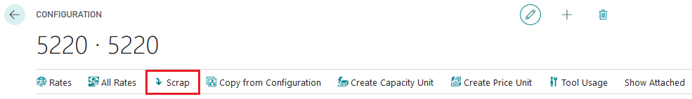
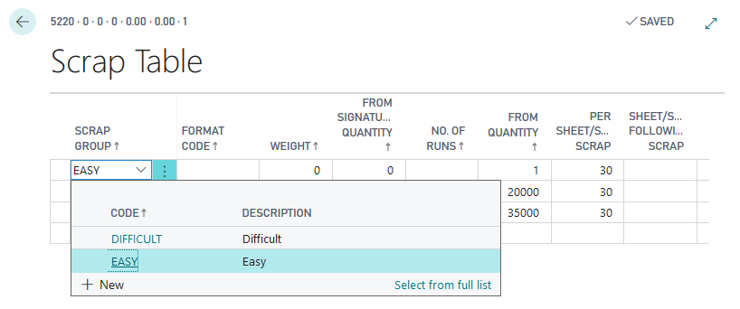
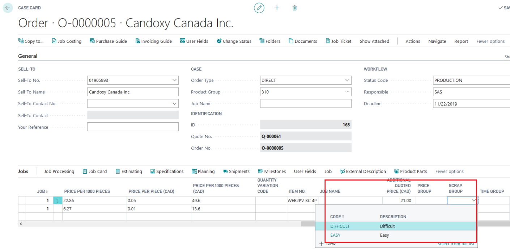
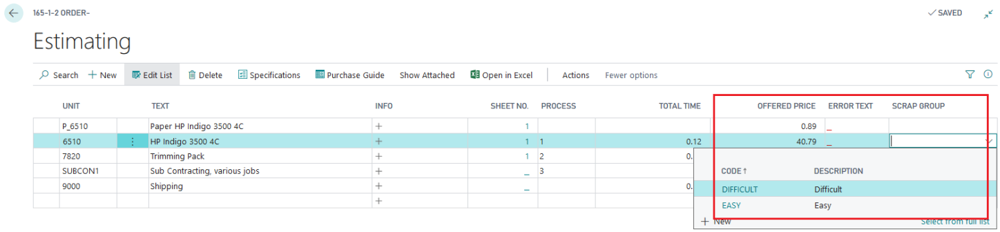

# Scrap Group Setup

## Summary

Scrap Groups allow for adjusting scrap amounts through predefined steps/values rather than fixed inputs. They are utilized in Scrap Tables.

## Setup

- **Recommendation**: Set up a line without a specific Scrap Group attached to represent an average value. This allows for automatic calculation without needing to select a specific Scrap Group.

## Usage

Scrap Groups can be applied in two ways:

1. **Globally for the Job**:
   - Affects all Scrap Tables that include the selected Scrap Group.

2. **For a Specific Price/Calculation Unit**:
   - Impacts only the selected Price/Calculation Unit.
   - The available Scrap Groups are limited to those in use in the Scrap Tables attached to this price unit.

### Scrap Group Selection on Job

- Allows global application across all Scrap Tables containing the selected Scrap Group.

### Scrap Group Selection on Calculation Unit

- Only displays Scrap Groups that are active in the attached Scrap Tables.

