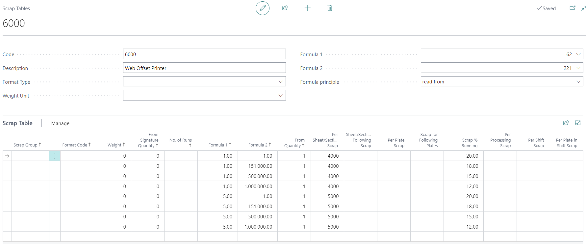
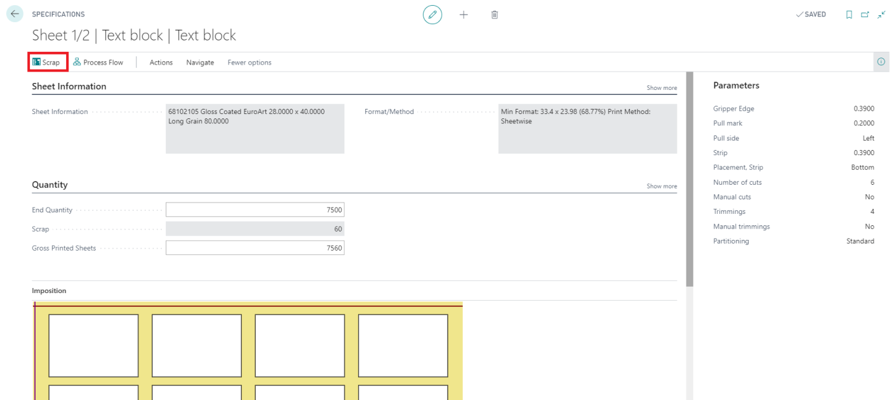
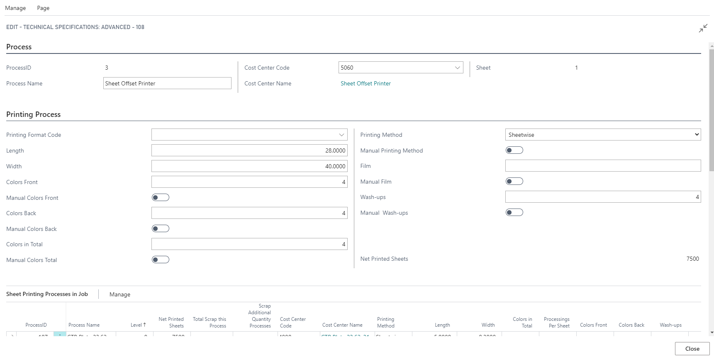
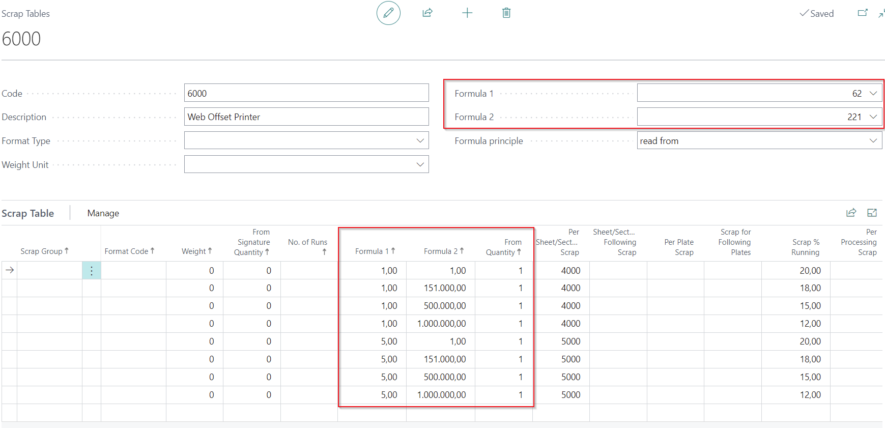

# Scrap Table Setup

## Summary

Scrap calculation in PrintVis is managed through tables attached to a cost center's configuration. Scrap tables are vital for accurately calculating scrap in processes such as printing, finishing, and other operations.

## Setup

 Accessing Scrap Tables

- Search for "Scrap Tables" and select "PrintVis Scrap Tables" to set up or modify scrap tables.

 Parameters

- **Scrap Group**: Defines the parameters for scrap calculation.

 Header Fields

| **Field Caption**     | **Description**                                                                                                                                                                                                                                         |
|-----------------------|-----------------------------------------------------------------------------------------------------------------------------------------------------------------------------------------------------------------------------------------------------|
| **Code**              | Enter a code for this scrap table. This can be selected in a cost center configuration.                                                                                                                                                            |
| **Description**       | Enter a description for this scrap table.                                                                                                                                                                                                           |
| **Format Type**       | Select the format type for the format entered in the scrap table lines. **Available options include:** - **Blank**: No format required. - **Job Item Format**: Reads format from the job line (e.g., A formats), commonly for finishing processes. - **Printed Sheet Format**: Reads the printed sheet format, used for printing machines. The format is read for each process line in the job. - **Paper Sheet Format**: Reads the raw sheet format, typically for printing machines. - **Plates**: Reads from the individual printing process line (rarely used). - **Film**: Reads from the printing process line if films are attached to the sheet. |
| **Weight Unit**       | Used for **Imperial paper weights** only. Select the weight unit for the weight entered into the table lines. Leave blank for **M-Weight**.                                                                                                         |
| **Formula 1/2**       | Add up to two formulas if additional values or parameters are required. This is configured via the **Formula Principle** field.                                                                                                                     |
| **Formula Principle** | Determines how formulas are applied. **Options include:** - **Parameter**: Adds the formula's value as scrap quantity, allowing you to define custom scrap values. - **Read from**: Uses the formula value to determine which line to use, such as "Quantity From" or "Scrap Group." |

 Fields in Scrap Table

| **Field**                    | **Description**                                                                                                                                                                                                                                                             |
|------------------------------|-------------------------------------------------------------------------------------------------------------------------------------------------------------------------------------------------------------------------------------------------------------------------|
| **Product Group**            | Read from the job line. Use this if product groups impact scrap calculation, e.g., for rotary machines or finishing processes. Create a blank section for cases where no specific product group applies.                                                                 |
| **Scrap Group**              | Contains predefined groups like "easy," "medium" (blank), and "difficult." Use these groups to grade the scrap table.                                                                                                                                                   |
| **Format Code**              | Uses sliding format lookup, reading the nearest value. Create a blank section to handle unexpected formats.                                                                                                                                                              |
| **Weight**                   | Works as intervals. For sheet-dependent processes (e.g., printed sheets), the system reads the paper weight. For processes across sheets (e.g., stapling), it reads the job line weight.                                                                                 |
| **From Signature Quantity**  | Reads the number of sections in a printing process from the job item table as intervals.                                                                                                                                                                                |
| **No. of Runs**              | Functions as an interval. Reads the number of runs for the individual printing process from the value on the line up to the next.                                                                                                                                       |
| **Formula 1 / 2**            | Defines scrap calculation for selected formulas. Example: Formula 2 (number of colors) with a value of 25 calculates 100 scrap units for a 4+4 job (4 x 25). Use "read from" mode to return the formula's calculated quantity instead.                                      |
| **From Quantity**            | Indicates the net printing sheet quantity. Scrap is calculated for one sheet set by default. To calculate for all sheet sets, use a formula.                                                                                                                           |
| **Per Sheet/Section Scrap**  | Quantity of scrap sheets assessed per printed sheet (e.g., start scrap).                                                                                                                                                                                                |
| **Sheet/Section Following Scrap** | Adds scrap for subsequent sheets, influencing only the first sheet of the process.                                                                                                                                                                                       |
| **Scrap % Running**          | Fixed percentage of scrap used for control purposes or machine operations. Added to other defined scrap.                                                                                                                                                               |
| **Per Plate Scrap**          | Layout scrap based on the number of plates used in the printing process.                                                                                                                                                                                               |
| **Plate Following Scrap**    | Scrap for additional plates, influencing only the first plate. Adds values for subsequent plates.                                                                                                                                                                       |
| **Per Processing Scrap**     | Scrap generated when the machine starts a run. Number of runs depends on colors and rolls/towers. For example, 4 colors on a 2-color machine require 4 runs, increasing scrap.                                                                                         |
| **Per Shift Scrap**          | Scrap caused by machine stops for plate shifts, such as changing languages. Calculated if specified in the sheet settings.                                                                                                                                              |
| **Per Plate in Shift Scrap** | Scrap for additional plates during shifts.                                                                                                                                                                                                                             |

## How PrintVis Calculates Scrap

- **From Quantity**: Actual quantity indication in the scrap table.
- **Per Sheet/Section Scrap**: Scrap quantity per printed sheet.
- **Sheet/Section Following Scrap**: Scrap for additional sheets.
- **Scrap % Running**: Fixed percentage of scrap during running.
- **Per Plate Scrap**: Scrap based on the number of plates used.
- **Plate Following Scrap**: Scrap for additional plates.
- **Per Processing Scrap**: Scrap expected at the start of a run.
- **Per Shift Scrap**: Scrap for machine stops during a shift.
- **Per Plate in Shift Scrap**: Scrap for additional shift plates.

- For finishing operations, use "Per Processing" rather than "Per Sheet" to calculate scrap for the entire job.
- Scrap is calculated for each process and totaled backward from the last to the first process.

### Calculation of the "Quantity Fromm" Field

- **Formula Principle = "Read From"**
- **Formula 1 = 62**: Determines fixed scrap based on the number of colors.
- **Formula 2 = 221**: Determines total net rotations for the sheet.

If a job has:
- 1 sheet set of 100,000 rotations for a 4-color job: Line 1 applies (4000 fix + 20% running scrap).
- 2 sheet sets of 100,000 rotations: Line 2 applies (4000 fix + 18% running scrap).

For different quantities, the "From Quantity" remains as per the formula used.

