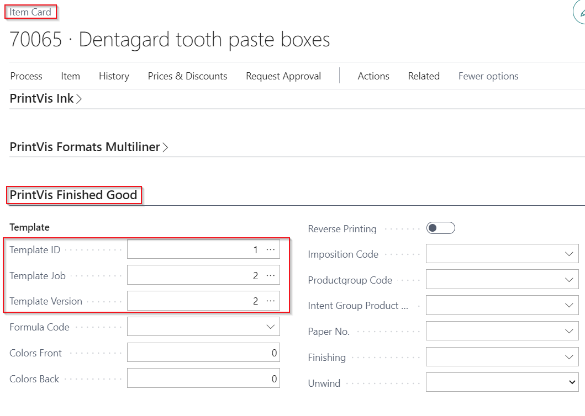
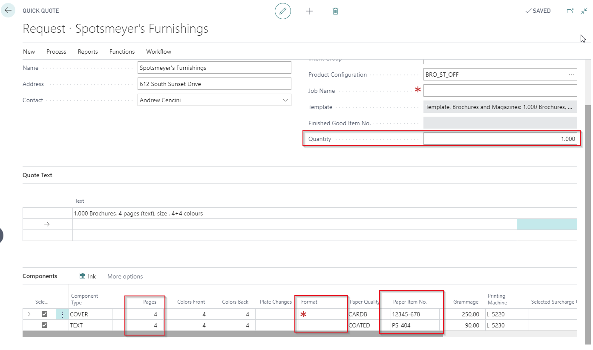

# Setup PrintVis Quick Quote

## Introduction

The Quick Quote page is designed for a user such as a front office user or an account manager with less experience in understanding calculations. The user can easily handle simple orders like business cards and posters that are standardized without involving an estimator. It serves as an easy entry point while talking to a customer. By entering standardized data or using a questionnaire, when the user clicks the calculate menu action, the quick quote populates the case in the background. From here, a quote can be directly made or an experienced estimator can take over to finish the estimate for a quote.

The PrintVis Quick Quote is an interface layer on top of the PrintVis Calculation, providing limited and standardized options for the user. Therefore, before setting up the quick quote, a final setup with all calculation units is necessary. The quick quote works based on the calculation unit setup and templates. In case any changes are made to the related calculation units, the templates must be updated accordingly!

## Quick Quote as your default Case Card

The Quick Quote functionality is accessible from the Small Print Business Role Center by default, but can be added wherever required.

You may even choose to use the Quick Quote as your default Case Card from your PrintVis Setup which has effect when calling a production order from a sales line. **Please Note:** PrintVis Sales Order Integration PTE is required for this!

## Estimation Automation Setup

All Product Groups which should be used in Quick Quote must have a Template setup in the PrintVis Estimation Automation Setup, even if the same templates are used for the Product Group on a case or Quick Quote. Otherwise, the Product Group will not be visible on the Quick Quote page:

 Setup:

 
Selection in Quick Quote:

Example setup for Product Group "300":

However, this template may later be overruled by picking a specific Product Configuration (described later in this document).

This way a single Product Group may host multiple Product Configurations, each with its own ‘basic template’ applied.

From the Estimation Automation setup, it is also decided if Paper/Substrate is to be suggested automatically when looking up to find the best fit printing press.

The filters applied to find the best fit paper in general are set at each Product Group (Item Group Filters) and possibly Lookup Filters to specify ‘Quality Codes.’

If a specific Order Type has been set for the Automation Setup it will be transferred to new jobs created. It is also possible to **NOT** set up a specific Order Type, to allow the system to populate that from the selected Quick Quote Template -or- Product Configuration Template.

## Template Filters and Settings

Further filters can be set specified to a template, and will work from the Quick Quote when such a template is selected for the Job.

To do so, be sure to **FIRST** mark the Job as a ‘template,’ then go via Job Items to the “Template Filters” and apply specific filters.

Filters are set with a ‘pipe’ between the required elements, for example `AAAA|BBBB|CCCC`.

Further filters can be applied for:

- **Qualities:** Item Quality Codes
- **Paper Item Filter:** Specific Paper Item numbers
- **Paper Weight Filter:** To specify that only certain paper weights within the set filters are displayed
- **Machine Filter:** To limit the list of Machines (List of Units) presented.

Another feature is the option to set the Job Item as a ‘Candidate’ for ganging (Setting per Job Item).

This could be a default setting required for Business Cards, for example. If so set, the ‘Ganged Job Possible’ setting will be transferred to the job created from the template.

## Product Group Setup

Further, some setup is required for each Product Group to be presented in the Quick Quote; you must select if you wish to display those.

### Additional Charges

Additional Charges grant the possibility to add or delete calculation units that are set up to show up in Quick Quote.

### Product Configuration

Show Product Configuration: If a questionnaire is set up for the product configuration, the questionnaire will show up in this section. This questionnaire is used to build the calculation (adding calculation units) and completing data, e.g.

- **Calculation values:** -> See screenshots below
- **Adding hours or quantities to calculation details**
- **User Field:** Edit certain user fields and store information.

# Finished Good Item Setup

If you want to calculate Finished Good Items, set up a template at the Item Card.

## Calculation Unit Setup

From within the Calculation Unit Setup, you decide which units from the template are shown in the Quick Quote by marking the field “Show in Quick Quote.”

Some units could be regarded as ‘Additional options’ and will be displayed as additional prices on the quotation letter sent to the customer. The units you wish to have displayed as such are to be marked in the field “Specify quote.”

The text displayed for these units, on the Quick Quote as well as on the Quotation Letter, will show what is written in the field “External description” on the Calculation Unit Setup.

Further, if you do not wish all lines for a Calculation Unit to be displayed in the Quick Quote, you can hide any you wish by marking these in the field "Hide in Quick Quote."

## Estimation Automation Features

The automation ‘Engine’ itself has had a comprehensive stack of new features added to make the automated Paper and Printing Press selections even better. It is not only available for quick quotes but also for usual calculation workflows.

### Estimation Automation Machine Selection

To optimize the automated Machine selection, the following features are available:

- If the Job Item has an Imposition Type attached or selected, the machines presented when looking up will be filtered to match the size indicated on the Imposition Type.
- If the Imposition Type has a stated ‘Trim’ to be transferred, that will be used in the automation and for the actual created Job Item.
- The default ‘cutting distance’ (setup in cost center configuration) is only used if no trim is specified.
- If the number of pages for the Job Item generates one or more Residual Sheets, the Imposition Type is NOT carried over to the Residual Sheets.
- Residual Sheets will only have Printing Method Work-and-Turn or -Tumble if the Job Item has colors on both sides.
- The Printing Method is further used in the automation calculation to find the least expensive process.
- Printing Presses are filtered so none are displayed if a paper is pre-selected which does not match the Press specifications (for example, Web Presses are not displayed if a sheeted paper is pre-selected).

### Estimation Automation Paper Selection

To optimize the automated Paper selection, the following features are used to populate the possible papers/substrates:

- If a specific Paper Item is already selected on the Job Item, no ‘alternative’ paper is presented, indicating that the selected paper is respected and kept for the Job Item.
- If the Job Item has an Imposition Type attached or selected, the papers/substrates presented when selecting the Machine will be filtered to match the ‘minimum size’ of the selected Imposition Code.
- The paper selection will by default select a paper/substrate with a size within the max print format of each Press.
- Only if no papers exist in that size, the system will select a larger paper, which is then to be trimmed before the Printing process.
- If such paper selection is necessary, the system will pick the larger paper which generates the least waste.
- The paper/substrates are filtered to find the largest size within the set filters and weight, according to the settings for each Press Configuration (max printed size).
- Web Paper will only display Paper items within the maximum width of each Web Press.

## Configuration Questionnaire Setup

### Product Configuration Features

In addition to the Product Groups, Product Configurations may be added to the Quick Quote usage to allow some parts of the Quick Quote to be used as a simple questionnaire demanding replies to verbal questions, rather than doing look-ups and selections.

When setting up the Product Configurations, for example, a ‘Sheet Specific’ finishing unit can be added to a specific Component, like Lamination for the Cover component only.

The setup is to create a Job Item (without any specifications to it, other than the Component Type), and then add the required Finishing unit to that Sheet. As the unit is entered in the estimation of the Quick Quote, it will automatically be linked to that matching Job Item.

The template includes one job item with a component assigned, and in the estimating page, the Lamination process is assigned to the cover component.

## Product Configuration Structure

A set of Product Configurations could be like the example below:

A Product Configuration is a sub-type to the assigned Product Group.

For example:

When choosing Product Group 300, only the following Product Configurations can be selected:

- BRO_02_DIGI
- BRO_02_OFF

The following Configurator Codes are selected for the Product Configuration "BRO_02_OFF" (Hit Action: Configurator Code Member).

Drilling further into the actual definition of the Configurator Code Lines and Template Lines:

This setup will display a question: "Scan required?" which must be answered with "Yes" if required. This will add the template assigned to the Template Code A30, and further "questions" can be defined in the assigned "Template Lines." Those will be unfolded for the user.

In the setup below, every template line is assigned to one calculation detail line in the template. When a user is entering a value, this value will be stored in the selected calculation detail line.

 To add/create template lines:

- Create a new line.
- Enter a sorting text.
- The sorting text of configuration lines and template lines will give the overall sorting of the questions for the user.
- Best practice to structure and group the questions in the required sequence is to create the sorting text with a letter ("A", "B", or "C") to group them and then a number inside of the group:
    - A100
    - A110
    - A120
    - B100
    - etc.
- Enter the question/request to the user.
- By hitting the action "Select Field," the field from the template to store the user input value can be selected.

- By hitting the action "Select Record ID," the Record from the template to store the user input value can be selected. In the example below, the field that was selected is "Calculation Details: Hours." The calculation detail lines from the template in the template code setup will be displayed for selection.
  - If you don't see any line to select, perhaps your template does not contain any calculation unit/detail line.

- Select Field/Record ID can also be handled by clicking a link in the related field. However, this is not supported on all browsers!

### Limitations of tables to be used for Quick Quote input values

For the Quick Quote Product Configuration lines, only the following tables are supported:

- 6010081 PV User fields
- 6010321 PV Job Calculation Units
- 6010322 PV Job Calculation Details

Values for the job or job item tables can only be used for a questionnaire on sales lines and jobs; they are not supported on Quick Quotes!

Values for these tables must be directly entered into the related section in the Quick Quote page.

