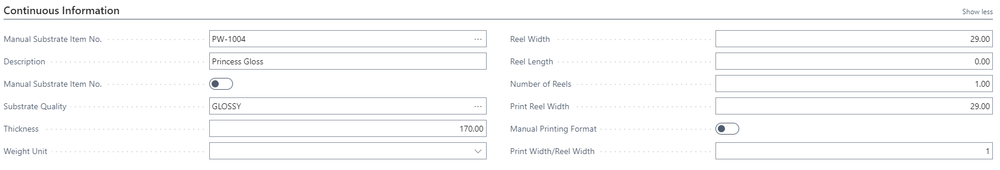

# Specification Page

## General Page Layout

- The page layout adapts based on the type of printing machine (sheet-fed, web-fed, continuous).

- The layout includes several FastTabs that display relevant fields for each type of machine.

- Access the specification page from various locations: case card job line, job card, estimating page.

---

## Sheet-Fed Machines

### Sheet Information

- Contains fields for raw material and printing sheet information.
- Use the "Show more fields" option if needed to view additional fields.

### Quantity
- Displays net and gross quantities for printing and raw material sheets.

---

## Web-Fed Machines

### Web Information

- Contains fields specific to web-fed printing.
- Units for area or length are configured in the setup; printing is shown in the selected unit (e.g., linear meters).

### Quantity

- Displays net and gross quantities for printing.
- PrintVis calculates based on rotations.

---

## Continuous Machines

### Continuous Information

- Specific fields for continuous machines.

### Quantity

- Displays net and gross quantities for printing.
- PrintVis calculates based on length (e.g., linear meters).

---

## General - For All Machines

### Job Items

- Shows data for job items on the selected sheet.
- To add job items:
  1. Create space using the "PartSheet…" fields.
  2. Press "Extra Job Item" to add another job item.
  3. Repeat as needed.
- Customizable columns and sorting options.

### Parameters

- Displays machine configuration parameters.
- Values can be adjusted to influence imposition (e.g., reducing gripper space if not needed).

### Imposition showing a picture

### Imposition showing the PrintVis imposition drawing

- Displays either PrintVis imposition drawing or a picture.
- Pictures can be CIP4 folding catalog types or manually added images (e.g., packaging layouts).
- Requires a designated folder in PrintVis Folder setup for imposition files.

### Special Job Items - Packaging

- For packaging companies needing CAD layouts.
- Fields are limited; typically only "Pages in Sheet" is needed.
- This FastTab is not shown by default but can be displayed by personalizing the page.
