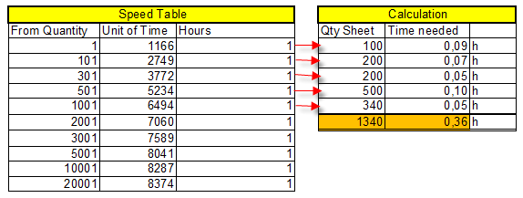

# Speed Table Setup

Speed tables are the core component in the system for defining how quickly a cost center performs specific operations. They ensure consistent operation speeds when calculating jobs, accommodating both measurable and non-measurable factors, such as job difficulty.

Speed tables are essential for calculating time for operations. They can be detailed or simple, depending on your needs. Factors influencing speed can include pieces, intervals, grammage, and more.

## Setup

Speed tables consist of two main sections:

1. **Speed Tables List**: Displays created speed tables, each line representing a setup for operation performance.
2. **Calculation Lines**: Contains factors and speeds for the operation.

| **Field**                | **Description**                                                                                                                                                                                                                                                                                       |
|--------------------------|-------------------------------------------------------------------------------------------------------------------------------------------------------------------------------------------------------------------------------------------------------------------------------------------------------|
| **Code**                | Enter a recognizable code for the speed table. The code may consist of either numerals or letters. In the default setup, an abbreviation of the description is selected for easier recognition elsewhere in the program.                                          |
| **Description**         | Fill in an explanatory description of the speed table in this field.                                                                                                                                                                                                                                  |
| **Format Type**         | Determines how format impacts speed calculation. Options include: - **Job item format** - **Printed sheet format** - **Paper sheet format** - **Plates** - **Film**                                                                             |
| **Calculation**         | Specifies the default calculation method for speed. Options include: - **Min. value**: Default value. - **Reduction**: Reduces the precise quantity. - **Reduction %**: Reduces by the stated percentage.                                              |
| **Speed Principle**     | Specifies the method of speed calculation: - **Accumulating**: Recalculates average speed for changes in the "From Quantity" field. - **Linear**: Uses the exact speed for the matching interval. - **Linear with set additional**: Uses main quantity speed for additional quantity calculations. |
| **Formula 1 & Formula 2** | Allows speed to depend on other job parameters via a calculation formula. Proper formulas appear in the bottom table after being set.                                                                                                                          |
| **Weight Unit**         | If using US paper weights, this field becomes available to select the weight unit for the speed table.                                                                                                                                                                                                |
| **Find Best Format**    | Determines how format codes are validated: - **FALSE**: Size must exactly match the format code. - **TRUE**: Both format values (length and width) must fit within the format code dimensions.                                                                                                   |
| **Per Processing**      | Select this field if the speed table represents print or process speeds requiring multiple runs. For each run, a new speed is calculated. Example: A print job of 8,000 prints in 2 runs is calculated as 4,000 x 2.                                                                                   |

 **Lines**

The lines in the speed table are used for speed calculations and include the following fields:

| **Field**           | **Description**                                                                                                                                                                                                                         |
|---------------------|-------------------------------------------------------------------------------------------------------------------------------------------------------------------------------------------------------------------------------------|
| **Product Group**   | Relates to the "Code" field in the **Product Group** table. Select from the table to define rules influencing job speed. For example, the "Art books" group may apply a lower speed due to the higher resolution required.              |
| **Signature**       | Represents the number of sheet sets from the current sheet. For example, 48 pages on a 16-page imposition results in **3 Sheet Sets** (3×16=48).                                                                                     |
| **Format Code**     | Relates to the "Code" field in the **Format Code** table. Often used in speed tables, especially for finishing processes. For prepress, specific speed tables for each format may be required to account for job costing nuances.       |
| **Time Group**      | Relates to the "Code" field in the **Time Group** table. Select options like Easy, Normal, or Difficult to influence speed rules. Ensure a default (empty) set for normal situations is included.                                     |
| **Paper Quality**   | Relates to the "Code" field in the **Item Quality** table. Paper quality can influence speed, e.g., offset vs. glazed vs. recycled paper. If the process isn't sheet-dependent, the quality of the first sheet is used.                 |
| **Grammage**        | Defines weight intervals as primary keys for speed table lines. Intervals start at 1 gram and are used to read speed for a particular weight range. Important for printing and finishing processes.                                   |
| **From Quantity**   | Sets the minimum quantity for a specific speed line. Commonly used to define accumulating speed tables.                                                                                                                              |
| **Unit of Time**    | Defines the units processed per time period. Example: "6000 pcs in 1 hour" or "300 pcs in 0.05 hours."                                                                                                                              |
| **Hours**           | Specifies the time required to complete the defined **Unit of Time**. Example: "3,000 qty per 1 hour" or "5,000 linear feet per 0.5 hours."                                                                                          |
| **Warning**         | Adds a warning or reminder triggered when this speed line is read during a calculation. For instance, it could highlight special conditions affecting speed. The warning is dismissed by clicking **OK**.                            |

## Example

 Calculation Printing Speed

For a printing job:
- **Sheets**: 1340
- **Time**: 0.36 hours (US formatting)
- **Average Speed**: 3,722.22 (US formatting)

 Warning Message for Min/Max Size Restrictions

To set up a warning message based on format code dimensions:
- Use **Formula 1** and **Formula 2** to evaluate length/width individually.
- Set the speed principle to **Linear** to look up a single line and not accumulate.

This approach ensures that the dimensions fit within the specified format code size, triggering warnings if size restrictions are not met.

