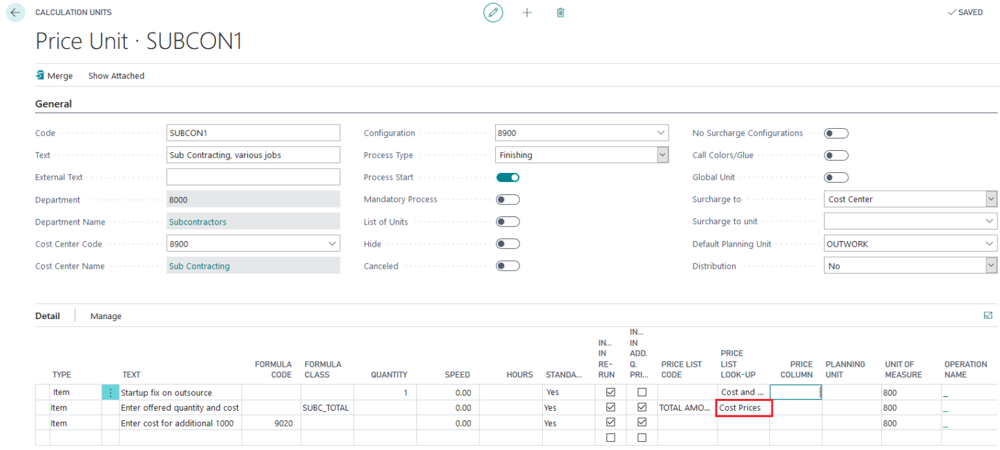

# Setup for Subcontracting / Outwork

## Summary

When requesting a price from a subcontracting vendor, you typically receive a base price for a specified quantity and an additional price per 1000 pieces ("price per M"). Sometimes, a fixed fee is also added. 

## Best Practice Setup

With a well-configured setup, you can calculate the subcontracting sales price for any requested quantity automatically. 

 Example

For a subcontracting job of 2000 brochures, the offered pricing is:

- **Fixed Fee:** 20 EUR
- **Offered Price for 2000 Brochures:** 100 EUR
- **Offered Price for Additional 1000 Brochures:** 30 EUR

 Calculation for Different Quantities

- **For 2500 pcs:** The system calculates the price based on the fixed fee and the offered price for additional quantities.

- **If the job quantity is increased to 3000 pcs:** The new result is calculated automatically.

The additional price per 1000 pieces is dynamically calculated based on the job quantity, eliminating the need for manual adjustments.

### Calculation Unit Setup

The setup for calculation detail lines 2 and 3 involves:

- **Line 2:** Uses a price list to determine the base price. This price list is set to "Total Amount" for line 2.
- **Line 3:** Calculates the additional price per 1000 pieces based on the rate provided.

Please pay attention on those topics!

Item No.
Price List and Price List look-up
Formula Class
Formula for line 3

### Item Setup for Subcontracting / Outwork

- **Item No.:** "OUTSOURCE" is configured with a price unit of 1000 pcs, which is used to apply additional rates per 1000 pcs.
- **Price Calculated from:** For line 3, the field is set to "Total Amount". For line 2, it uses a dummy price list to set the "Price Calculated from" to "Total Amount".

 Price List and Price List Look-Up

- **Price List Lookup:** Set to "Cost Prices" to use additional rates for calculating the sale price.

Possible options: Choose Cost Price – sale price is then calculated with the given margins of the Additional Rates setup.

### Setup for "Outsource Startup"

If a fixed startup fee is required, set up as follows:

- **Item No.:** "OUTSOURCESTART" with a price unit of pcs.
- **Quantity:** Set to 1 (not required but simplifies entry).

The "OUTSOURCESTART" item card is similar to the "OUTSOURCE" item but with Price Unit set to pcs.

### Required Calculation Formulas

 Formula 1

- **Purpose:** Read the quantity using the Formula Class Filter “SUBC_TOTAL”.

 Formula 2

- **Purpose:** Calculate finishing quantity (Formula 420) minus the quantity from Formula 1.

