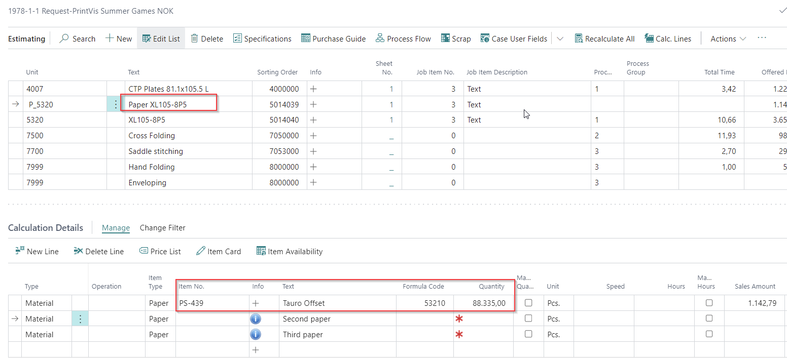
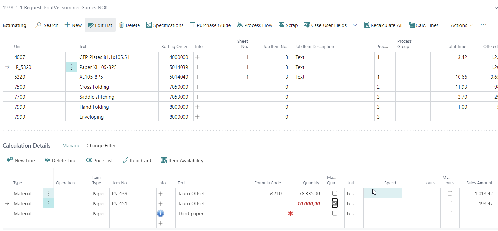
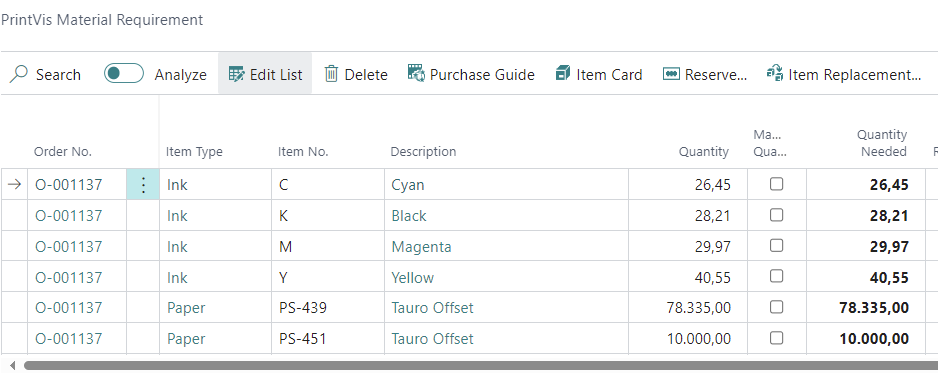
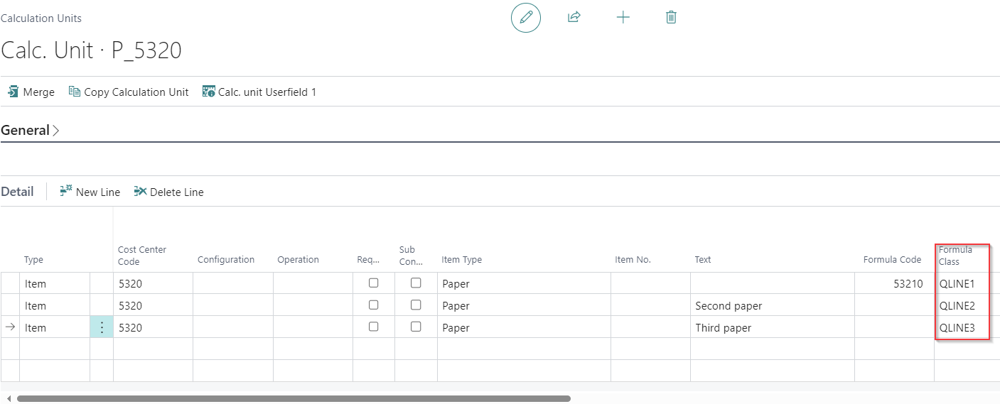
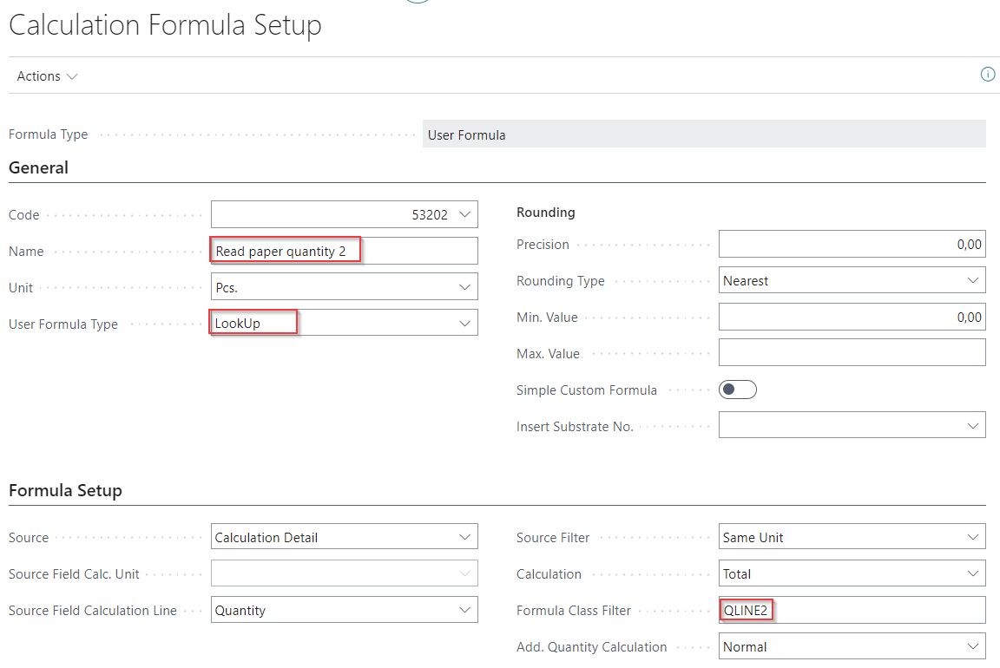
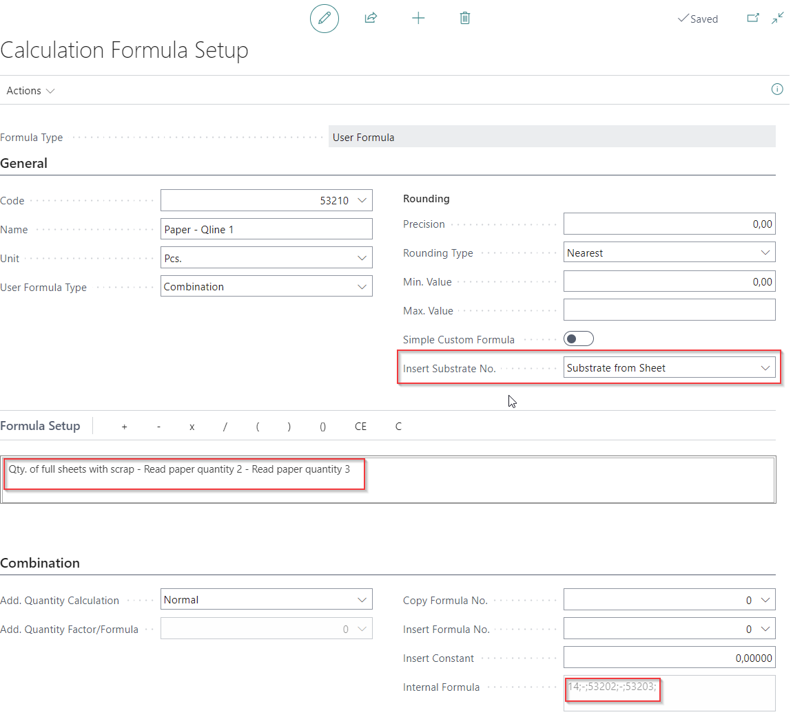

# How to consume more than 1 paper item on a sheet?

## User Story

Sometimes, there is a need to use more than one print substrate item on the same sheet. This could occur when there is leftover stock of a similar paper item that matches the quality and weight of the original paper. To accommodate this, it is necessary to set up multiple paper lines in the paper calculation unit for the press.

 Example

**Scenario:**
- Requirement: 88,335 sheets of paper.
- Stock: An additional paper item with 10,000 sheets available.

**Process:**
1. **Primary Paper:**
   - Original paper item required: 88,335 sheets.

 

2. **Additional Paper:**
   - Paper item no. PS-451 with 10,000 sheets available.
   - The user selects the additional paper item and enters the quantity in line 2 (10,000 sheets).

   

3. **Recalculation:**
   - The remaining quantity for the original paper is automatically recalculated.
   - PrintVis Material Requirements and reservations will adjust accordingly.

**Note:** This example does not involve new layout/imposition or automated cutting calculations for the second paper. The setup assumes that the additional paper can serve as a direct replacement for the original paper.

## Setup

- The first line is for the typical paper calculation detail on a press.
- Additional lines allow users to select extra paper items and enter quantities.

### Calculation Units Setup:

### Calculation Formula Setup:
- Formulas need to read if there is any input in lines 2 or 3.

- **Formula 3** should be used on the calculation detail lines (line 1) instead of the standard formulas 14 or 15.

