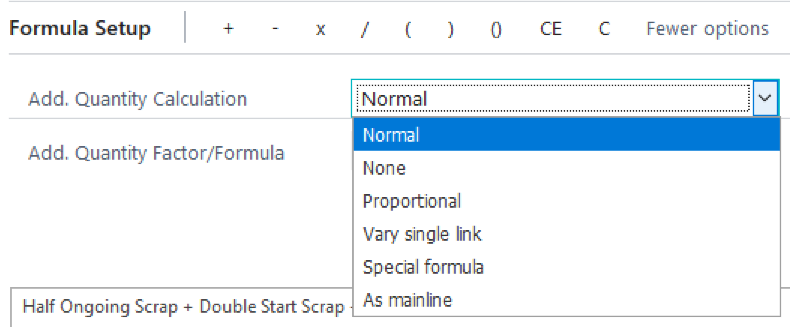

# Custom Formulas with Additional Quantity Calculation

 
PrintVis offers a Formula Generator to build custom formulas for calculations not covered by standard system formulas. This is particularly useful for determining prices for additional quantities.

## What is an additional quantity price?

An additional quantity price allows customers to calculate the cost for quantities beyond those initially quoted. For instance, if the total price for 10,000 brochures is $2,500 (at $0.25 each), and the additional price per 1,000 units is $150, the cost for an increased quantity of 12,500 brochures can be calculated as follows:

- **Base Price**: $2,500 for 10,000 brochures
- **Additional Cost**: 2.5 x $150 = $375
- **Total Price**: $2,500 + $375 = $2,875
- **Price Per Unit**: $2,875 / 12,500 = $0.23 each

## How setup a formula for an additional quantity?

PrintVis standard formulas handle additional quantity calculations. For custom formulas, follow these rules:

1. **Add. Quantity Calculation Option**: Use “Vary single link.”
2. **First Parameter**: The base formula for additional quantity must be the first parameter.
3. **No Interlacing**: The base formula should not be interlaced with other formulas; it should only combine standard formulas and constants.

### This formula is right and will give the expected result

- Use “Vary single link.”
- The base formula for additional quantity is the first parameter.
- The formula is not interlaced and combines only standard formulas and constants.

### This example is wrong and will not give the expected result

- “Vary single link” is not selected.
- The base formula (e.g., Ongoing finishing = Standard Formula 425) is not the first parameter.
- The formula is interlaced with other formulas.

### Options for Additional Quantity Calculation are

1. **Normal**: Additional quantity is calculated based on the first formula. Ensure the formula is designed for additional quantity calculations.

2. **None**: No additional quantity calculation is performed.

3. **Proportional**: Calculation is proportional to the total formula result. The system divides the result by the quantity and multiplies by the additional quantity. Ensure the first formula supports this type of calculation.

4. **Vary Single Link**: Specifies which term in the formula to use for additional quantity calculations (e.g., if the quantity is the fourth term).

5. **Special Formula**: Select a specific formula for additional quantity calculation using the “Add. Quantity Factor/Formula” field.

6. **As Main Line**: The additional quantity calculation mimics the main line result, useful for fixed parameters affecting other details like speed calculations.

