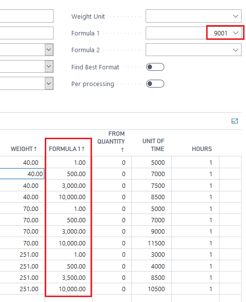
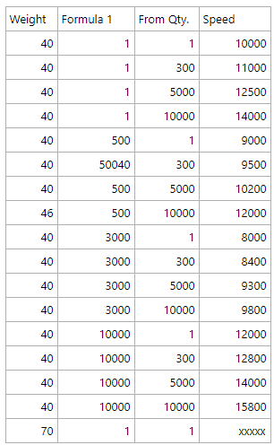

# Custom Formula on the Speed Table

## Summary

PrintVis offers flexibility in adapting speed impacts through the use of formulas as parameters on Speed Tables. However, there are limitations to consider, particularly regarding the accumulation of speed values.

- **Accumulation Restrictions**: Speed tables can only accumulate speed values based on the "From Quantity." It is not possible to accumulate speed values based on other parameters.

## Example

For a custom formula used in a speed table:

- Accumulation on speed tables is limited to "From Quantity" only.
- To achieve precise speed values, additional steps and careful setup of formula values are necessary.

Ensure to adjust your formulas accordingly to accommodate the restriction of accumulation based only on "From Quantity."

