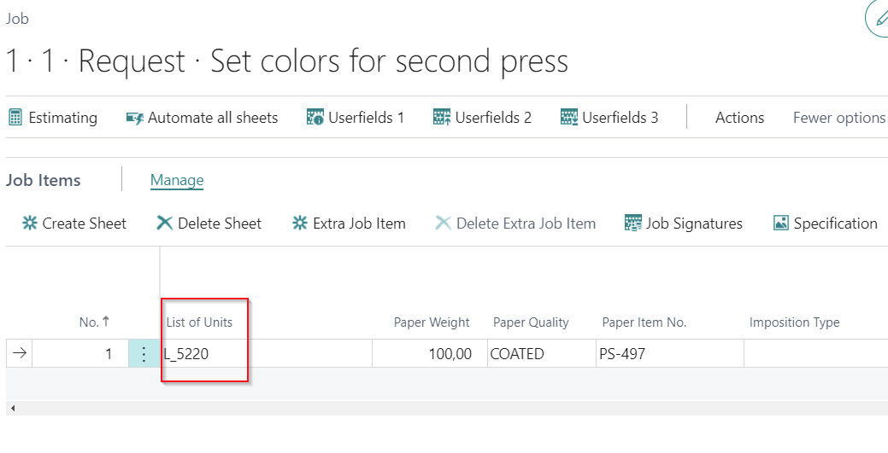
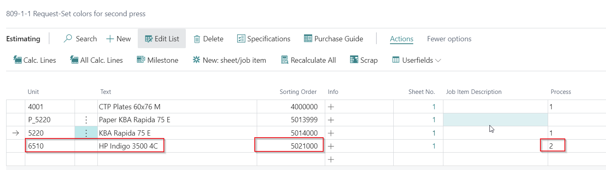
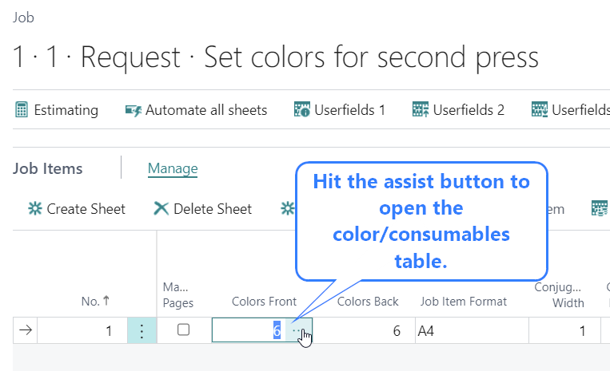
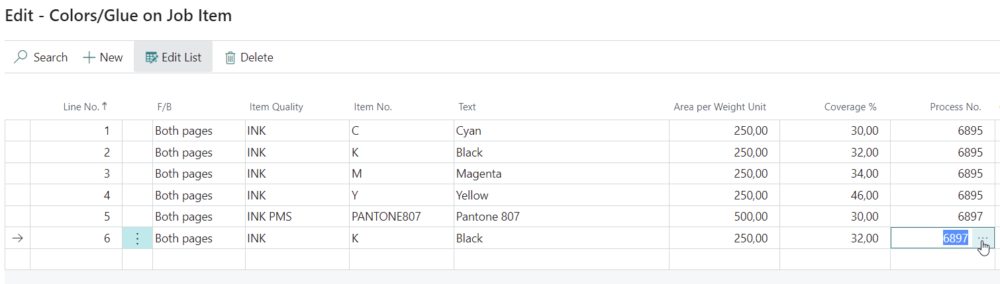
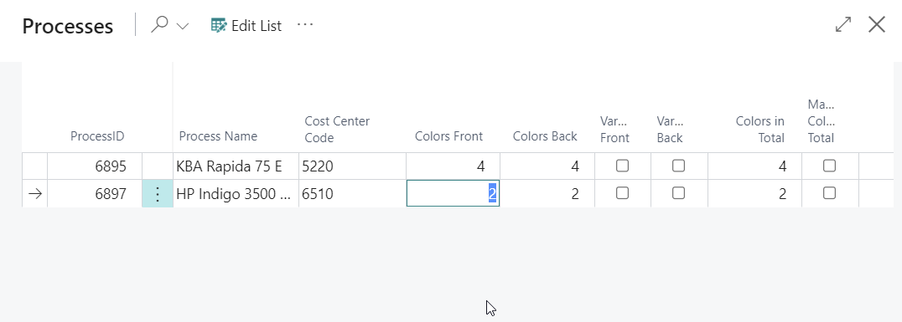
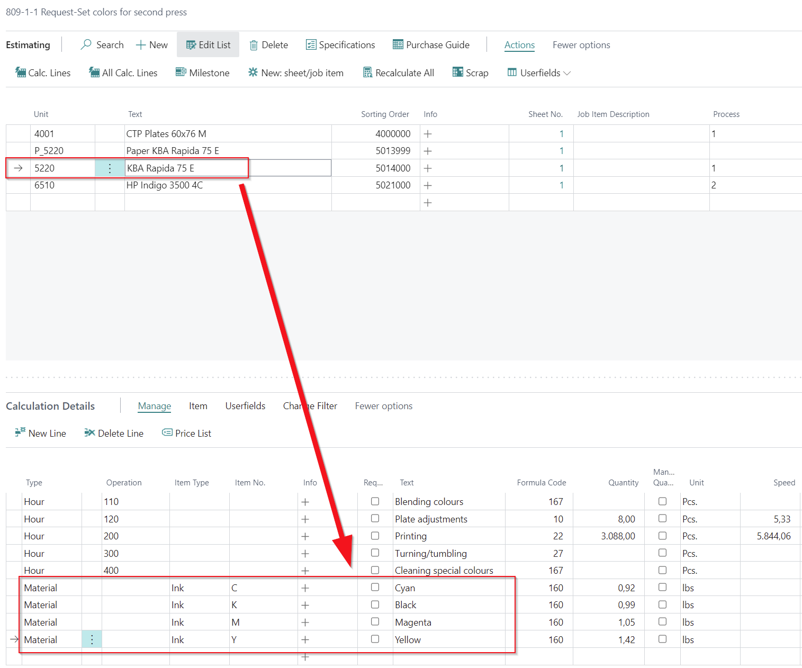

# Assign inks to 2 or more print processes / print passes

## Summary

When a sheet goes through multiple presses, it's important to assign the ink used for each press accurately. This process is detailed as follows:

## How to ...?

1. **Select Initial Press**:
   - In the job item setup, choose the first press that the sheet will go through.

2. **Add Second Press**:
   - On the estimation page, add another press as a calculation unit. Ensure you do not select a list of units that includes paper; only select the press.
   - If plates are required for the second press, create a separate list of units for the press and plates only. Avoid adding a paper unit for this press, but if it appears, it won’t be double-counted due to the smart PV formulas. However, having two paper lines might be confusing if one shows a quoted price of 0.

3. **Adjust Sorting**:
   - Ensure the second press is sorted correctly, appearing after the first press for accurate scrap calculations.

4. **Assign Ink to Each Press**:
   - On the ink/color page, select the machine by its process number. Use the 

5. **Process No.** field to lookup and assign the correct number of colors (plate calculation) and select the ink process for each press.

6. **Verify Calculation Details**:
   - Ensure that the calculation details for each press only display the inks assigned to that specific press.

By following these steps, the ink usage will be properly assigned and calculated for each press involved in the job.

