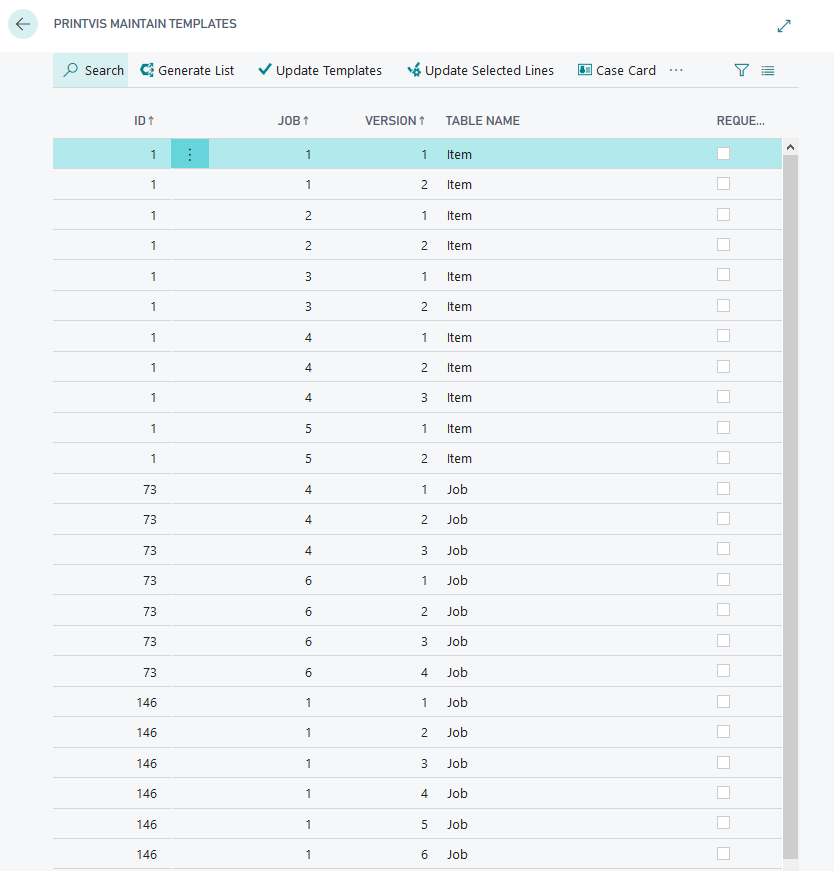

# Maintain / Update Templates

## Summary
When a price unit is changed and it is already used in a template, the template does not automatically update.

## Maintain/Update Templates

To update existing templates, follow these steps:

 1. Use the Maintain Templates Tool

- **Search for:** PrintVis Maintain Templates

 ## Results

The tool will:

- **Update Estimates:** Reflect the newest price units in the estimate.
- **Restore Unit Quantity and Hours:** Restore the unit quantity and hours on the price unit in the estimate.
- **Retain Manual Changes:** Try to retain all manual changes on the calculation line if the new setup matches the old line.
- **Avoid Surcharge Dialog:** No surcharge dialog will pop up.
- **Allow Changes to Archived Templates:** Archived templates are permitted to be updated.

By using the Maintain Templates tool, you ensure that your templates are up-to-date with the latest price unit changes and retain manual adjustments as needed.
