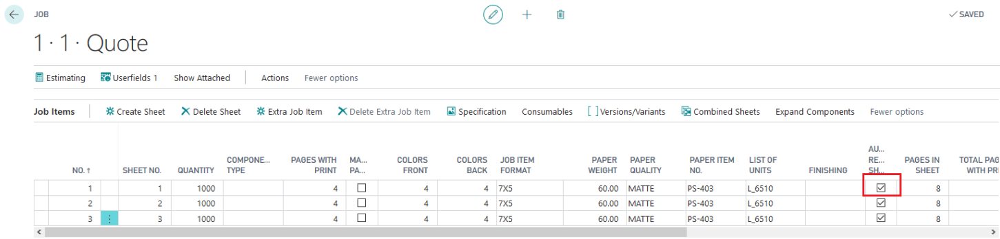
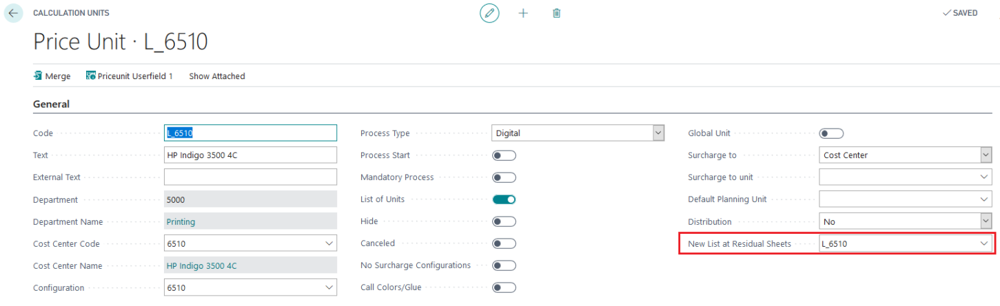

# How to get the right make ready time for residual sheets

When using the "Auto Residual Sheet" feature on a Job Item, PrintVis will automatically split the sheet into the required number of sheets based on the same imposition.

To avoid calculating excessive make-ready time for residual sheets, it is advised to:

1. **Set Up a Subsequent List of Units:**
   - Create a new List of Units specifically for residual sheets that does not include a complete make-ready operation.

2. **Configure the Calculation Unit for Residual Sheets:**
   - Ensure that the List of Units selected for residual sheets is different from the main production List of Units.
   - The new List of Units should contain a Price Unit for the printing machine with a lower calculation (or no calculation) of make-ready time.

**Auto Residual Sheet Setting:**
- Products: 3 different 4-page folders.

**Calculation Units List:**
- Select the appropriate List of Units for Residual Sheets from the marked field.

**Default Setting:**
- The default field value is set to its own code, which may include excessive make-ready time.

**Adjustments:**
- Change the List of Units to avoid double make-ready time.
- Ensure that the new List of Units has a lower or no make-ready calculation.

By following these steps, you can optimize the calculation of make-ready time for residual sheets and ensure efficient production.
