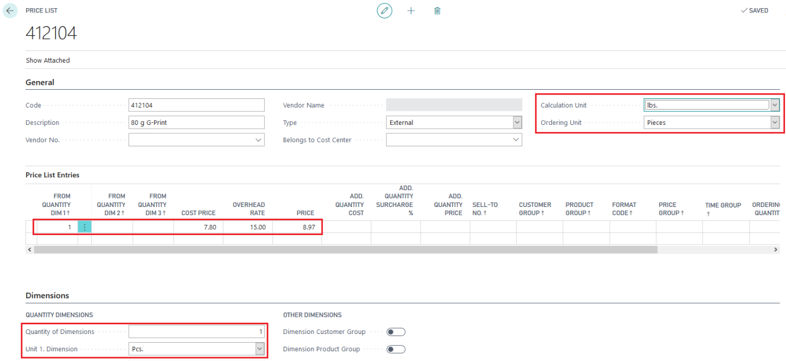
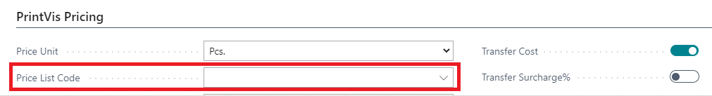

# Setup material counted in pcs but calculated in kg/lbs

This article describes how to configure PrintVis to handle material calculations in kilograms or pounds when consumption is measured in pieces.

## Price List Setup

1. **Create a Price List:**
   - **Calculation Unit:** Set to kg/lbs.
   - **Ordering Unit:** Set to pieces.

## Item Setup

- **Add the Price List to the Item Card:**
  - Navigate to the PrintVis Pricing section.
  - Assign the created price list to the relevant item.

## Calculation Formula

- **Apply Formula 15:**
  - Use this formula on the calculation line for the material to ensure correct conversion between units.

