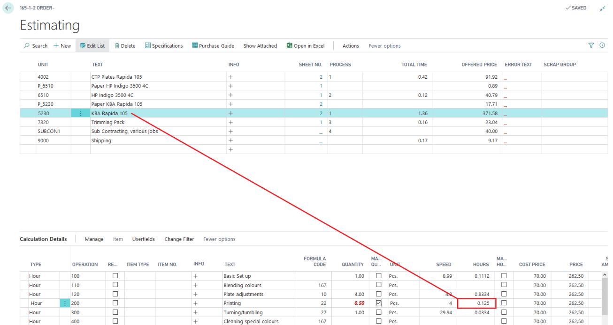
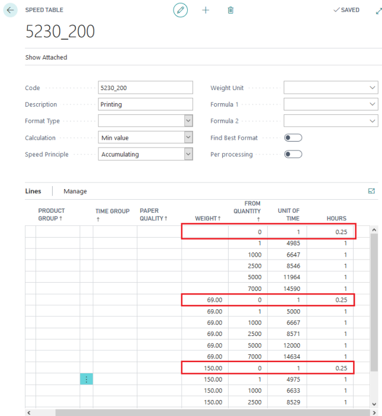

# Minimum Hours in Operation

## Summary

If a minimum time for an operation is desired, this is typically because the available calculation data is not properly split into fixed and variable parts.

 

But with a trick in a speed table it is possible to achieve this requirement.

## Goal

To achieve a minimum printing time of 0.25 hours (or any other desired minimum time).

## Setup

To ensure that the operation meets the minimum time requirement, you can use a specific setup in the speed table. This method adjusts the calculation to include a minimum time threshold.

 Important Note

- **Accumulating Function Impact:** The accumulating function in the speed table might affect the precision, so achieving an exact minimum time of 0.25 hours may not be possible. The result may be close but not exact.

By applying this setup, you can ensure that your calculations account for a minimum operation time, though some variability may occur due to the nature of the accumulating function.
