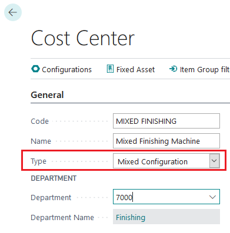
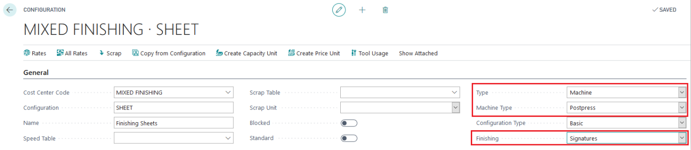
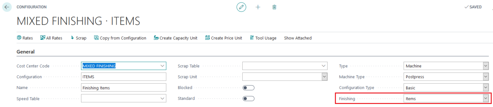
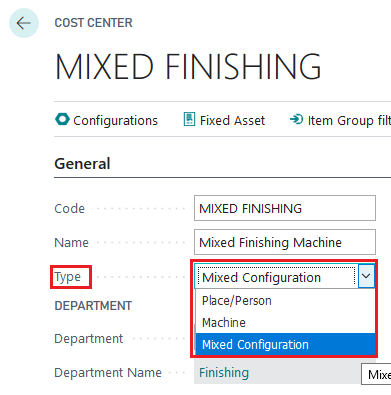
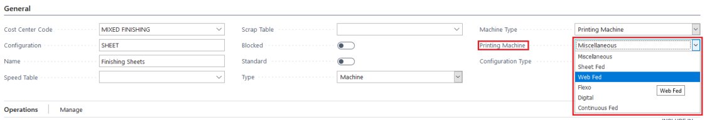

# Mixed Configuration - machine setup for printing and different types of finishing

## Summary

With PrintVis, you can configure a Cost Center to handle both printing and finishing operations. A Cost Center with the type "Mixed Configuration" can manage various machine types, enabling flexible handling of both sheets and items.

## Setup

The setup involves configuring the Cost Center with the appropriate machine types and configurations:

1. **Configuration for Finishing Sheets or Signatures:**
   - Quantity is calculated per sheet.
   - Examples include folding or lamination of covers.

2. **Configuration for Finishing Items:**
   - Quantity is calculated based on the final product.
   - Examples include saddle stitching, where multiple sheets are merged into a final product.

 Key Points

- **Distinction Between Signatures and Final Items:** 
  - While a finished signature is technically an item, PrintVis calculates based on the final configuration, such as books, rather than individual signatures.

## Example 

### Configuration 1
   - Production quantity based on signatures per printed sheet, plus scrap/waste.

### Configuration 2

   - Production quantity based on the ordered quantity, plus scrap/waste.
   - Examples include the number of books on a perfect binder or inserter.

## Printing Machine

- For presses that handle both sheet and web paper:
  - Set up two configurations:
    - **Sheet-Fed Press**
    - **Web-Fed Press**

- **Historical Context:** 
  - Previously required three separate cost centers (signatures, sheets, and items).
  - The "Mixed Configuration" option simplifies this by allowing configuration changes at the machine level.

 Solution

- **Setup the Cost Center as a "Mixed Configuration" type:**
  - This allows you to modify the Machine Type directly in the configuration setup.

