# How does PrintVis create a sheet layout/imposition and residual sheets?

## Summary

Sometimes users inquire about how PrintVis splits pages on a sheet and how this process can be modified. This article explores the logic behind it and provides examples.

## How Does It Work?

PrintVis uses two main methods to place pages on a sheet or print section:

1. **Maximizing Page Placement**
   - PrintVis tries to fit as many pages as possible onto a print section.
   - Each job item/sheet has the same imposition and may contain multiple such sheets.
   - Residual sheets are created if needed (unless disabled).

2. **Using Imposition Types**
   - Imposition types preset the number of pages per sheet or print section.
   - Relationships and ranges are set up on the imposition to dictate how sheets are split.
   - The imposition can be preset on the component.

### Top1: PrintVis tries to put as many pages as possible into the print section

In this example, a job has 56 pages, and “Automatic Residual Sheet” is enabled. Each print section can hold 16 pages. Here's how PrintVis handles this:

- **First Print Section**: 3 sheets of 16 pages each (48 pages total).
- **Residual Sheet**: 8 pages left, creating a residual sheet. The same paper and press are used, and PrintVis places 2 more pages on this residual sheet.
- **Additional Residual Sheets**: If pages cannot be evenly divided, additional residual sheets are created.

**Residual Sheet Identification:**
- It uses the same Job Item No. and appears in a different color.
- Users can adjust press/paper if needed or use the auto-function to select the best options.

If "Automatic Residual Sheet" is disabled:
- PrintVis will not create a residual sheet and will waste paper by printing the remaining 8 pages on a 16-page section.

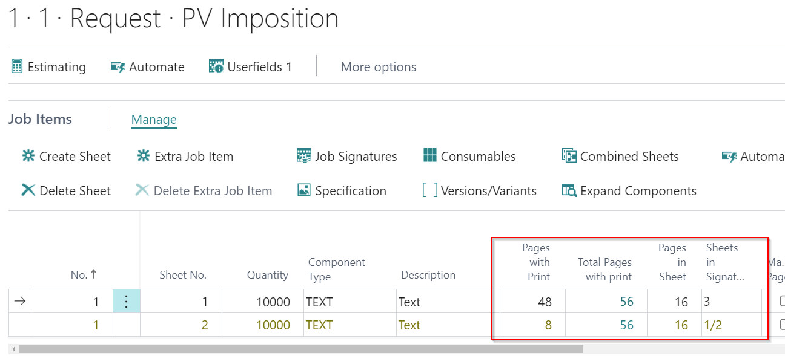

The specification indicates that Web 1 of 2 (setup is on a web offset press) exists 3x with the same layout.

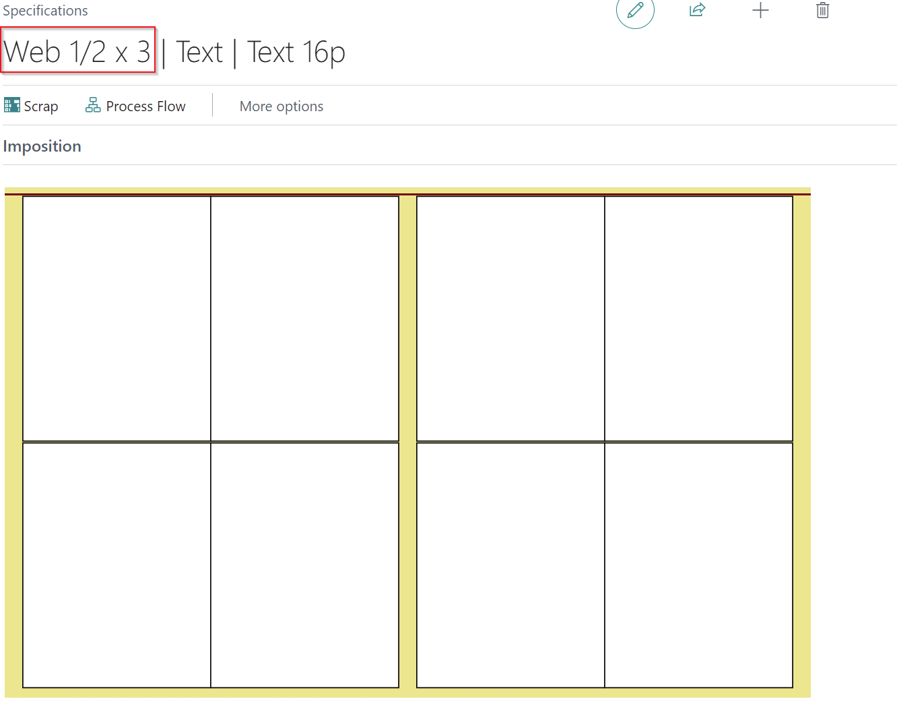

#### Disabling "Automatic residual sheet"

When disabling "Automatic residual sheet" on example 1 PrintVis will not create a residual sheet and calculate as if the 8 pages would be printed on a 16p section by wasting 1/2 of the paper.  This could be suitable for low volume orders.

The imposition picture will not that. It still shows the layout for the 16 pages because there is just 1 layout picture available for every sheet.
This option cannot be used in a JDF environment because for every page layout the folding scheme and imposition type must be selected

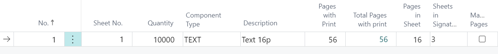

### Top 2: Using imposition types that presets how many pages will be on the sheet/print section - Common setup for newspaper printers

**Common Setup for Newspaper Printers:**
- This setup is typical for printers with presses running multiple webs and press units.
- PrintVis automatically assigns the required press units for a specified imposition type.

- A component type for 32 pages is selected with the imposition type G32P-T.
- The setup will automatically create residual sheets for every 8-page section, using different press units for each residual sheet.

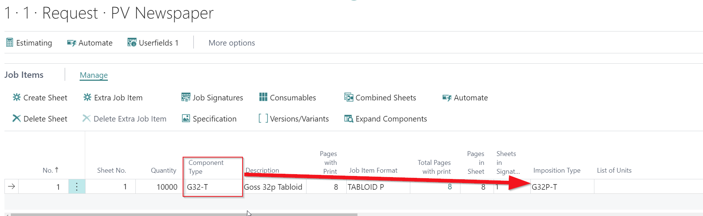

**Setup compunent:**

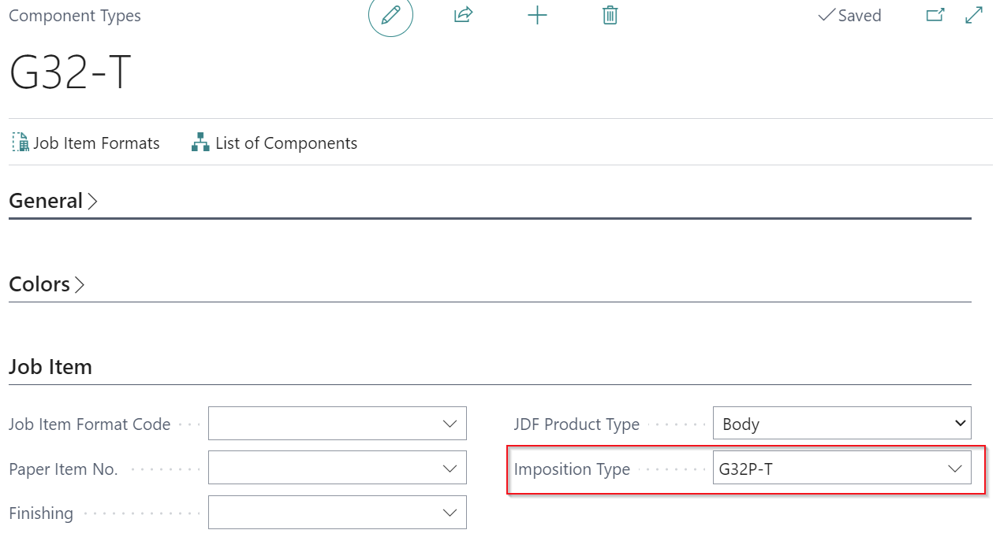

If the newspaper press is now selected (List of Units) PrintVis is creating residual sheets for every sheet of 8 pages. Pleas note for every residual sheet a different press unit is selected automatically which is in use for the no. of pages. All 4 units will then be merged into the 32 pager in the same folding unit.

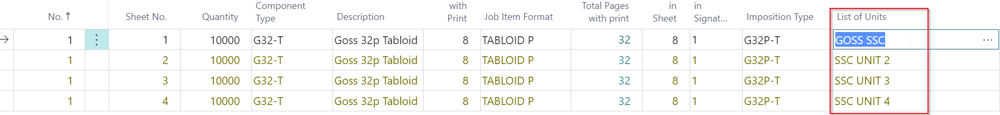

#### What is the setup behind that?

1. **Imposition Type:**
   - G32P-T is set up for 8 pages only.

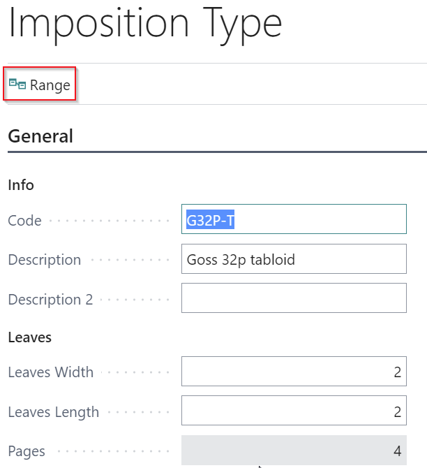

2. **Residual Sheets:**
   - Created based on the "Range" setup for each entry.
   - PrintVis uses the given imposition code (8 pages per residual sheet).

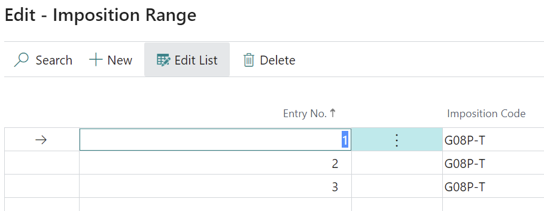

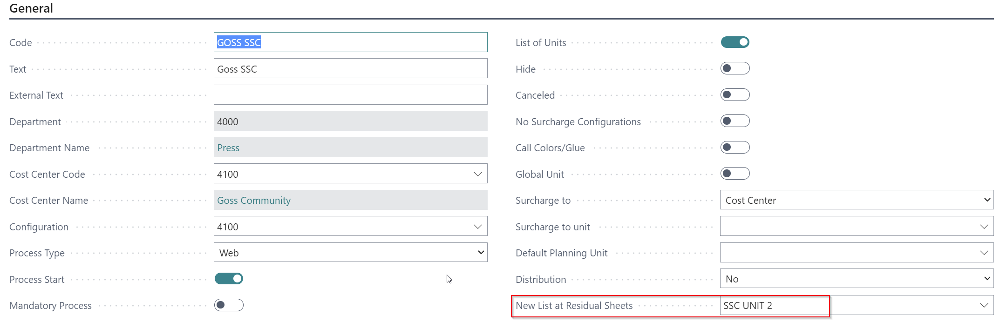

3. **List of Units:**
   - Different press units are selected automatically for each residual sheet.

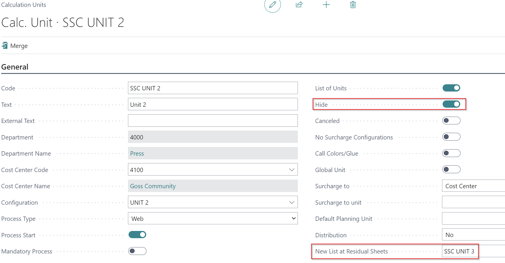
   

	- "Hide" setting is enabled for units except the first one, making them invisible in the unit selection list but used automatically for residual sheets.

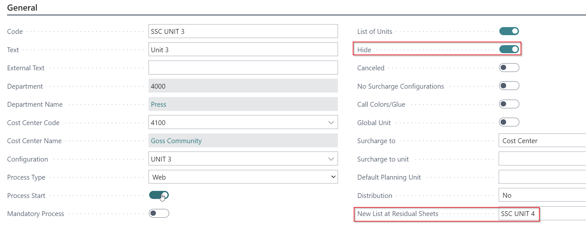

By understanding these settings, users can better manage how PrintVis handles page placement and residual sheets, ensuring efficient use of paper and press time.
