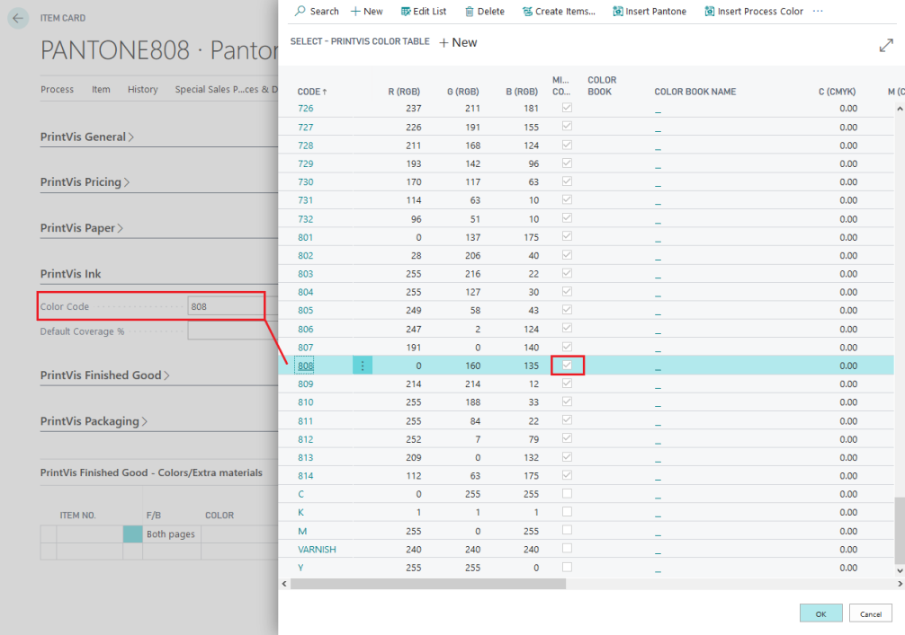
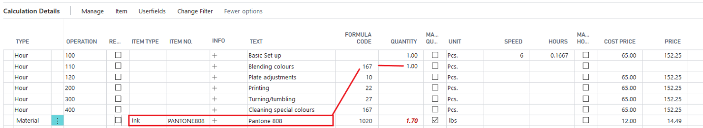

# Calculate Setup or Cleanup for special inks

To ensure that ink items are accounted for in machine wash-up or ink mixing time calculations, follow these steps:

1. **Set Up Ink Item**:
   - Create and select a **Color Code** from the Item card.
   - Set the boolean field **“Mixed Color”** in the color table to **“True”**.

2. **Calculation Details**:
   - Formula 167 will total the number of colors included in the Job Item that have the **Mixed Color** setting.

3. **Result**:
   - The calculation details will reflect the total number of mixed colors based on the setting, which impacts the machine wash-up or ink mixing time calculations.

