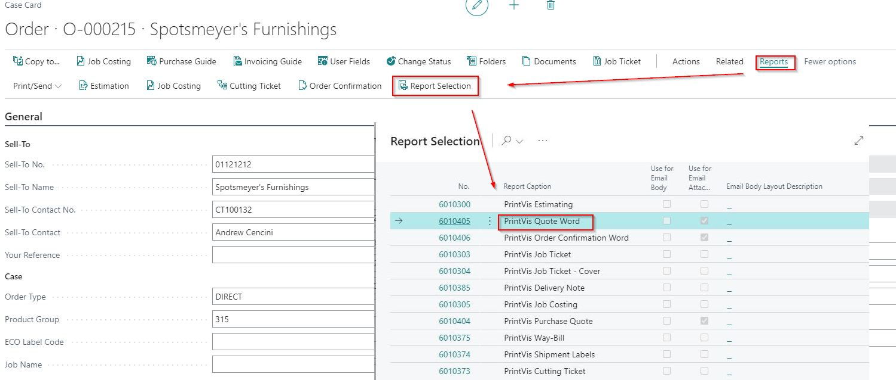
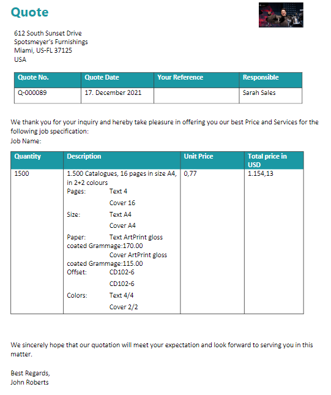
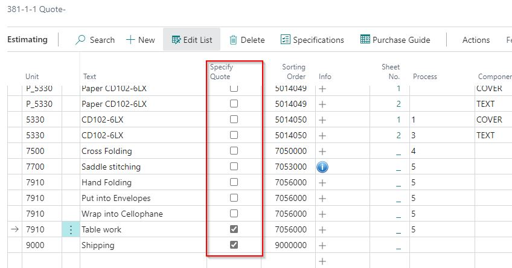
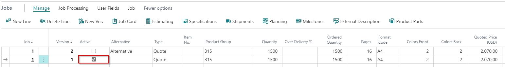
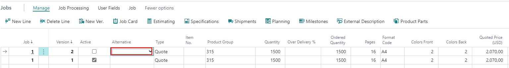
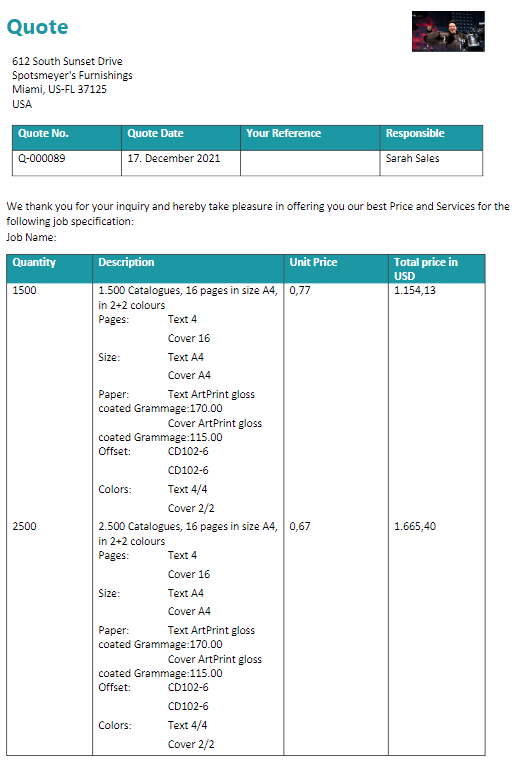

# Specify PV Quote Report

## Summary

This article describes the possibility to specify the PV Quote report with additional work based on estimation.

### PrintVis Quote Report

Here is an example of a PrintVis Quote report from the case card:

#### Specify the Quote

To specify the quote report at the estimation card:

1. Navigate to the estimation card in PrintVis.
2. Set up the required specifications for the quote report.

#### Alternative Quote Lines

If you want to include alternative quote lines:

1. Mark the main line as **Active**.

2. If the field **Alternative** is empty, the system will print only the active line.

 Example with "Alternative"

