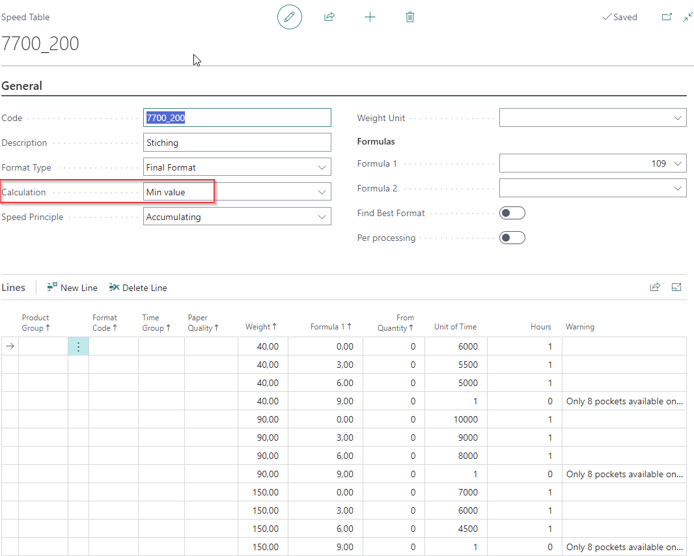

# How to set up speed table reduction?

## Introduction

Machine speeds can be affected by parameters such as paper quality, size, weight, or production quantity. These parameters can be easily configured in each speed table. 

Additional custom parameters can be introduced by using formula 1 or 2 in the header (this scenario is not covered in this article).

This article focuses on the impact of a specific aggregate that, when activated, reduces the speed of the main machine. The machine type is configured in the PrintVis Cost Center Configuration and must be set to one of the following types:

- **Basic:** This is the main line of the machine and can operate independently.
- **Surcharge:** This is an aggregate that can be added to the Basic Configuration and cannot operate independently.

## Machine Examples

Examples of machines and aggregates include:

- **Saddle Stitcher with 7 Pockets and 3-Knife Trimmer**
  - Saddle Stitcher with 6 Pockets: Main line (Basic Configuration)
  - 3-Knife Trimmer: Surcharge unit that requires the saddle stitcher's main line (Surcharge Configuration)

Other examples:

- **Folding Machine (Basic Configuration) with a Gluing Unit (Surcharge Configuration)**
- **Folding Carton Folder/Gluer (Basic Configuration) with a Unit for 4- or 6-Corner Gluing (Surcharge Configuration)**
- **Printing Press (Basic Configuration) with Drying, Varnishing, or Other Optional Units (Surcharge Configurations)**

## How to Setup?

Speed tables that interact need to be set up in the header of the configuration:

1. **Base Configuration:** This is set in the production operation and defines the main speed (e.g., 10,000 pcs/hr).
2. **Surcharge Configuration:** Defines the reduction in speed when the surcharge unit is used.

### Setup Example

Consider the following scenario:

- A finishing machine has a speed table set to 6,000 pcs/hr.
- Saddle Stitcher is set as a Basic Configuration.
- An optional inline process, such as a 3-Knife Trimmer, is chosen. This process reduces the primary speed by 10%.

#### Basic Configuration

- The speed table impacted by the reduction is set in the header of the configuration. For this example, it is speed table code "7700_200".

- The speed table calculation field must state "Min value".

#### Surcharge Configuration

- The speed tables defining the reduction are set in the header of the configuration. Typically, this is not used in an operation for this unit.

- The speed table calculation field must state "Reduction", "Reduction %", "Max. Reduction", or "Max Reduction %".

#### Reduction/Max Reduction

- The saddle stitcher is added to the Estimation page, showing a speed of 5,999.88/hr.

- Adding the 3-Knife Trimmer by selecting it from the lookup in the "Unit" field for the saddle stitcher, and clicking "OK", results in a speed reduction.

**Result with Reduction:**
- Speed is reduced to 5,399.83/hr (note: rounding impacts may occur with accumulating speed tables).

The 3-Knife Trimmer adds extra setup time.

## Difference between Reduction and Max Reduction

 Speed Reduction in Estimation (PrintVis)

Speed reduction settings allow you to adjust the basic configuration speed based on surcharges applied during estimation. There are two main types of reduction: **absolute (hours)** and **percentage (%)**.

---

 🕒 Reduction (Hours)

- **Reduction** will reduce the speed of the basic configuration based on **hours**, depending on the **surcharge** added on the estimation.

---

 📉 Reduction % (Percentage)

- **Reduction %** will reduce the speed of the basic configuration based on **percentage** instead of hours.
- This reduction is also tied to **surcharges** in the estimation.

---

 🔁 Multiple Surcharges & Accumulation

- If **multiple surcharges** with reduction setups are applied to the **same basic configuration**, the reductions are **accumulated**.
- This can lead to excessive speed reduction — which is where **Max Reduction** and **Max Reduction %** become useful.

---

 ⛔ Max Reduction (Absolute Limit)

- **Max Reduction** sets a limit for the total reduction (in hours) that can be applied.
- **Example 1:**
  - Surcharge A = 1000
  - Surcharge B = 500
  - Sum = 1,500
  - If Surcharge C has a **Max Reduction = 1,000**, it is **not applied**, because 1,500 > 1,000
- **Example 2:**
  - Surcharge A = 250
  - Surcharge B = 500
  - Sum = 750
  - If Surcharge C has a **Max Reduction = 1,000**, then final reduction = **1,000**

---

 📊 Max Reduction % (Percentage Limit)

- **Max Reduction %** sets a limit for the total **percentage reduction** applied.
- **Example 1:**
  - Surcharge A = 15%
  - Surcharge B = 25%
  - Sum = 40%
  - If Surcharge C has a **Max Reduction % = 25%**, it is **not applied**, because 40% > 25%
- **Example 2:**
  - Surcharge A = 10%
  - Surcharge B = 5%
  - Sum = 15%
  - If Surcharge C has a **Max Reduction % = 25%**, then final reduction = **25%**

---

> ✅ **Tip:** Use Max Reduction and Max Reduction % to avoid unrealistic or unintended slowdowns in your estimation.

