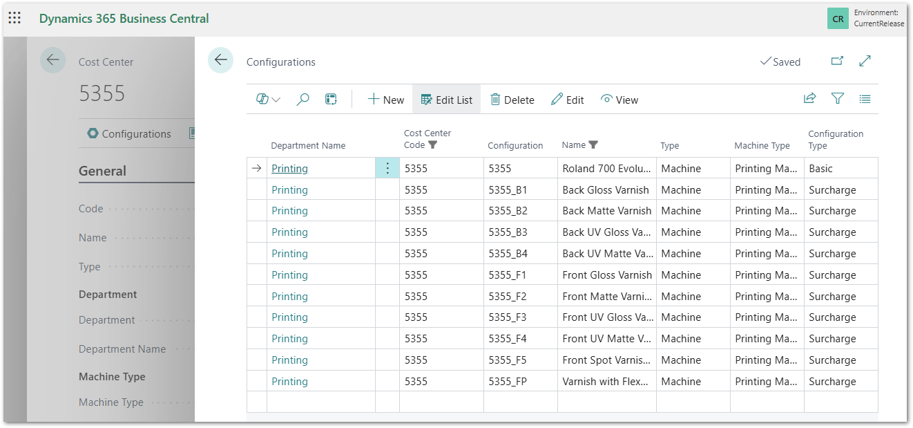
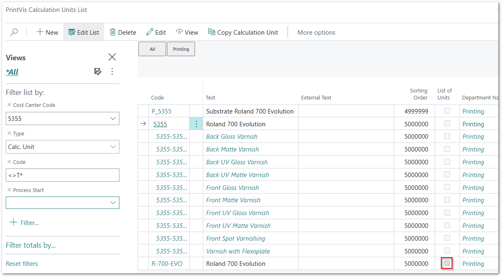
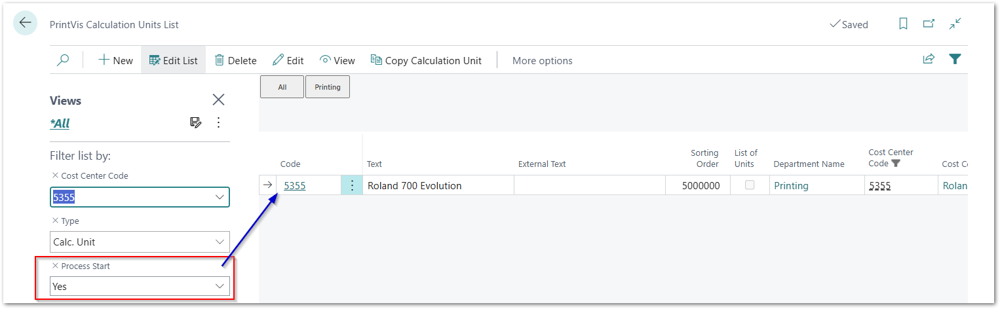
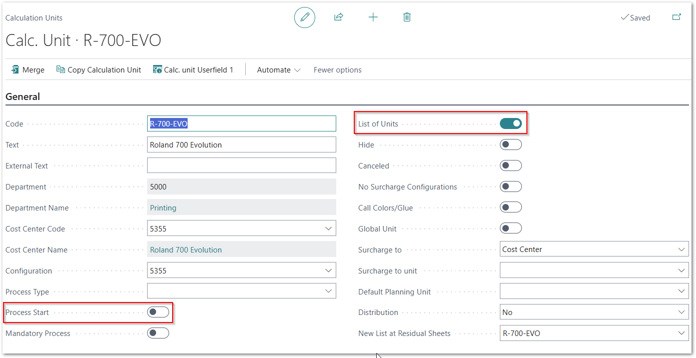
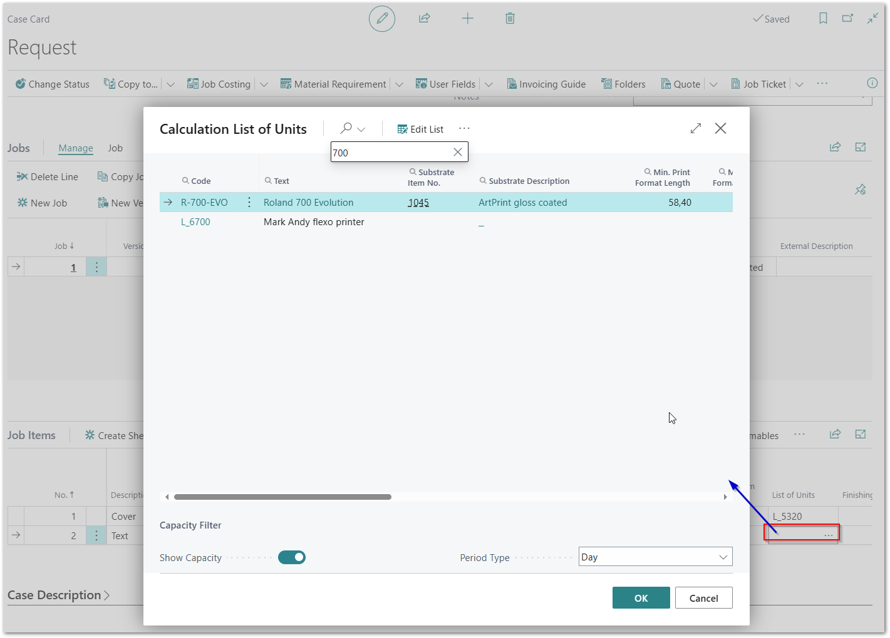
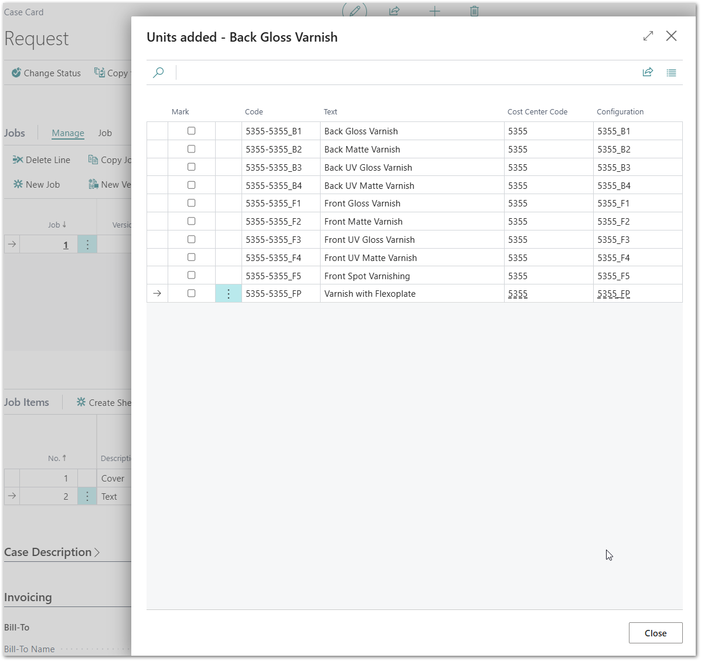

# Surcharges on press pop-up 2 times when List of Units for press is selected

## Description

 **Troubleshooting Surcharge Pop-Up on Job Item (PVS List of Unit)**

You might run into the problem where the pop-up, after selecting the **PVS List of Unit** on the job item (typically a press), appears more than once. This pop-up gives the user a choice of surcharge units that should be added to the calculation.

This issue is typically caused by incorrect setup.

---

 **Cause**

The **surcharge pop-up window** is triggered when a **process for a machine** is created. If a **PVS List of Unit** adds more than one calculation unit to the estimate, and **more than one calculation unit has the “Process Start” field enabled**, then **each of those calculation units** will trigger a separate pop-up.

---

 **Solution**

If this problem occurs:

- Check that **only the main calculation unit** (from the base configuration) for the press has the field **“Process Start”** enabled.
- Also, **check the PVS List of Unit**! This should **also have the field “Process Start” disabled**.

---

> Ensuring only one calculation unit has "Process Start" enabled will prevent multiple surcharge pop-ups from appearing.

## Setup Example:

This cost center contains several surcharge units/configurations:

These are the Calculation Units: the last line is the List of Units.

Only the unit for the base configuration has "Process Start" enabled:

List of unit setup: "Process Start" is disabled!

## Job Example:

When selecting the List of Units for a job item:

The pop-up page comes up only once:

