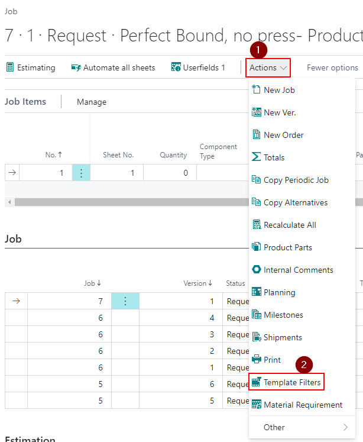
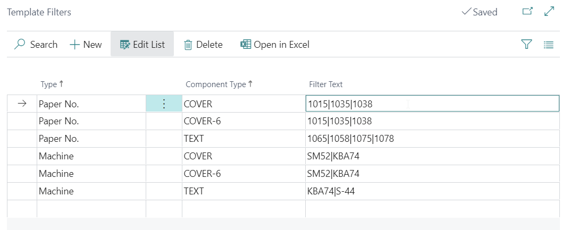
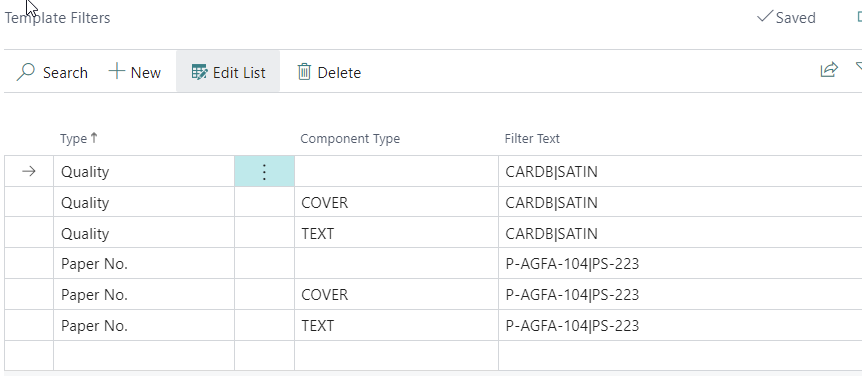
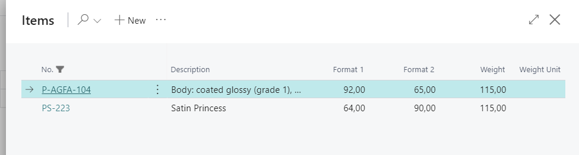

# Template Filter Setup

## Introduction 

Template Filters in PrintVis are used to limit the choices available for users in Quick Quote and Case Templates. Filters can be applied to Qualities, Paper Item Numbers, Machines (Cost Centers), and Paper Weights. The setup of these filters helps in customizing and narrowing down the options based on specific criteria.

## Template Filters and Settings

1. **Mark Job as Template:**
   - Ensure the Job is marked as a ‘template’ before applying filters.

2. **Apply Template Filters:**
   - Navigate to the desired Job Card.
   - Click `Actions` -> `Template Filters` to open the Template Filters page.

3. **Filter Setup:**
   - Filters are defined with a ‘pipe’ (|) separating the elements. For example: `AAAA|BBBB|CCCC`.

4. **Available Filters:**
   - **Qualities:** Filter by Item Quality Codes.
   - **Paper Item Number:** Specify exact Paper Item Numbers.
   - **Paper Weight:** Limit choices to certain paper weights.
   - **Machine:** Restrict the list of Machines (Cost Centers) available.

   **Note:** Filters set up here will only affect the selected Job and Version.

5. **Component Type Consideration:**
   - Ensure that the Component Type used or selectable on the Job Card is included in the Template Filters setup. The setup will not work if the Component Type is left blank while selected on the Job Card.

6. **Paper No. and Quality Filter:**
   - When using Paper No. and Quality filters, only the Paper No. filter impacts the Item list when the template is used on a Case.

## Example 

- **Qualities and Paper Item No.:** PrintVis does not support using both filters simultaneously. Choose to filter by either Item No. OR Qualities.
- **Paper Weight Filtering:** Can be used in combination with Qualities filtering.

- **Attach Template:**
  - Once the template, including Template Filters, is set up, attach it to PrintVis Estimation Automation or a Product Group.
  - This setup allows the template to be used in cases or Quick Quotes.

 Example Result

- Proper setup and filtering will refine the options presented in the Quick Quote or Case based on the specified criteria, ensuring only relevant choices are available to users.

