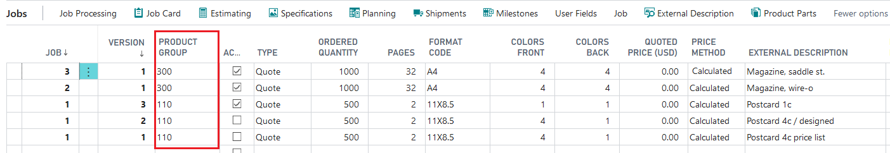
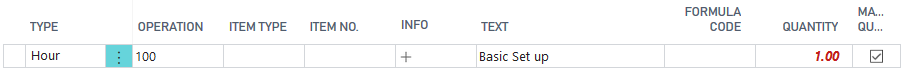
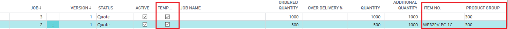
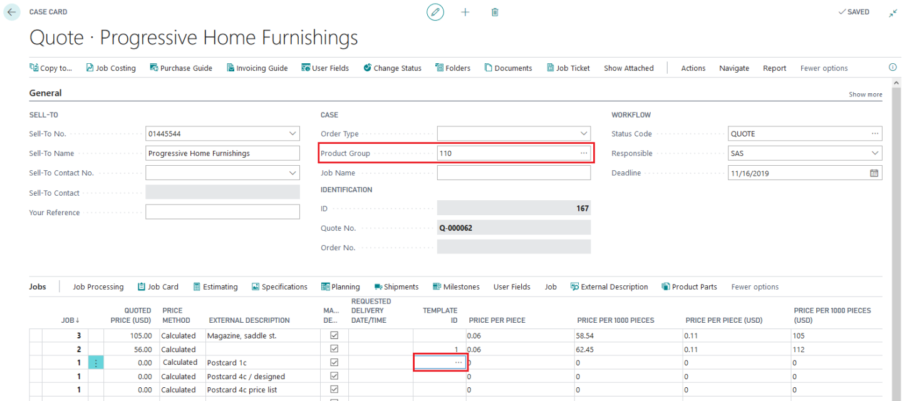
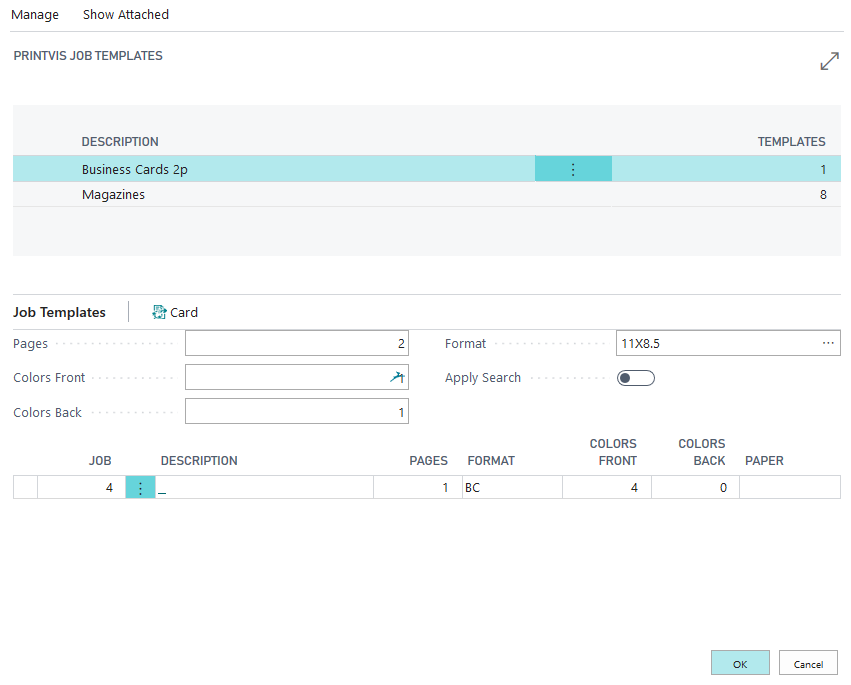
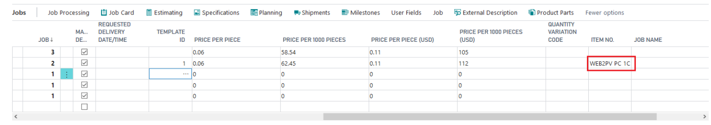

# Create and Use Templates

Templates in PrintVis are designed to streamline the quoting process by recycling information for similar jobs. This helps speed up the process and ensures consistency. Templates can be related to Product Groups or Finished Good Items.

## Types of Templates

1. **Templates Related to a Product Group**

   **Example - Product Group: Brochure**
   
   - Saddle stitch brochure 4 pages cover
   - Saddle stitch brochure 6 pages cover
   - Saddle stitch brochure 8 pages cover
   - ...

2. **Templates Related to a Finished Good Item**

   **Example** 
   
   - Finished Good Items
   - Label
   - Calendar
   - Poster

## Create a Template

- The simplest way is to create a Job Card for each Product Group as a template.
- It is also possible to define any calculation as a Template.

 Case Card - Templates

- A complete calculation includes all product parts and calculation units for every job line. 
- Not all fields must be filled. The “External Description” field is used as the Template description.

**Warning!**

- Avoid manual or fixed entries in the calculation. Templates should be adaptable to changing conditions, such as higher quantities.

 Estimating - Manual/Fix Entry

### Assign to the Product Group

1. After defining the Template, open the Job Card from each line.
2. Mark this Job as a Template for the Product Group (first line).

   **Job Card - Job**

### Assign to the Finished Good Item

1. Allocate the Templates to a Finished Good Item by inputting the Item number in the relevant field (second line).

   **Job Card - Job**

 ## Use the Templates

1. Create a new Case and input all necessary information:
   - Customer
   - Order Type
   - Product Group
   - Job Name
   - Product Groups

2. Select the Template from the field.

   **Case Card**

### Finished Good Items

  

 **Case Card**

## Modify Templates

- The Template setup can be accessed by searching for PrintVis Job Templates.

### Job Templates

- Open the Template Job Card from this section and make modifications as needed.

