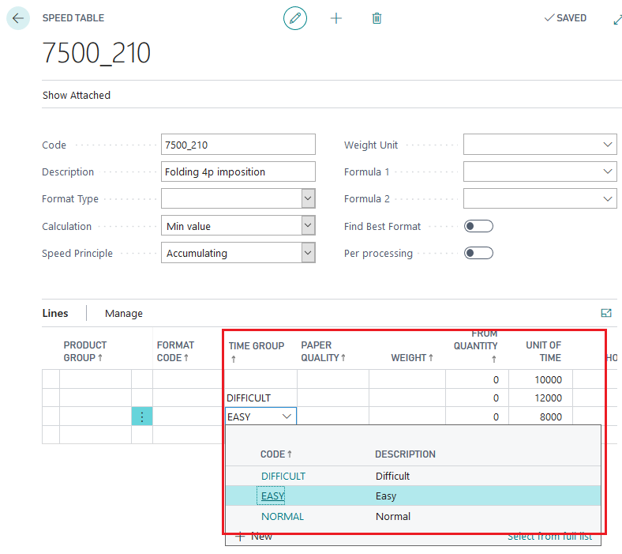
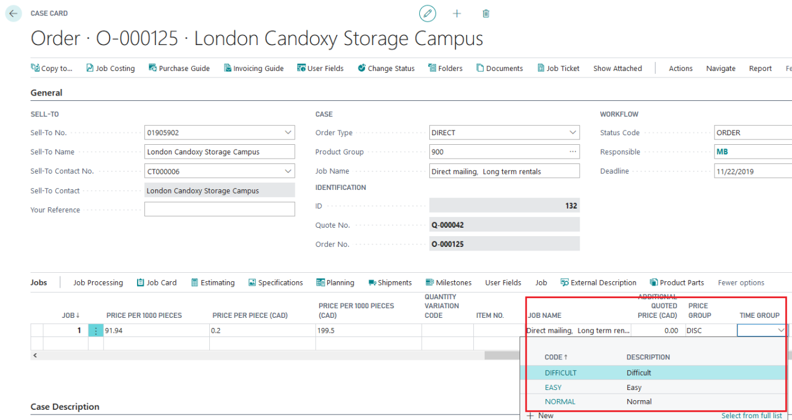
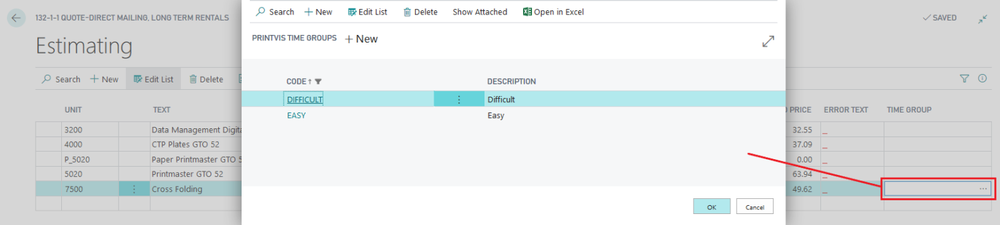

# Time Group Setup

## Summary

Time Groups allow for adjusting speeds or prices through predefined steps rather than fixed values. They are utilized in both Speed Tables and Price Lists.

## Setup

- **Recommendation**: It is advisable to set up a line without a specific Time Group attached to represent an average value. This allows for automatic calculation without needing to select a specific Time Group.

## Usage

Time Groups can be applied in two ways:

1. **Globally for the Job**:
   - Affects all Speed Tables that include the selected Time Group.

2. **For a Specific Price/Calculation Unit**:
   - Impacts only the selected Price/Calculation Unit.
   - The available Time Groups are limited to those in use in the Speed Tables attached to this Time Unit.

### Time Group Selection on Job

- Allows global application across all Speed Tables containing the selected Time Group.

### Time Group Selection on Calculation Unit

- Only displays Time Groups that are active in the attached Speed Table.
- Example: Only groups such as DIFFICULT and EASY are available for selection if they are the ones used in the Speed Table setup.

