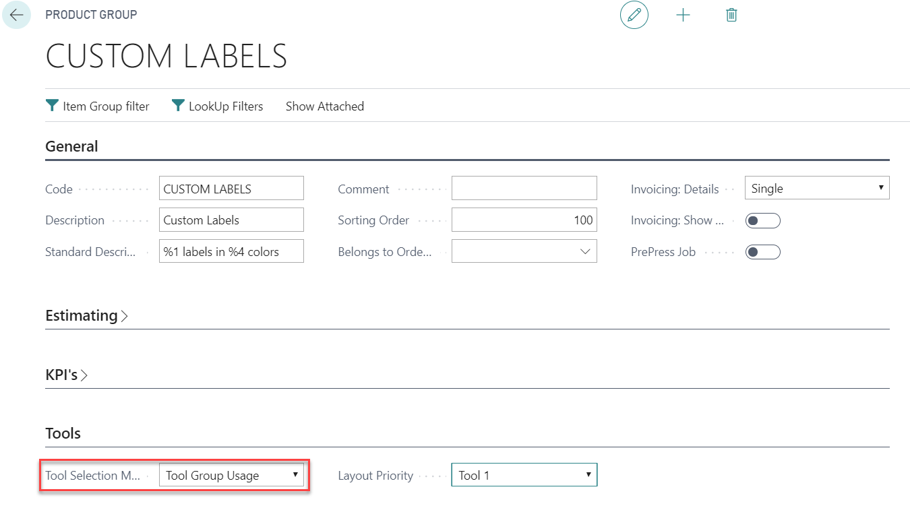

# PrintVis Tools Selection

## Introduction

This functionality works as a guide for displaying possible combinations of machines (presses), print cylinders, and dies which meet specific product parameters. It is made for PrintVis customers in the narrow web label production industry.

For example, the PrintVis Tools Selection supports the sales department for inquiries, locating existing print cylinders and dies for a quote requested from a customer or prospect. With this information, it is possible to define a delivery time frame, which might be longer and provoke extra costs if no die is available.

If no die is available for certain specific product parameters, the page will display which print cylinders are available and where the product with the given parameters fits. The calculation of potentially usable cylinders is made by using default gaps/distances between the labels in the print section/step-and-repeat layout that are common/required and product. Gaps/distances and other defaults can be set up in the Job Item Format Setup and selected for each component type.

The user is able to select one of the possible combinations that will be used on the actual job item. The data will be filled into the calculation, and the Job Item Fields List of Units (selected machine), Tool (selected die), and Tool 2 (selected print cylinder) will be filled with the selected combination.

**Please note:** For more details and other setup options, please refer to the "Label / Tool functionalities" article!

## Prerequisites

PrintVis provides up to 4 different tool fields per Job Item that can be assigned for your needs. To use the Tools Selection functionality, it is mandatory that:

- Field Tool (Tool1) is used for the Die that is chosen on the Tools selection.
- Field Tool 2 is used for the Print Cylinder that is chosen on the Tools selection.

## Required Setup

### Setup Product Groups

Functionality is available only for the “Tool Selection Mode” = "Tool Group Usage" on Product Group setup:

**Please note:** 

- This functionality is not supported for options other than “Tool Group Usage”!
- The setup of the Tool Usage will always be taken into consideration. If you don't get the expected result on the Tools Selection page, please check if there is any Tool Usage setup!

### Tools Codes Setup

For Tools Codes of type "Group," a Tool Type needs to be selected for each group.

- At least one entry of type "Die" and one entry of type "Print Cylinder" must exist. If an entry is not a die or print cylinder, keep the Tool Type field empty.

For more details, please refer to the "Label / Tool functionalities" article!

### Machine Tool Group Usage Setup

Set up all possible combinations of machines, groups of dies, print cylinders, etc.

### Tools

Set up tools with the related groups.

#### Die Tools

Tool Card for a die with a Tool Group attached. This tools group is of Tool Type "Die," see above.

#### Print Cylinder Tools

Tool Card with a Tool Group attached. This tool group is of Tool Type "Print Cylinder," see 
above.

## Default Label Parameters / Filters

When calculating possible combinations of machines, print cylinders, and tools.

### Job Item Format Setup

With the Job Item Format Setup, it is possible to set up default values for the following parameters to be used in the Tools Selection page and stored per Job Item:

- Minimum Distance Front
- Maximum Distance Front
- Distance Across
- Corner Radius

### Component Type Setup

Select Job Item Formats on each Component Type where default values should be set up:

Set up the default values for each Component Type and make sure a Component Type is selected on the Job Item!

## Tools Selection

If the above setup exists (Job Item Format setup is not mandatory) and a Product Group with option "Tool Group Usage" is selected for this job, the action "Tools Selection" will be visible on the Job Card.

If a Component Type with Job Item Format Setup is selected on the Job Item, it is possible to look up the default values and edit them. Click the assist button in the Job Item Format field:

When hitting the action "Tools Selection" for a Job Item, the Tools Selection page opens:

 Fields on the "Filters" Section

| Field                           | Description                                                                                                                                                                                                                   |
|---------------------------------|-------------------------------------------------------------------------------------------------------------------------------------------------------------------------------------------------------------------------------|
| Min. Label Distance Front       | This value defines the minimum gap between 2 items around the cylinder. Used when trying to find cylinders and dies. If no combination with this minimum gap is available, no line will be displayed in the results section. |
| Max. Label Distance Front       | This value defines the maximum gap between 2 items around the cylinder. Used when trying to find cylinders and dies. If no combination with this maximum gap is available, no line will be displayed in the results section. |
| Distance Across                 | Defines the gap between 2 items in the width of the cylinder. Used as a filter on available dies only. If the value is 0, it will be ignored.                                                                             |
| Corner Radius                   | Defines the corner radius of the die. Used as a filter on available dies only. If the value is 0, it will be ignored.                                                                                                     |
| Shape                           | Select from available die shapes. Used as a filter on available dies only. If no value is selected, the field will be ignored.                                                                                            |
| Max. No. of Labels in Width     | Number of possible items in the width of the cylinder. Helps to lower available combinations of dies and print cylinders. Default value is 12.                                                                          |
| Colors                          | Total number of colors from the actual job item (front + back). Used as a filter on field "Max. Number of Colors" available print cylinders only.                                                                       |
| Max. Number of Colors           | Number of available cylinders with the given parameters. Format 1 and Format 2 from the job item format.                                                                                                                  |

The values from the Job Item Formats setup are displayed in the related fields on the Tools Selection page. The values can be modified and will be stored after hitting "OK" for this Job Item as new default on Job Item Formats. When reopening this page, the new values will be displayed.

When hitting "Apply Filters," available combinations are calculated and filtered:

 Fields in the Result Section after "Apply Filters"

| Field                          | Description                                                                                                                |
|--------------------------------|----------------------------------------------------------------------------------------------------------------------------|
| Code                           | List of Units Code of the press/machine                                                                                   |
| Text                           | List of Units description of the press/machine                                                                           |
| Min. Print Format Width        | Min. print width (width of print substrate) calculated from label width, no. of labels in width, distance across, paper margin, and distance front (calculated). |
| Distance Front (calculated)    | Calculated distance between the labels in height/circumference of the cylinder                                             |
| No. of Labels in Height (calculated) | Calculated number of labels in height/circumference of the cylinder                                                         |
| Print Cylinder (Tool 2)         | Tools code of the print cylinder                                                                                           |
| Teeth                           | Number of teeth from print cylinder or die                                                                               |
| Optimal Height                 | Optimal Height/Circumference of print cylinder or die                                                                    |
| Die (Tool 1)                    | Tools code of the die                                                                                                     |
| Corner Radius                   | Corner radius of the die                                                                                                  |
| Hardness                        | Hardness value of the die                                                                                                 |
| No. of Labels in Width          | Number of labels in width from the die, or if no die available, value is calculated                                         |

 When hitting OK:

- List of Units is filled into the Job Item
- Die is filled into the Job Item field "Tool" (which should bring the imposition information)
- Print Cylinder is filled into the Job Item field "Tool 2"
- The Distance values are stored in the Job Item
- The modified Job Item Format values are stored

### Result

