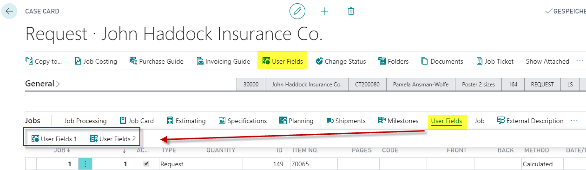

# Userfields

Userfields contain all information not covered elsewhere in the system. They organize and make relevant information available in one place, allowing your company to define a fixed structure for information accessible to all members of the organization.

Userfields can be accessed by searching PrintVis Userfield Tables.

## PrintVis General Setup

You can define which Userfields are visible on the case card and price units here.

## Userfield Groups
User Field Groups are crucial for printing userfields on the Job Ticket. Refer to the following for setup:
- [PrintVis Departments](#)
- [Setup Job Ticket Report](#)

Example for Userfield Groups:

## User Field Setup

| **Field**                   | **Description**                                                                                                                                                                                                                                                                                                                                 |
|----------------------------|-----------------------------------------------------------------------------------------------------------------------------------------------------------------------------------------------------------------------------------------------------------------------------------------------------------------------------------------------------|
| Field No.                  | Field No. is a unique entry number which is assigned to the field.                                                                                                                                                                                                                                                                               |
| Field Name                 | Enter a name/explanatory text for the field.                                                                                                                                                                                                                                                                                                     |
| Group Code                 | Select which group this field belongs to.                                                                                                                                                                                                                                                                                                        |
| Datatype                   | Choose between: - **Text**: For example "Is only used in Prepress" - **Numbers**: For numerical values like 27 - **Yes/No**: Binary choice (can be empty) - **Date**: For dates - **Time**: For hours and minutes (e.g., 13:05) - **Selection field**: Choose from a dropdown of multiple options                                 |
| Option Values              | Sums up how many option fields the Field column contains in the User Fields window.                                                                                                                                                                                                                                                             |
| Option Values only         | Should only options be allowed (no manual input).                                                                                                                                                                                                                                                                                                |
| Field Sorting              | Indicate the order in which fields must appear.                                                                                                                                                                                                                                                                                                 |
| Production Plan            | Display this field in Production Plan?                                                                                                                                                                                                                                                                                                          |
| Editable in Production Plan| Should this field be editable in Production Plan?                                                                                                                                                                                                                                                                                              |
| Must Be Filled In          | If selected, the field must always be filled in. Marked with a red question mark in User Fields.                                                                                                                                                                                                                                                 |
| Report Print               | Options: - **Empty**: Field left blank - **If filled-in**: Included in report if a value exists - **Always**: Always included in report                                                                                                                                                                                                 |
| Report Location            | Options: - **Section**: Placed in body text - **Top**: Placed in header - **Bottom**: Below shipment lines                                                                                                                                                                                                                              |
| Section Placement          | Choose between: - Empty - Left - Right - Center                                                                                                                                                                                                                                                                                      |
| External Suppliers         | Export the field to vendor reports (e.g., purchase quote).                                                                                                                                                                                                                                                                                       |
| External Customers         | Export the field to customer reports (e.g., quote print).                                                                                                                                                                                                                                                                                        |
| Style                      | Select the field Style from a fixed list.                                                                                                                                                                                                                                                                                                        |
| Blocked                    | Select this if the line should be blocked from further editing.                                                                                                                                                                                                                                                                                  |
| Decimals                   | Number of decimals (only active if Data Type is Numbers).                                                                                                                                                                                                                                                                                        |
| Initial Value              | Define a default value for the field. Must align with datatype setup. For Number fields, text values are not allowed. **Note**: If Initial Value is defined, "Report Print" must be "Always".                                                                                                                                                |
| Minimum Value              | Only active if Data Type is Numbers.                                                                                                                                                                                                                                                                                                              |
| Maximum Value              | Only active if Data Type is Numbers.                                                                                                                                                                                                                                                                                                              |
| Length                     | Define the maximum length of the field.                                                                                                                                                                                                                                                                                                           |
| Help Text                  | Auxiliary text displayed when entering data.                                                                                                                                                                                                                                                                                                     |

## Field Options Setup

Here you enter the options for the User Fields.

## Userfields on Case Card

- **At the Top**: Order User Fields.
- **Below**: Job User Fields.

