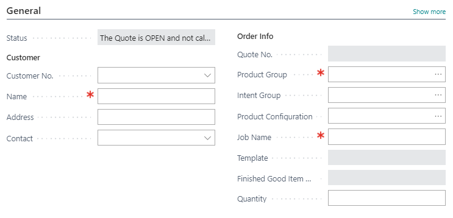
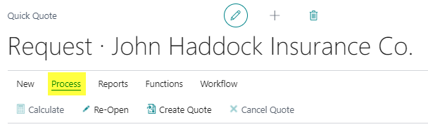
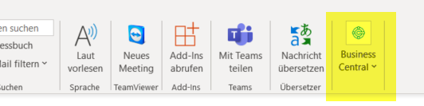

# Create / Use Quick Quote

## Summary
Before PrintVis Quick Quote can be used, some settings are necessary. The necessary instructions can be found under "Setup PrintVis Quick Quote"

## Start Quick Quote
There are several ways to start PrintVis Quick Quote:

- "Search" function

- From Role Center

- From PrintVis Case List

When the page is opened from within the Case List, click **"New Quote"** as the FIRST thing to do, clearing and reading the page for new input.

## Create a Quick Quote

### General Tab

After selecting **Customer**, **Product Group**, and **Job Name**:

| **Field**                   | **Description**                                                                                                                                                                                                                                                                                                                                                                                                                                |
|----------------------------|----------------------------------------------------------------------------------------------------------------------------------------------------------------------------------------------------------------------------------------------------------------------------------------------------------------------------------------------------------------------------------------------------------------------------------------------------|
| Customer No.               | Select the Customer from the list.                                                                                                                                                                                                                                                                                                                                                                                                              |
| Name                       | The easiest way to find the customer is to enter part of the customer's name in this field, then **Tab** out. This will either populate the customer directly or display a list of matching customers.                                                                                                                                                                                                                                         |
| Contact                    | Select the Contact from the list, or type part of the contact’s name to open the list for selection.    If no **Customer** is selected, you can select a **Company Contact** instead, thus creating the quotation for a contact.                                                                                                                                                                                                         |
| Product Group              | Select the Product Group from the list. (**Product Groups must have a Template attached**.)                                                                                                                                                                                                                                                                                                                                                     |
| Product Configuration      | When a **Product Group** is selected, the next step is to select the required **Product Configuration** (linked to the selected group).    Example: If you have special booklet sizes with specific imposition types, paper items, etc., these can be set as **Product Configurations** to a generic Product Group.    Selecting a configuration will populate the job specs from its template.     |
| Job Name                   | Enter the Job Name.                                                                                                                                                                                                                                                                                                                                                                                                                             |
| Template                   | Displays the **name** and **External Text** from the selected template.                                                                                                                                                                                                                                                                                                                                                                         |
| Finished Good Item No.     | Displays the Finished Good Item number if the selected template is set to call a **FG-Item**.                                                                                                                                                                                                                                                                                                                                                   |
| Quantity                   | Enter or overwrite the Quantity.                                                                                                                                                                                                                                                                                                                                                                                                                |

### Quote Text Tab

You can add a new line or modify/delete an existing line. By default, PrintVis builds the text as set up for the Product Group.

**Note:**
The "pages" are being read from the "sheet 1" line on the "Job Card."

Example:

This is (among other reasons of course) the reason we have added the part of the **'Quote Text'** to the Quick Quote — so the user is able to modify this information directly on the Quick Quote itself.

Since the job card can have **many components**, we would not have a clear way to determine which components to "add up" to get to a single number of pages quantity for the case card.

If you update the pages on the case card and have multiple job items, you will notice that **all components that are not manually set are all set to the same value**. The field on the case card is not necessarily "Text" pages.

That is how we setup our commercial print examples: by manually setting the **COVER** component to be 2 or 4 pages, so when the case card `# of pages` field is changed, it doesn't change the COVER component `# of pages`. But this isn't the only way people use the system.

We might have:

- 1 job item with 24 pages  
- another with 48 pages  
- both having 4-page COVERs  

Which number of pages should appear on the case card?

The `Pages` field on the case card is there to make it **possible for a salesperson** to avoid going to the job card to add that information — but it **isn't used for system calculations**.

---

### Components Tab

The Components Tab has had **many new features added**, enabling the user to control far more directly from this section – thus making the Quick Quote more generic.

| **Field**                | **Description** |
|--------------------------|-----------------|
| Pages                    | For the Text-component, the number of pages will not be populated from the Template and should be filled in. |
| Format                   | As the templates are generally generic, the required Final Format should be filled in. In certain cases where the Product Configuration has the Final Format entered via the Template and has specific Imposition Types attached, the format could be pre-filled. |
| Plate Changes            | If there are multiple versions (perhaps languages), the Plate Change information should be filled in. |
| Printing Machine         | Will typically **NOT** be selected and pre-set from the Template. Looking up to find the best fit Press will also enable automation to find the best fit paper. |
| Finishing                | When you set up the Quick Quote and Product Configurations, you should decide if you wish to enter sheet-specific finishing via the ‘Finishing’ field, or via Configurator Questionnaire (below). |
| Selected Surcharge Units| If the selected Press has Surcharge Options, the selected option will be displayed in this field. If the Press is pre-set from the template, you can via a Lookup in the field select Surcharges, if required. |

 "More Options" Buttons (Components Section)

- **Inks** – Ink specific to the current Job Item/Component  
- **Specification** – Specifications window to the Job/Component  
- **Shipments** – Enter the Shipments page for the Job

---

### Product Configuration

This **Product Configuration** is a sub-type to the assigned **Product Group** based on the related Setup. Based on the answers, the template belonging to the product group is added.

---

### Additional Charges Tab

The Additional Charges tab presents all units marked as **“Show in Quick Quote”** to display the **optional units** added to the Job.

- The units displayed can, when so set, be specified on the quote letter as **‘surcharged’** to the base price.
- The base price will be calculated as the total price, minus the ‘specified’ units’ prices – all based on the pricing method.
- When a unit is ticked in the field **‘Specify quote,’** the line is presented separately on the quote letter.

| **Field** | **Description** |
|-----------|-----------------|
| Details   | Shows the operation lines for the selected unit in a separate page. |
| Add       | Add a new unit; the list is based on the calculation unit setup for each unit. |
| Delete    | Delete the selected line (Unit). |

## Quantity Breaks Tab

Having entered just these few pieces of information, the Quick Quote is ready to be estimated.

- To estimate, simply press the **‘Calculate’** button on the Ribbon, and each quantity break is now completely calculated.

| **Field**        | **Description** |
|------------------|-----------------|
| New              | Create a new line (Quantity). |
| Delete           | Delete the selected line. |
| Pricing Fields   | Pricing fields may be overwritten from this view. |

> 💡 **Note:** Prices are not available until the ‘Calculate’ has been activated.

---

## Ribbon Actions and Features

### New

### Process

| **Action**       | **Description** |
|------------------|-----------------|
| Calculate        | Calculate this Quick Quote. |
| Re-Open          | Re-open this Quick Quote. See picture 16* |
| Create Quote     | Set status to “Quote”. Once you have set the status to Quote you cannot re-open the Quick Quote. Changes must be made from the Case Card. |
| Cancel Quote     | Archive this Quick Quote. |

* 

### Reports

| **Action**          | **Description** |
|---------------------|-----------------|
| Estimation          | Start Estimation Report. |
| Quote               | Start Quote Report. |
| Quote Print/Send    | Create Quote Report and send via e-mail. |

### Functions

| **Action**      | **Description** |
|------------------|-----------------|
| Copy from ...    | Copy from an existing job. |
| Case Card        | Open the Case Card. |
| Copy to ...      | Copy to a new Quick Quote. |
| User Fields      | Open “User Field” page. |
| Instructions     | Open “Internal Description” page. |

### Workflow

| **Action**    | **Description**       |
|---------------|------------------------|
| Next Status   | Go to next Status.     |

---

## Outlook Integration

It’s possible to create a new Quick Quote from Outlook, based on the selected email address.

