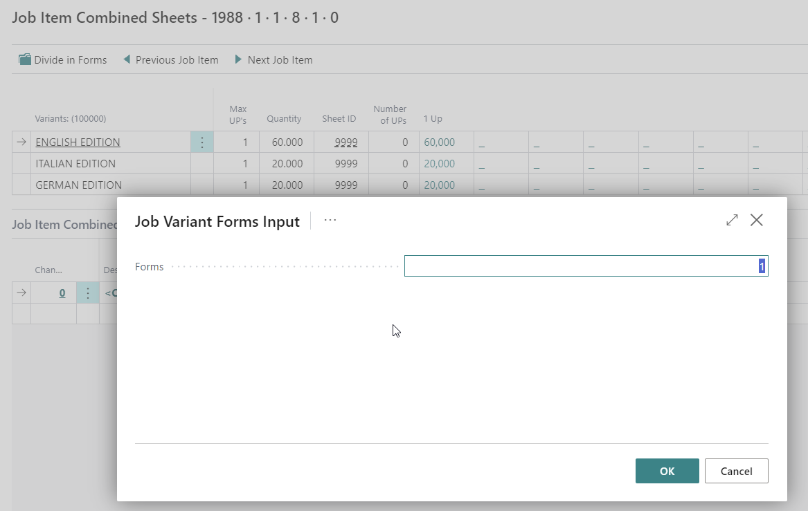

# Versioning functionality / Product Parts

## Introduction

Versioning is used to manually combine different Job Parts from a single Case and Job onto the sheet(s) necessary to produce the Job. This can be for newspapers with different local versions, for a combination of Cover and Matter in different languages/versions, or for a job with many different Job Parts.

After combining the different Job Parts into versions, PrintVis will automatically calculate the needed plate changes for each sheet based on the combination you have entered, and thus have the print processes estimated correctly.

To begin the versioning process, the different Product Parts must be defined. This is done from the Case Card directly in the Jobs section by activating the button “Product Parts,” where you define Parts and Quantity.

 Available Fields

| Field                     | Description                                                                                   |
|---------------------------|-----------------------------------------------------------------------------------------------|
| **Text**                  | Product part name and identifier.                                                             |
| **Quantity**              | The quantity of the finished product of this part at the end of the production process.       |
| **Item Variants**         | System field not for input. Displays how many components the product part is in (e.g., 2 for cover and text components). |
| **From Stock**            | Tick this field if you do not expect to print this product part but have it in stock (e.g., a perfume insert delivered by the customer). |
| **Finished Good Item Number** | Point to the item number if you have the item in stock, or if the printed component has a finished good item number. |
| **Product Code**          | PrintVis Products can be looked up here. They can be used as a template and data carrier for re-runs. |
| **Item Description**      | Description from the Finished Good Item Card mentioned in the number field.                   |
| **Finishing Code**        | Standard Unit of Measure from the Finished Good Item.                                         |
| **Lot**                   | If the Finished Good item is lot controlled, this field specifies the lot number used for this production. |

## Typical Examples for Versioning

1. **Example – Brochure in 3 Languages**
   - Cover, English edition – quantity 6200 pcs.
   - Cover, Italian edition – quantity 2800 pcs.
   - Cover, German edition – quantity 3000 pcs.
   - Content, English edition – quantity 6200 pcs.
   - Content, Italian edition – quantity 2800 pcs.
   - Content, German edition – quantity 3000 pcs.

2. **Example – 3 Parts in Different Sizes**
   - Leaflet A5, 4+4 colors, quantity 5500 pcs.
   - 4-Page Folder A5, 4+4 colors, quantity 3000 pcs.
   - Poster 300x600 mm, 4+0 colors, quantity 1000 pcs.

3. **Example – Newspaper with Different Local Versions**
   - Coverpage, Region 1 – quantity 25000 pcs.
   - Coverpage, Region 2 – quantity 15000 pcs.
   - Coverpage, Region 3 – quantity 10000 pcs.
   - Content, general for all regions – quantity 50000 pcs. (32 pages)
   - Content, Region 1, area 1 – quantity 14000 pcs. (8 pages)
   - Content, Region 1, area 2 – quantity 7000 pcs. (8 pages)
   - Content, Region 1, area 3 – quantity 4000 pcs. (4 pages)
   - Content, Region 2, area 1 – quantity 9000 pcs. (8 pages)
   - Content, Region 2, area 2 – quantity 6000 pcs. (4 pages)
   - Content, Region 3 – quantity 10000 pcs. (8 pages)

## How to Use PrintVis Versioning

As indicated with the examples mentioned above, any combination of Job Items to combine can be set up as Product Parts. For each Product Part, the quantity is defined, allowing PrintVis to calculate the quantity of impressions needed for each sheet based on the required quantity or the entire combined sheet.

Some Product Parts can even be set as “from stock” with a Finished Goods Item No. to indicate these parts are not to be printed but will be taken directly from the warehouse and added to the production line.

If only a Finished Goods Item No. is added, but the Product Part is not marked as “from stock,” this information can be used after production to build invoice lines based on Item Numbers or to ‘Put on stock’ to the stated Item Number.

Once the different Product Parts are defined, the next step is to define which Versions/Variants are to be made available for the Job from the page “Job Card.”

The system will create one column for each sheet created in the job card. Each combination of Product Part and component will have a field that allows for variant input.

Under Actions, you can ask the system to create the variants automatically. They will then have the full text as the variant code. You can also overwrite or manually write the variant codes to make them shorter. If a combination of Product Part and component is not needed, leave the field blank.

It is also possible to create a variant used for all Product Parts. To do this, create a new sheet in the Job Item section. Then in Versions/Variants enter a common variant code for this new variant.

In the example below 24.000 covers will be created in 3 variants, 2x12.000 text sections will be created in 3 variants, and 24.000 of a common text section will be created.

### Combining the Sheets for Print

When opening the “Combined Sheets” window, the selected sheet is opened and displays the possible combinations with 1 to however many ups are possible for the Job Item on the Sheet/Printing Press. For each combination, the number of Prints in thousands is displayed.

 **Sheet 1: Cover**

In this example, the Cover sheet is selected, and the sheet has space for 4ups of the Cover.

To combine Job Items to the best possible imposition for this cover sheet, click on the quantity in the 2 Up field for Variant UK, and then select the sheet (in this case, the baseline) you wish to apply the Job Item to this sheet.

After selecting this for the first Job Item, PrintVis will, if possible, utilize the remaining space for the rest of the Job as shown. Do the same for all other parts to be placed on the combined sheet.

It also indicates on the combined sheet that 5 of 4 ups are "used" and the "Ups remaining" is negative (-1). This must be corrected by the user. There is no warning other than the information about the result.

The goal is to have the "Ups remaining" on a combined sheet equal to 0, so the sheet is fully covered with products and not "overbooked."

**Sheet 2: Text with 2 Plate Changes**

For the next sheet (main content sheet), the combination is to add 2 Plate Changes and apply each Version to the Base and 2 Plate Changes.

**Sheet 3: Text with 1 Plate Change**

For the residual sheet of 8 pages, combine this into 2 Printed Sheets:

So, when combining parts, PrintVis will tell you how many Job Parts will fit onto the selected sheet, and you then select the number of Ups for each Product Part to make the optimum use of each sheet.

In the example above, the Cover sheet could best be combined on a full sheet with space for 4 Job Items on the sheet, having the English edition 2up, and the remaining 2 editions 1up each. This would increase the number of ‘good prints’ to 3100 but would require only one set of plates for work and turn processing. The Matter, however, with 8 pages for the residual sheet, is best made as 2 sheets with the English edition on the first sheet for turning, and the Italian and German versions on the second sheet for work and turn.

This means that the combination of Product Parts is automatically ‘divided’ into actual Folding Signatures and these combined as in the example above.

Should the number of Pages change for the Job, you will most likely have to redo the combination of all sheets affected by that change. Similarly, if the total quantity changes, the Product Parts with parts and quantities will need adjusting.

The Versioning function is capable of placing product parts within a created sheet. If there are more sheets, the system will anticipate the need for each product part to be made for this sheet.

If you do not want a product part to have a particular component, ensure the grid is empty in this combination. For example, no cover on the Italian version – remove the code IT in the grid combination for the Italian Version and COVER.

### Action: Divide into Forms

If there are more print sheets on a PrintVis sheet/Job item, it is possible to split/divide this sheet into forms. This could lead to more plate changes and stops but results in a proper number of extra plates. The production quantity does not change unless impacted by more scrap for plate changes.

**Example:**

- Total pages = 32 on a 16-page print sheet = 2 Sheets in Signature

Divide into Forms:

- Keeping the Number of Forms = 1.

PrintVis creates a line for each variant for every sheet in the signature.

Now creating 5 plate changes and selecting them on the variants, you can see how many plates are required for each sheet and variant. There are 2 sheets for each language variant, and in this case, the second sheet of the same variant requires the change of 1 plate (black) only. For the next language variant, all 4 plates must be changed, etc.

