# Working with Templates

## Summary

The idea behind working with templates in the calculation is to enable quick assembly of a quote. Salespeople often encounter jobs with similar requirements, so "recycling" information for a quote when applicable can expedite the process. This information can be stored in templates.

A template aims to:

- Define a certain product with its product parts.
- Fix a production method for it.

## Types of Templates

1. **Templates Related to a Product Group**

   **Example: Product Group: Brochure**
   - Saddle stitch brochure 4 pages cover
   - Saddle stitch brochure 6 pages cover
   - Saddle stitch brochure 8 pages cover
   - …

2. **Templates Related to a Finished Good Item**

   **Example: Finished Good Items**
   - Label
   - Calendar
   - Poster
   - …

## 1. Templates Related to a Product Group

### 1.1 One Template per Product Group

A product group template can be assigned to a product group and will be copied automatically when a new job is created.

**Setup:**

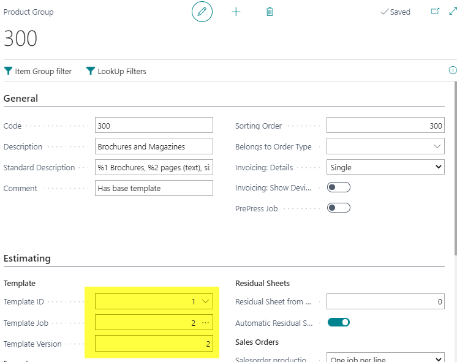

  **Use this Template**

 Select Product Group on Case Card:

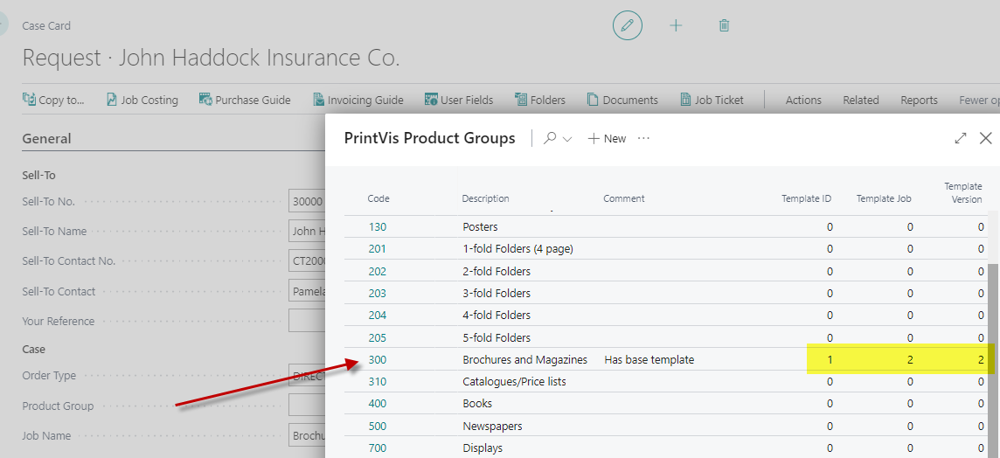

Result:

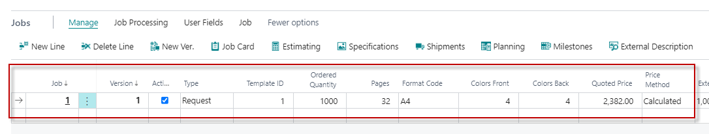

#### 1.2 Template List Related to a Product Group

Create a template for a Product Group by creating a Job Card, e.g., per product group. It is also possible to define any calculation as a template.

Define different jobs on your template case with different Product Groups:

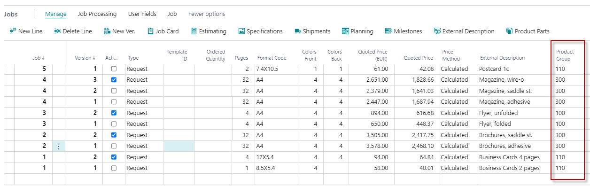

**Warning!**

Avoid fix/manual inputs in the calculation. These should be adapted later using the templates to avoid issues with changing conditions, such as higher quantities.

**Steps to Use Templates:**

1. Open Job Card and set all lines as Template:

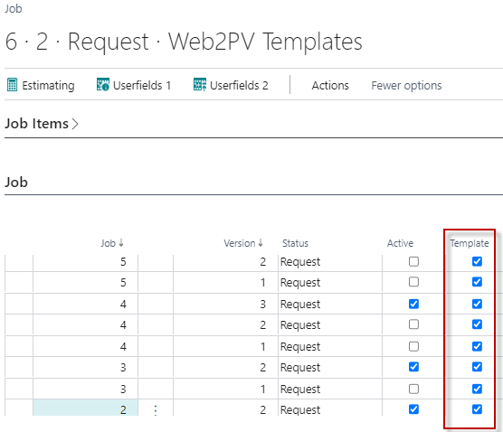

2. Use the Product Group Template List

3. Select your Template from the list:

   - Create a case and select your Product Group:

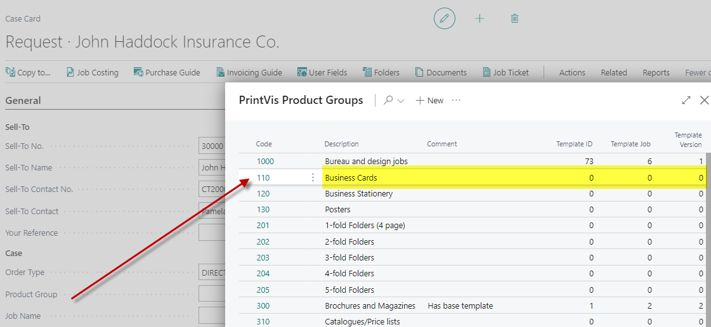

   - Go to Job line - Open Template list:

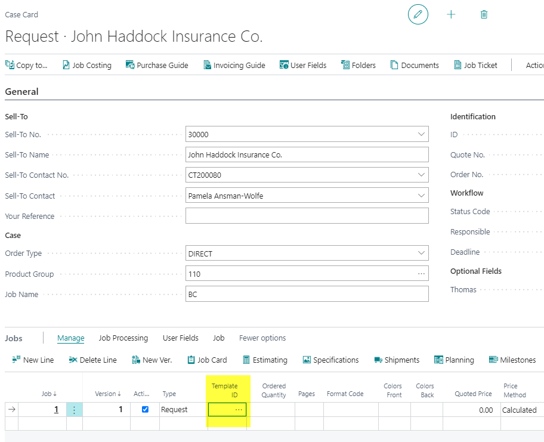

   - Select your Template from the list:

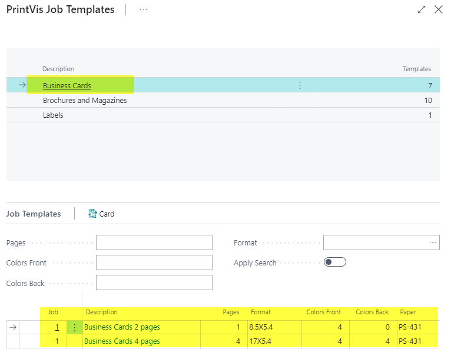

Result:

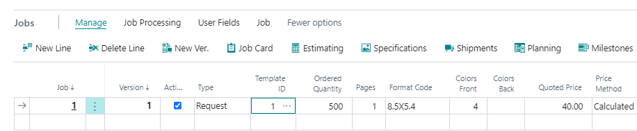

## 2. Template Related to a Finished Good Item

 **Create a Template**

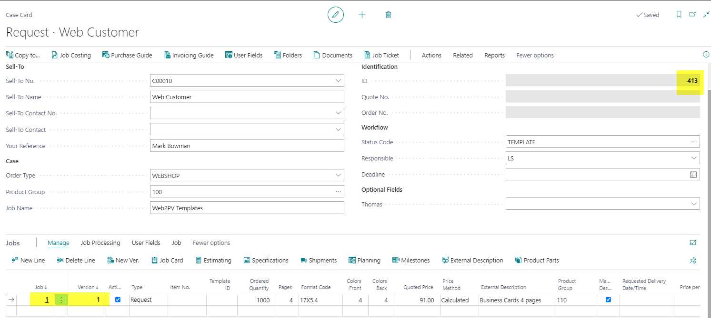

**Warning!**

Avoid fix/manual inputs in the calculation. Adapt these later using templates to avoid issues with changing conditions, such as higher quantities.

**Steps:**

1. Create a Finished Good Item and add the Template:

   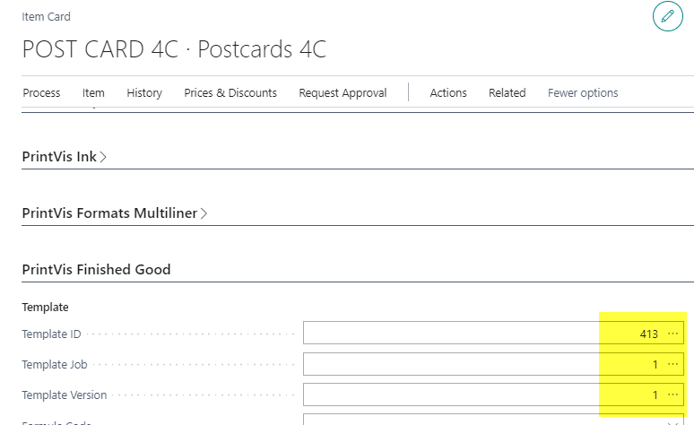

2. **Use FG-Item Template**

   Select Item No. on Case Card - Job line:

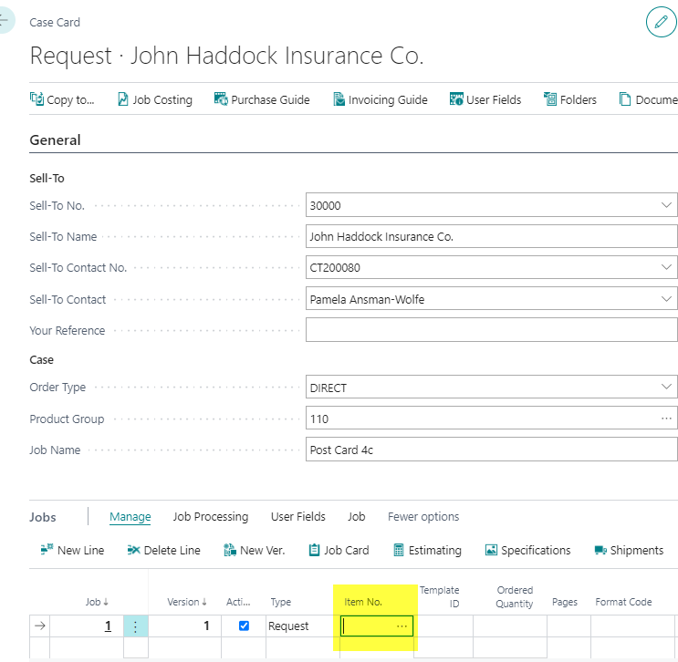

**Result:**

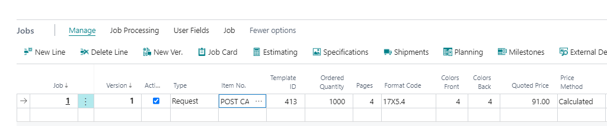

## 3. Sequence of Templates if Setup in More than One Place

If a template is copied due to a product group setting (i.e., the product group selects the template), the template set up in a finished good item will not be copied. This means the selected template will not be overwritten.

If you want to use the template from the item, do not select a product group first. Enter the Item number on the job first, and the product group will be filled automatically with the product group assigned to the item template.

## 4. Priority of Templates

When adding templates in multiple places, such as Product Group and FG Item, PrintVis will ignore the FG Item template if the Product Group template is already entered for the case.

**To avoid this issue:**

1. Select FG Item first before choosing the product group. This will pull the template and assign the product group from the template to the new case and job.
2. If necessary, change the product group for this case.

## 5. Modify Templates

The Template setup can be found here:

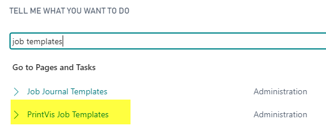

From here, open the Template Job Card and modify it as needed.

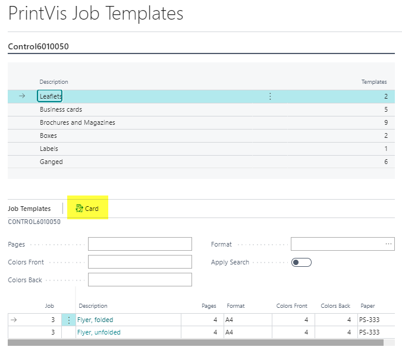

## 6. Maintain Templates

Search for:

From this page, you can update the templates, for example, after modifying calculation units.

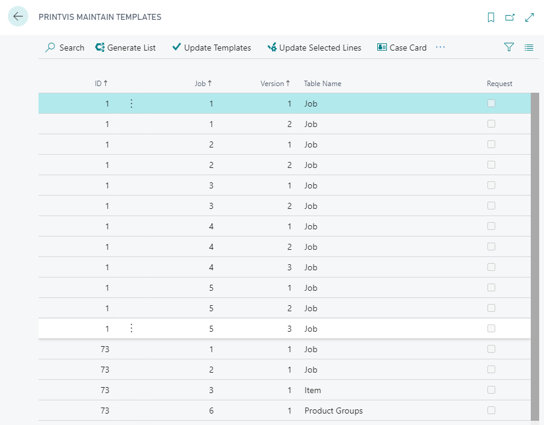
