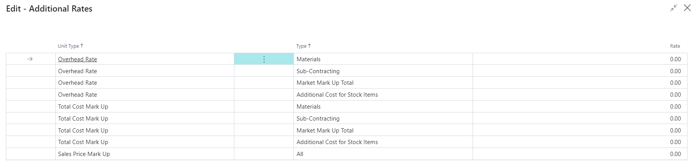

# Additional Rates - PV Assisted Setup

## Introduction

PrintVis Additional Rates allow you to set up overhead and profit mark-ups for calculation and job costing. While it is possible to set up overhead and profit on each item card individually, using Additional Rates simplifies and streamlines maintenance.

## Setup

| **Field**                     | **Description**                                                                                                                                                                                                                                                                                                                                                 |
|-------------------------------|-----------------------------------------------------------------------------------------------------------------------------------------------------------------------------------------------------------------------------------------------------------------------------------------------------------------------------------------------------------------|
| **Unit Type**                 | **Overhead Rate**: Additional markup applied to the item cost to calculate the Total Cost, considering the selected type.   Formula: `Item Cost + Overhead = Total (Self) Cost`.    **Total Cost Mark Up**: Additional markup applied to the Total Cost to calculate the Sales Price, considering the selected type.   Formula: `Total (Self) Cost + Markup (Profit) = Sales Price`.    **Sales Price Mark Up**: Additional markup applied directly to the Sales Price. |
| **Type**                      | **Materials**: The additional rate is applied to material items not classified as "Sub-Contracting." The item cost is typically sourced from the Item Card or an attached Price List, while surcharges are calculated via this setup.    **Subcontracting**: The additional rate is applied to material items classified as "Sub-Contracting." Prices are often sourced directly from sub-suppliers or a price list, and the Total Cost and Prices are calculated based on these inputs.    **Market Mark Up Total**: Applied as a total surcharge to the job's calculated sales price, contributing to the Net Profit Ratio. This is calculated after other surcharges or discounts (negative markup).    **Additional Cost for Stock Items**: Applied to material consumption of inventory items, considering any delimitations. This surcharge acts as a handling fee for inventory items and is included in the Contribution Margin Ratio of the job. |
| **Rate**                      | Enter the desired additional percentage based on the chosen configuration. Supports up to 2 decimal places.                                                                                                                                                                                                                            |

- Apply the appropriate rates based on the Unit Type and Type fields. If some columns do not apply to your company, leave the "Rate" field as "0" to indicate no markup.
- Only the "Rate" field is editable. Ensure that you correctly set the rates for the relevant Unit Type and Type to avoid any unintended costs or mark-ups.

