# Business Central Relationship Management

Business Central's relationship management tools are generally sufficient for printing companies, and PrintVis integrates with these features to enhance sales and marketing processes. This integration helps in building segments, tracking opportunities, and applying discount codes to PrintVis cases based on selected campaigns.

## Segments

Segments enable companies to focus interactions based on specific criteria. PrintVis extends this functionality by allowing the selection of case-specific criteria, such as:

- **Order Type**
- **Product Group**
- **Sales Amounts**

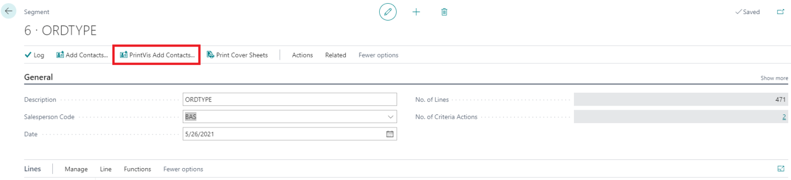

1. **Add Contacts**: On the "PrintVis Add Contacts" page, you can select criteria based on PrintVis case information to populate the contacts that meet the selected criteria.

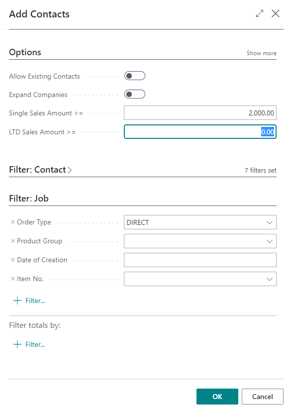

2. **Populate Contacts**: Clicking **OK** will populate the contact lines with contacts that match the criteria.

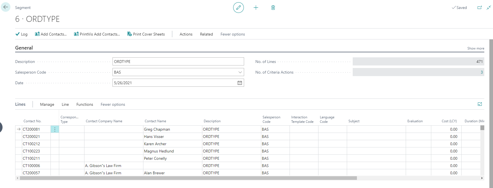

All additional functionality remains standard Business Central.

## Opportunities

Opportunities in Business Central track sales cycles and interactions. PrintVis enhances this feature by allowing interaction between opportunities and PrintVis cases.

- **Create PrintVis Case**: A PrintVis case can be created directly from an opportunity, establishing a link between them.

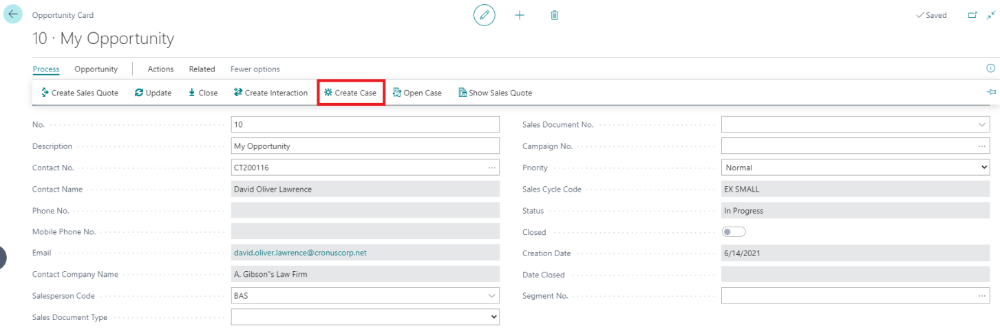
  
- **Track Sales Cycle**: Salespeople can monitor the progress and mark the opportunity as won or lost through the opportunity interface.
  
- **Update Values**: When an opportunity is updated, the estimated sales value is pulled from the PrintVis active quote line.

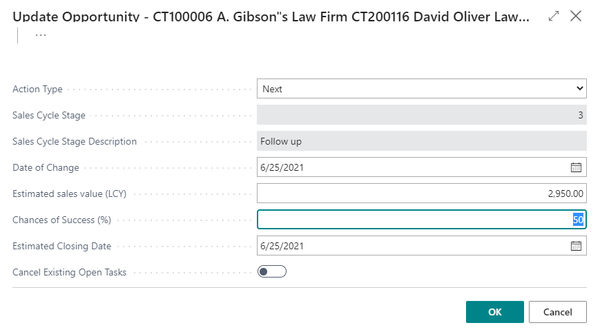

- **Automatic Status Updates**:
 If an opportunity is marked as **Won** and the status code is set to **Default Ordered**, the PrintVis case can automatically move to the default ordered status.

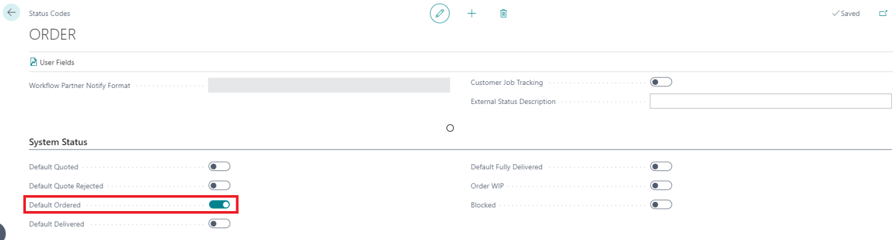  

  -
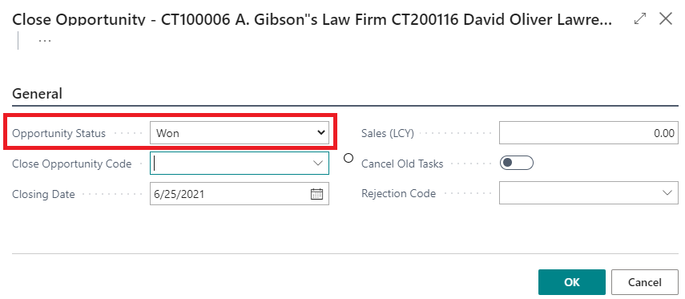

  - If an opportunity is marked as **Lost** and the status code is set to **Default Quote Rejected**, the PrintVis case can move to the default quote rejected status. The rejection reason can be added to the PrintVis case.

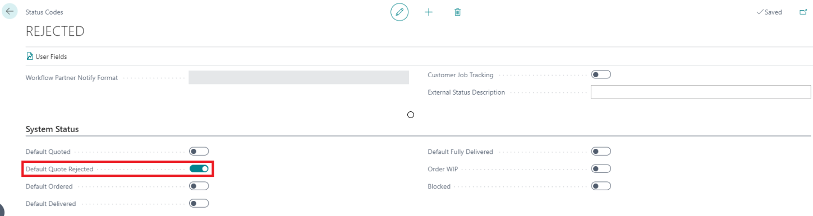

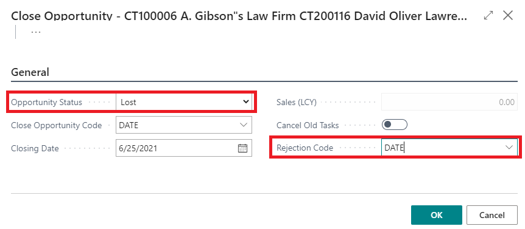
 
## Campaigns

Business Central campaigns are used to create activities or tasks and can be attached to opportunities. PrintVis integrates with campaigns by adding a discount group field to the campaign setup page.

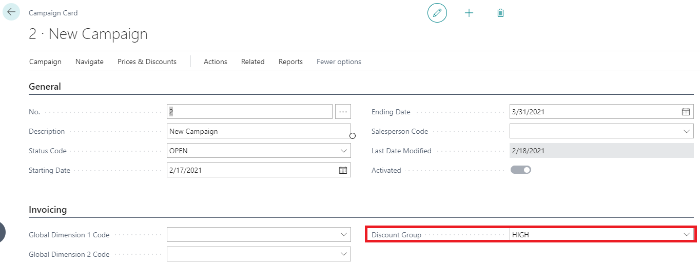

- **Assign Campaigns**: When a campaign is assigned to an opportunity and a case is created from it, the discount group is automatically added to the case. This eliminates the need for estimators to manually apply discounts.

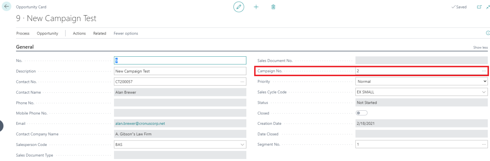

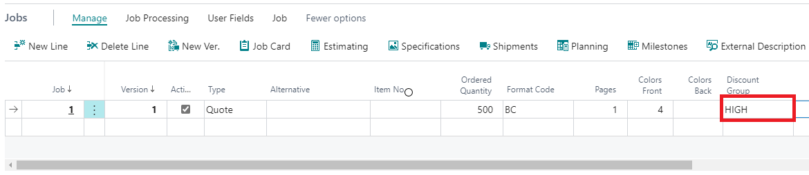