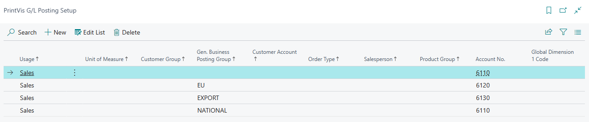

# G/L Posting Setup - Touchpoints between Business Central and PrintVis

## Introduction

Invoices are posted to G/L accounts. Business Central uses General Product Posting Group and General Business Posting Group to post invoices. PrintVis uses Gen. Bus. Posting Group along with Order Type, Customer Group, Unit of Measure, etc. to post invoices. PrintVis does not use Gen. Prod. Posting Group because selling "items" are not done in the same way that Business Central does.

## PrintVis G/L Posting

PrintVis requires for material consumption a posting setup:

- Gen. Bus. Posting Group  = XXX
- Gen. Prod. Posting Group  = <BLANK> (not used)

Additional setup available:

- Order Type
- Product Group
- PrintVis Unit of Measure
- Customer Group
- Customer Account (customer no.)
- Salesperson
- Global Dimension 1

Product and Inventory Posting Groups should be Production related:

- Plates
- Paper and other Print Substrates
- Ink
- Package Material
- Finished Goods
- Outwork / Subcontracting

